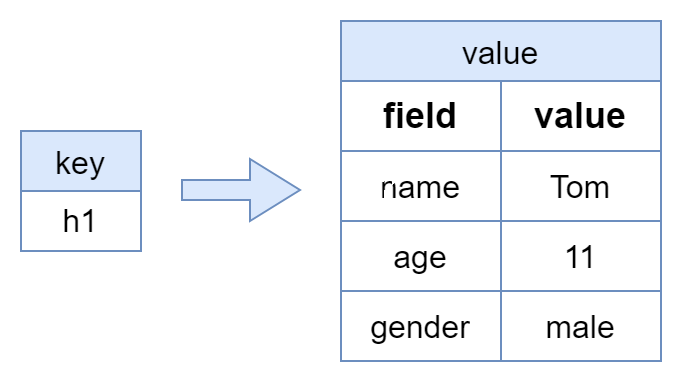
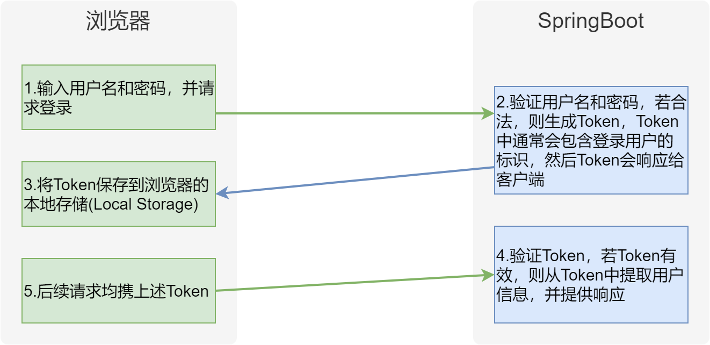
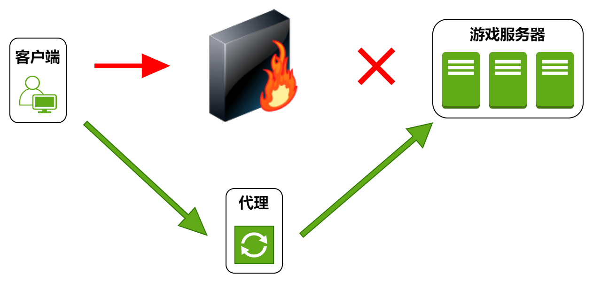

# 1. 项目概述

## 1.1 项目业务概述

尚庭公寓是一个公寓租赁平台项目，包含**移动端**和**后台管理系统**，其中移动端面向广大用户，提供找房、看房预约、租约管理等功能，后台管理系统面向管理员，提供公寓（房源）管理、租赁管理、用户管理等功能。下面分别介绍两端的具体业务功能。


### 1.1.1 移动端

移动端的线上体验地址为：http://139.198.127.41:8002，其主要业务功能如下图所示


各功能模块具体内容如下

- **房源检索**

  用户可以使用这个功能来搜索和检索符合其需求的房源。他们可以根据不同的条件，如地理位置、租金范围、支付方式等，快速找到适合的房源。

- **看房预约管理**

  用户可以通过这个功能预约看房。他们可以选择合适的时间，预约在特定的公寓进行实地看房，以便更好地了解房源的情况和环境。

- **租约管理**

  这个功能允许用户查看和管理他们的租约信息。他们可以在移动端查看租约合同，以及提交租约终止或延长的请求。

- **房源浏览历史**

  用户可以在这里查看他们曾经浏览过的房源历史记录。这个功能可以帮助用户追踪之前感兴趣的房源，方便他们重新查看或做出决策。

### 1.1.2 后台管理系统

后台管理系统的线上体验地址为：http://139.198.127.41:8001，主要业务功能如下图所示


各功能模块具体内容如下

- **公寓信息管理**

  这个模块负责管理所有公寓的基本信息，包括公寓名称、地址、联系方式等。管理员可以在这里添加、编辑、删除公寓信息。

- **房间信息管理**

  该模块负责管理每个公寓内各个房间的详细信息，包括房间号、户型、面积、租金等。管理员可以在这里进行房间信息的添加、编辑和删除。

- **公寓/房间属性管理**

  这个模块允许管理员定义公寓和房间的各种属性，比如公寓和房间的配套设施，方便管理员在维护公寓信息和房间信息时进行选择。

- **看房预约管理**

  该模块用于管理用户的看房预约请求。用户可以在移动端提交看房预约，管理员可以在后台管理系统中查看和处理这些请求，以方便安排人员接待用户。

- **租约管理**

  这个模块用于管理租约的创建、修改和终止。管理员可以在这里生成租约合同，并发送给用户签约。

- **后台系统用户管理**

  该模块用于管理后台系统的用户账户信息，管理员可以创建、编辑、删除、禁用账户信息。

- **移动端用户管理**

  这个模块负责管理移动端用户的信息。管理员可以查看用户信息，处理账户相关问题。

### 1.1.3 核心业务流程

本项目的核心业务流程为签约、续约、退租，具体流程如下图所示


在上述的业务流程中，会涉及到租约状态的多次变化，下面详细介绍一下租约状态。租约共有7个状态，分别是`签约待确认`、`已签约`、`已取消`、`已到期`、`退租待确认`、`已退租`、`续约待确认`，以下是这些状态的变化流程。


## 1.2 项目技术概述

本项目的技术架构如下图所示。


项目采用前后端分离的模式，下面介绍各模块用到的技术。

- **前端**
  
  - 框架：VUE3
  
- **后端**
  
  - 框架：Spring Boot
  
  - 数据库访问：MyBatis、MyBatis Plus
  
    > MyBatis-Plus（简称 MP）是一个MyBatis的增强工具，在 MyBatis 的基础上只做增强不做改变，为简化开发、提高效率而生。
  
  - Web：Spring MVC
  
- **数据存储**
  - 关系型数据库：MySQL
  
  - 缓存：Redis
  
  - 对象存储：MinIO
  
    > **对象存储**是用于存储非结构化数据的数据存储架构，它将一个数据单元称为一个对象，每个对象都包含数据本身、元数据（描述数据的信息）和一个唯一标识符（通常是一个URL地址）。
    >
    > 在2001年，亚马逊推出了Simple Storage Service（简称S3），这是第一个商业化的、面向互联网的对象存储服务。随后国内众多云服务厂商也都推出了自己的对象存储服务，例如阿里云的OSS，华为云的OBS，百度云的BOS等等。
    >
    > **MinIO**是一个开源的对象存储方案，兼容亚马逊S3协议。
    >
    > 对于对象存储，我们可以选择直接购买各大云厂商提供的服务，也可以选择使用开源的服务，自行安装和维护。本项目采用开源的对象存储Minio来存储图片信息。
  
- **部署**
  
  - 前端服务器：Nginx

# 2. 项目开发流程

前后端分离项目的完整开发流程如下

**第一步**

由产品经理负责分析市场、用户需求，并将其转化为详细的产品需求。然后创建初步的产品原型，以便更好地理解和传达产品的设计和功能。

> 原型通常指的是产品、系统或概念的初步版本或样品，旨在展示设计概念、功能、外观或其他关键特征。

**第二步**

由UI设计师基于产品需求和初步原型，设计用户界面的外观和交互，得到高保真的原型。高保真原型可能包含更具体的设计元素，如颜色、字体、布局等。

**第三步**

由架构师根据高保真原型，规划软件系统的整体结构和组件。他们会设计数据库架构和定义接口，输出API文档，以便开发团队进行后续工作。

> API文档是关于接口的详细说明文档，其会包含接口所提供的功能，所需参数、返回值、错误处理等细节。接口文档的目的是为开发人员、集成人员以及其他利益相关者提供清晰的指导，以便他们能够正确地使用和集成接口。
>
> 

**第四步**

前后端开发工程师根据API文档，分别开发前端和后端的业务逻辑和功能。前端工程师负责构建用户交互界面，而后端工程师负责数据处理逻辑和数据存储。

**第五步**

测试工程师进行各种测试，以确保软件的质量和稳定性。

**第六步**

运维工程师负责配置、部署和维护应用程序的生产环境，确保应用程序能够正常运行并具备良好的性能和可用性。

# 3. 项目原型

目前市面上有很多功能强大的原型设计工具，常用的有[墨刀](https://modao.cc/)，[Figma](https://www.figma.com/)等，这些工具设计出的原型美观且具备交互逻辑。以下是本项目的原型（当做原型看吧\^_\^）。

**移动端**地址：[点击访问](https://modao.cc/proto/yaPxwdkwrvtlaepAbqZzO/sharing?view_mode=device&screen=rbpTgNkz0plpyCNJi&canvasId=rcTgNntk14ENgkLr #租赁平台APP-分享)

**后台管理系统**地址：[点击访问](https://modao.cc/proto/jyri5tlrvvh6dn3SWyLBQ/sharing?view_mode=device&screen=rbpTgTi9axnREyQVW&canvasId=rcTgTi9ay8uTGyt0 #租赁平台后台管理-分享)

# 4. 数据库设计

## 4.1 数据库设计理论

### 4.1.1 数据库模型

数据库设计中最常采用的模型为**实体（Entity）关系（Relationship）模型**，简称ER模型。其核心思想是将现实世界中的复杂数据表示为一组实体，并描述这些实体之间的关系。

- **实体**通常对应现实世界中的一个**对象**，例如：学生、班级、教师、课程。

- 每个实体都包含一组**属性**，这些属性用于描述实体，例如学生实体包含姓名、年龄、性别等属性。
- **关系**用于描述各实体之间的联系，例如学生和班级之间存在从属关系。

其中**关系**可分为**一对一**、**一对多**、**多对多**三种，例如学生和班级之间的关系为**一对多**、学生和课程之间的关系为**多对多**。

实体关系模型通常使用实体关系图（ER diagram）进行表示。下图是一个简易的选课系统的实体关系图，其中方框代表实体，方框之间的连线则代表实体间的关系，连线两端的不同符号用于表示一对一、一对多、多对多的关系。


符号说明如下：

|                符号                |   说明   |
| :--------------------------------: | :------: |
|    | 表示0个  |
|  | 表示1个  |
|  | 表示多个 |

上述符号通常是两个**成对**使用，其分别表示**最小值**和**最大值**。例如上述ER图中的**班级**和**学生**之间的连线，**班级**一侧的符号表示**一**（最小值和最大值都是一），**学生**一侧的符号表示**多**（最小值是一，最大值是多），其表达的含义就是班级和学生之间的关系为**一对多**，一个学生只对应一个班级，而一个班级会对应多个学生（且至少对应一个学生）。

### 4.1.2 数据库设计流程

传统的数据库设计流程分为三个阶段，分别是概念模型设计阶段、逻辑模型设计阶段和物理模型设计阶段。三个阶段由粗略到详细，由抽象到具体。

#### 4.1.2.1 概念模型设计

概念模型是一个粗略的初步设计，其只关注实体和关系，不体现最终建表所需的各种细节信息（例如实体的属性）。下图便是一个典型的简易**选课系统**数据库的概念模型。


#### 4.1.2.2 逻辑模型设计

相较于概念模型，逻辑模型会包含更多的细节信息，例如实体的属性、用于关联两个实体的字段等等。需要注意的是，逻辑模型并不关注具体的数据库实现（例如MySQL或者Oracle）。下图是上述选课系统数据库的逻辑模型。


#### 4.1.2.3 物理模型设计

相较于逻辑模型，物理模型会包含更多的与所选数据库相关的具体信息，例如存储引擎、字段类型、索引等信息。一般而言，物理模型会包含最终建表所需的所有信息，下图是上述选课系统数据库的物理模型。


## 4.2 数据库设计实操

### 4.2.1 概念模型设计

根据原型可得，本项目包含的实体有**公寓**、**房间**、**用户(租客)**、**租约(合同)**、**看房预约**、**浏览历史**和**后台管理系统用户**，各实体间的关系如下


### 4.2.2 逻辑模型设计

根据原型明确各实体所需属性并明确各表关联字段，得到的完整的逻辑模型如下图所示。下面逐一分析。


#### 4.2.2.1 公寓信息

公寓信息包含的属性有`公寓名称`、`公寓简介`、`公寓地址`、`公寓联系方式`、`公寓图片`、`公寓标签`、`公寓杂费`、`公寓发布状态`，这部分的逻辑模型如下图所示


#### 4.2.2.2 房间信息

房间信息包含的属性有`房间号`、`房间租金`、`房间所属公寓`、`房间可选租期`、`房间可选支付方式`、`房间属性`、`房间标签`、`房间配套`、`房间图片`、`房间发布状态`，这部分的逻辑模型如下图所示


#### 4.2.2.3 用户信息

用户信息包含的属性有`手机号码`、`密码`、`头像`、`昵称`、`账号状态`，这部分的逻辑模型如下


#### 4.2.2.4 看房预约信息

看房预约包含的属性有`预约用户信息`、`预约公寓信息`、`预约时间`、`备注信息`、`预约状态`，这部分的逻辑模型如下


#### 4.2.2.5 租约信息

租约信息包含`签约用户信息`，`签约房间信息`、`租期`、`支付方式`、`租约来源`、`租金`、`押金`，这部分的逻辑模型如下


#### 4.2.2.6 浏览历史信息

浏览历史指的是用户浏览房间详情的历史，包含的属性有`用户信息`、`房间信息`、`浏览时间`，这部分的逻辑模型如下


#### 4.2.2.7 后台管理用户信息

后台管理系统用户包含的属性有，这部分的逻辑模型如下


### 4.2.3 物理模型设计

本项目采用MySQL数据库，所有表均使用InnoDB存储引擎，完整的物理模型如下图，详细信息可参考资料中的数据库初始化文件`lease.sql`。


**注意**：

- 所有表均省略了`create_time`、`update_time`、`is_deleted`三个字段。
- 所有的状态或类型字段（例如租约状态），均使用数字表示。

# 5. 接口定义

## 5.1 后台管理系统接口定义

### 5.1.1 公寓信息管理

#### 5.1.1.1 属性管理

属性管理页面包含公寓和房间各种可选的属性信息，其中包括**房间的可选支付方式**、**房间的可选租期**、**房间的配套**、**公寓的配套**等等。其所需接口如下

- **房间支付方式管理**

  **页面如下**

  

  **所需接口如下**

  - `查询全部支付方式列表`
  - `保存或更新支付方式`
  - `根据ID删除支付方式`

- **房间租期管理**

  **页面如下**

  

  **所需接口如下**

  - `查询全部租期列表`
  - `保存或更新租期`
  - `根据ID删除租期`

- **标签管理**

  **页面如下**

  

  **所需接口如下**

  - `保存或更新标签`
  - `查询标签列表`
  - `根据ID删除标签`

- **配套管理**

  **页面如下**

  

  **所需接口如下**

  - `保存或更新配套`
  - `查询配套列表`
  - `根据ID删除配套`

- **房间基本属性管理**

  **页面如下**

  

  **所需接口如下**

  - `保存或更新属性名称`
  - `保存或更新属性值`
  - `查询全部属性名称和属性值列表`
  - `根据ID删除属性名称`

  - `根据ID删除属性值`

- **公寓杂费管理**

  **页面如下**
  
  
  
  **所需接口如下**
  
  - `保存或更新杂费名称`
  - `保存或更新杂费值`
  - `查询全部杂费名称和杂费值列表`
  - `根据ID删除杂费名称`
  
  - `根据ID删除杂费值`

#### 5.1.1.2 公寓管理

- **公寓列表页面**
  
  **页面如下**
  
  
  
  **所需接口如下**
  
  - `根据条件分页查询公寓列表`

  - 查询条件所需接口
    - `查询省份列表`
    - `根据省份ID查询城市列表`
    - `根据城市ID查询区县列表`
  - `根据ID修改公寓发布状态`
  - `根据ID删除公寓信息`
  
- **公寓详情页面**
  
  **页面如下**
  
  
  
  **所需接口如下**
  
  - `根据ID查询公寓详细信息`（用作修改时的表单回显）
  - `保存或更新公寓信息`
  - 表单所需接口
  
    - `查询省份列表`
    - `根据省份ID查询城市列表`
    - `根据城市ID查询区县列表`
    - `查询公寓配套列表`
    - `查询公寓标签列表`
    - `查询公寓杂费信息列表`
    - `上传图片`

#### 5.1.1.3 房间管理

- **房间列表页面**

  **页面如下**

  

  **所需接口如下**

  - `根据条件分页查询房间列表`

  - 查询条件所需接口

    - `查询省份列表`
    - `根据省份ID查询城市列表`
    - `根据城市ID查询区县列表`
    - `根据区县ID查询公寓列表`
  - `根据ID修改房间发布状态`
  - `根据ID删除房间信息`

- **房间详情页面**
  
  **页面如下**
  
  
  
  **所需接口如下**
  
  - `根据ID查询房间详细信息`（用作修改时的表单回显）
  - `保存或更新房间信息`
  - 表单所需接口
    - `查询省份列表`
    - `根据省份ID查询城市列表`
    - `根据城市ID查询区县列表`
    - `根据区县ID查询公寓列表`
    - `查询房间属性列表`
    - `查询房间标签列表`
    - `查询全部支付方式列表`
    - `查询租期列表`
    - `上传图片`

### 5.1.2 租赁管理

#### 5.1.2.1 预约看房管理

- **看房预约列表页面**

  **页面如下**

  

  **所需接口如下**

  - `分页查询预约信息列表`

  - 查询条件所需接口

    - `查询省份列表`
    - `根据省份ID查询城市列表`
    - `根据城市ID查询区县列表`
    - `根据区县ID查询公寓列表`
  - `根据ID更新预约状态`

#### 5.1.2.2 租约管理

- **租约列表页面**

  **页面如下**

  

  **所需接口如下**

  - `根据条件分页查询租约信息列表`
  - 查询条件所需接口

    - `查询省份列表`
    - `根据省份ID查询城市列表`
    - `根据城市ID查询区县列表`
    - `根据区县ID查询公寓列表`
  - `根据ID更新租约状态`
  - `根据ID删除租约信息`

- **租约详情页面**

  **页面如下**
  
  

  **所需接口**
  
  - `根据ID查询租约信息`（用作更新租约时的表单回显）
  - `保存或修改租约信息`
  - 表单所需接口
  
    - `查询省份列表`
    - `根据省份ID查询城市列表`
    - `根据城市ID查询区县列表`
    - `根据区县ID查询公寓列表`
    - `根据公寓ID查询房间列表`
    - `查询可选支付方式列表`
    - `查询可选租期列表`

### 5.1.3 用户管理

#### 5.1.3.1 用户列表页面

**页面如下**


**所需接口如下**

- `分页查询用户信息列表`
- `根据用户ID更新账号状态`

### 5.1.4 系统管理

#### 5.1.4.1 系统用户岗位管理

- **岗位列表页面**
  
  **页面如下**
  
  
  
  **所需接口如下**
  
  - `分页查询岗位信息列表`
  - `根据ID修改岗位状态`
  - `根据ID删除岗位`
  
- **岗位详情页面**
  
  **页面如下**
  
  
  
  **所需接口如下**
  
  - `根据ID查询岗位详细信息`（用作修改时的表单回显）
  - `保存或更新岗位信息`

#### 5.1.4.2 系统用户信息管理

- **系统用户列表页面**
  
  **页面如下**
  
  
  
  **所需接口如下**
  
  - `根据条件分页查询系统用户列表`
  - `根据ID修改用户状态`
  - `根据ID删除系统用户信息`
  
  **所需接口如下**
  
- **系统用户详情页面**

  **页面如下**

  

  **所需接口如下**

  - `根据ID查询系统用户详细信息`
  - `保存或更新系统用户信息`
  - `表单所需接口`
    - 查询岗位列表

### 5.1.5 登录管理

#### 5.1.5.1 登录页面

**页面如下**


**所需接口如下**

- `获取图形验证码`
- `请求登录`
- `获取登录用户信息`

## 5.2 移动端接口定义

### 5.2.1 登录

#### 5.2.1.1 登录页面

页面如下


所需接口如下

- `获取短信验证码`
- `请求登录`
- `获取登录用户基本信息`

### 5.2.2 找房

#### 5.2.2.1 房间列表页面

页面如下


所需接口如下

- `根据查询条件分页查询房间列表`
- 查询条件所需接口

  - `查询省份列表`
  - `根据省份ID查询城市信息`
  - `根据城市ID查询区县信息`
  - `查询支付方式列表`

#### 5.2.2.2 房间详情页面

页面如下


所需接口如下

- `根据ID查询房间详细信息`

#### 5.2.2.3 公寓详情页面

页面如下


所需接口如下

- `根据ID查询公寓详细信息`
- `根据公寓ID查询房间列表`

### 5.2.3 个人中心

#### 5.2.3.1 浏览历史

页面如下


所需接口如下

- `查询登录用户的浏览历史列表`

#### 5.2.3.2 看房预约

- **看房预约列表页面**
  
  页面如下
  
  
  
  所需接口如下
  
  - `查询登录用户的看房预约列表`
  
- **看房预约详情页面**
  
  页面如下
  
  
  
  所需接口如下
  
  - `根据ID查询看房预约详细信息`
  - `保存或更新看房间预约信息`

#### 5.2.3.3 租约管理

- **租约列表页面**
  
  页面如下
  
  
  
  
  
  所需接口如下
  
  - `查询登录用户的租约列表`
  - `根据ID修改租约状态`
  
- **租约详情页面**
  
  页面如下
  
  
  
  所需接口如下
  
  - `根据ID查询租约详细信息`
  - `保存或修改租约信息`
  - 表单所需接口
    - `根据房间ID查询可选支付方式列表`
    - `根据房间ID查询可选租期列表`

### 5.2.4 我的房间

略

### 5.2.5 圈子

略

### 5.2.6 消息通知

略

# 6. 开发准备

## 6.1 准备开发环境

项目开发会用到**MySQL**、**Redis**、**MinIO**，本章主要内容就是部署三者，部署环境为Linux虚拟机。

### 6.1.1 准备Linux虚拟机

#### 6.1.1.1 Linux快速入门

Linux入门相关内容可参考[尚硅谷Linux基础](./尚硅谷Linux基础.md)。

#### 6.1.1.2 开发环境要求

准备**两台**Linux虚拟机——`server01`和`server02`，具体要求如下

**提示**

开发阶段只需要一台虚拟机即可，另外一台留到后序的项目部署阶段使用。实际操作时，可先按要求准备一台，然后直接克隆得到第二台服务器。

- **操作系统为Centos7**

  > 由于下文的安装步骤都是基于Centos7系统的，所以建议统一使用Centos7系统。

- **网络设置**

  > 虚拟机网络使用NAT模式，且使用静态IP。

- **主机名设置**

  为两台主机分别设置一个主机名，分别是`server01`和`server02`，设置主机名的命令如下

  ```bash
  hostnamectl set-hostname <主机名> --static
  ```
  
- **配置好SSH远程登录**

  > ssh客户端不限，可使用Xshell、MobaXterm、finalshell等等

- **与网络时间保持同步**

  安装时间同步工具`chrony`。

  - 执行以下命令安装`chrony`

    ```bash
    yum install chrony
    ```

  - 执行以下命令启动`chrony`，并设置为开机自启。

    ```bash
    systemctl start chronyd
    systemctl enable chronyd
    ```
    
    **知识点**
    
    - **查看时间源**
    
      ```
      chronyc sources
      ```
    
      该命令显示结果如下
    
      ```
      210 Number of sources = 4
      MS Name/IP address         Stratum Poll Reach LastRx Last sample               
      ===============================================================================
      ^? ntp8.flashdance.cx            2   6     3     0    +44ms[  +44ms] +/-   93ms
      ^? electrode.felixc.at           2   6     5     0    +32ms[  +32ms] +/-  135ms
      ^* 81.16.177.123                 2   6     7     1   +457us[+28800s] +/-  149ms
      ^- dns2.synet.edu.cn             1   6     7     2    +55ms[+28800s] +/-   28ms
      ```
    
      - MS：当前事件源的状态
      - Name/IP：时间服务器地址
    
    - **配置新的时间源**
    
      可修改`vim /etc/chrony.conf`以增加新的时间源

- **关闭防火墙**

  关闭命令如下

  ```bash
  #关闭防火墙 
  systemctl stop firewalld
  
  #禁止防火墙开机自启
  systemctl disable firewalld
  ```

- **关闭SElinux**

  SELinux，全称为Security-Enhanced Linux，是一种用于Linux操作系统的安全增强功能，为保证后序部署阶段的Nginx能够正常工作，此处关闭SELinux功能。

  - **修改SELinux配置文件**

    打开配置文件

    ```bash
    vim /etc/selinux/config
    ```

    修改内容如下

    ```ini
    SELINUX=disabled
    ```

  - **重启操作系统**

    ```bash
    reboot
    ```

### 6.1.2 部署MySQL

在`server01`部署MySQL，具体步骤可[参考文档](https://dev.mysql.com/doc/mysql-installation-excerpt/8.0/en/linux-installation-yum-repo.html)。

1. **安装MySQL yum库**

     - **下载yum库**

       下载地址为https://dev.mysql.com/downloads/repo/yum/。需要根据操作系统选择相应版本，Centos7需选择`mysql80-community-release-el7-9.noarch.rpm`。

       执行以下命令可直接下载到服务器

       ```bash
       wget https://dev.mysql.com/get/mysql80-community-release-el7-9.noarch.rpm
       ```
     
      - **安装yum库**
     
        在上述`rpm`文件所在路径执行如下命令
     
        ```bash
        rpm -ivh mysql80-community-release-el7-9.noarch.rpm
        ```
        
      - **配置国内镜像**
     
        修改`/etc/yum.repo.d/mysql-community.repo`文件中的`[mysql80-community]`中的`baseUrl`参数，修改内容如下：
     
        ```ini
        [mysql80-community]
        name=MySQL 8.0 Community Server
        baseurl=https://mirrors.tuna.tsinghua.edu.cn/mysql/yum/mysql-8.0-community-el7-$basearch/
        enabled=1
        gpgcheck=1
        gpgkey=file:///etc/pki/rpm-gpg/RPM-GPG-KEY-mysql-2022
               file:///etc/pki/rpm-gpg/RPM-GPG-KEY-mysql
        ```


2. **安装MySQL**

   执行如下命令安装MySQL

   ```bash
   yum install -y mysql-community-server
   ```

3. **启动MySQL**

   执行如下命令启动MySQL服务

     ```bash
   systemctl start mysqld
     ```

     执行以下命令查看MySQL运行状态

     ```bash
   systemctl status mysqld
     ```


4. **root用户相关配置**

     - **查看root用户初始密码**

       MySQL启动后会将root用户的初始密码写入日志，通过以下命令可以获取密码

       ```bash
       cat /var/log/mysqld.log | grep password
       ```
     
      - **使用初始密码登录**
     
        执行以下命令登录MySQL
     
        ```bash
        mysql -uroot -p'password'
        ```
     
     - **修改root用户密码**
     
        ```bash
        ALTER USER 'root'@'localhost' IDENTIFIED BY 'Atguigu.123';
        ```
     
        **注意**：MySQL默认安装了[validate_password](https://dev.mysql.com/doc/refman/8.0/en/validate-password.html) 插件，默认情况下，要求密码要包含大写字母、小写字母、数字和特殊符号，且密码长度最小为8。若需设置简单密码，可禁用该插件，或调整该插件的密码强度级别。
     
     - **授予root用户远程登录权限**
     
        ```bash
        CREATE USER 'root'@'%' IDENTIFIED BY 'Atguigu.123';
        GRANT ALL PRIVILEGES ON *.* TO 'root'@'%' WITH GRANT OPTION;
        FLUSH PRIVILEGES;
        ```

### 6.1.3 部署Redis

在`server01`部署Redis服务，安装方式采用yum在线安装，安装版本为`redis-7.0.13`，具体步骤如下

1. **安装Redis yum仓库**

   - **下载yum仓库**

     Redis所在的仓库为**remi-release**，下载地址为：http://rpms.famillecollet.com/enterprise/remi-release-7.rpm，可使用如下命令直接下载到服务器

     ```bash
     wget http://rpms.famillecollet.com/enterprise/remi-release-7.rpm
     ```

   - **安装yum仓库**

     执行如下命令进行安装

     ```bash
     rpm -ivh remi-release-7.rpm
     ```

2. **安装Reids**

   执行以下命令安装Redis

   ```bash
   yum --enablerepo=remi -y install redis-7.0.13
   ```

   注：`--enablerepo`选项的作用为启用一个仓库

3. **配置Redis允许远程访问**

   Redis服务默认只允许本地访问，若需要进行远程访问，需要做出以下配置。

   修改Redis配置文件

   ```bash
   vim /etc/redis/redis.conf
   ```

   修改如下参数

   ```ini
   #监听所有网络接口，默认只监听localhost
   bind 0.0.0.0
   
   #关闭保护模式，默认开启。开始保护模式后，远程访问必须进行认证后才能访问。
   protected-mode no
   ```

4. **启动Redis**

   执行以下命令启动Redis

   ```bash
   systemctl start redis
   ```

   执行以下命令查看Redis的运行状态

   ```bash
   systemctl status redis
   ```

   执行以下命令设置Redis开机自启

   ```bash
   systemctl enable redis
   ```

### 6.1.4 部署MinIO

在`server01`部署MinIO，安装方式采用rpm离线安装，具体步骤可参考[官方文档](https://min.io/docs/minio/linux/operations/install-deploy-manage/deploy-minio-single-node-single-drive.html#minio-snsd)。

1. **获取MinIO安装包**

   下载地址如下：https://dl.min.io/server/minio/release/linux-amd64/archive/minio-20230809233022.0.0.x86_64.rpm，通过以下命令可直接将安装包下载至服务器

   ```bash
   wget https://dl.min.io/server/minio/release/linux-amd64/archive/minio-20230809233022.0.0.x86_64.rpm
   ```

   注：若下载缓慢，大家可直接使用课程资料中附带的安装包

2. **安装MinIO**

   ```bash
   rpm -ivh minio-20230809233022.0.0.x86_64.rpm
   ```

3. **集成Systemd**

   - **Systemd概述**

     `Systemd`是一个广泛应用于Linux系统的系统初始化和服务管理器，其可以管理系统中的各种服务和进程，包括启动、停止和重启服务，除此之外，其还可以监测各服务的运行状态，并在服务异常退出时，自动拉起服务，以保证服务的稳定性。系统自带的防火墙服务`firewalld`，我们自己安装的`mysqld`和`redis`均是由`Systemd`进行管理的，此处将MinIO服务也交给Systemd管理。

   - **编写MinIO服务配置文件**

     Systemd所管理的服务需要由一个配置文件进行描述，这些配置文件均位于`/etc/systemd/system/`或者`/usr/lib/systemd/system/`目录下，下面创建MinIO服务的配置文件。

     执行以下命令创建并打开`minio.service`文件

     ```bash
     vim /etc/systemd/system/minio.service
     ```

     内容如下，具体可参考MinIO[官方文档](https://min.io/docs/minio/linux/operations/install-deploy-manage/deploy-minio-single-node-single-drive.html#create-the-systemd-service-file)。

     ```ini
     [Unit]
     Description=MinIO
     Documentation=https://min.io/docs/minio/linux/index.html
     Wants=network-online.target
     After=network-online.target
     AssertFileIsExecutable=/usr/local/bin/minio
     
     [Service]
     WorkingDirectory=/usr/local
     ProtectProc=invisible
     EnvironmentFile=-/etc/default/minio
     ExecStartPre=/bin/bash -c "if [ -z \"${MINIO_VOLUMES}\" ]; then echo \"Variable MINIO_VOLUMES not set in /etc/default/minio\"; exit 1; fi"
     ExecStart=/usr/local/bin/minio server $MINIO_OPTS $MINIO_VOLUMES
     Restart=always
     LimitNOFILE=65536
     TasksMax=infinity
     TimeoutStopSec=infinity
     SendSIGKILL=no
     
     [Install]
     WantedBy=multi-user.target
     ```

     **注意**：

     重点关注上述文件中的以下内容即可

     - `EnvironmentFile`，该文件中可配置MinIO服务所需的各项参数
     - `ExecStart`，该参数用于配置MinIO服务的启动命令，其中`$MINIO_OPTS`、`$MINIO_VOLUMES`，均引用于`EnvironmentFile`中的变量。
       - `MINIO_OPTS`用于配置MinIO服务的启动选项，可省略不配置。
       - `MINIO_VOLUMES`用于配置MinIO服务的数据存储路径。
     - `Restart`，表示自动重启

   - **编写`EnvironmentFile`文件**

     执行以下命令创建并打开`/etc/default/minio`文件

     ```bash
     vim /etc/default/minio
     ```

     内容如下，具体可参考[官方文档](https://min.io/docs/minio/linux/operations/install-deploy-manage/deploy-minio-single-node-single-drive.html#create-the-environment-variable-file)。

     ```ini
     MINIO_ROOT_USER=minioadmin
     MINIO_ROOT_PASSWORD=minioadmin
     MINIO_VOLUMES=/data
     MINIO_OPTS="--console-address :9001"
     ```

     **注意**

     - `MINIO_ROOT_USER`和`MINIO_ROOT_PASSWORD`为用于访问MinIO的用户名和密码，**密码长度至少8位**。

     - `MINIO_VOLUMES`用于指定数据存储路径，需确保指定的路径是存在的，可执行以下命令创建该路径。

       ```bash
       mkdir /data
       ```

     - `MINIO_OPTS`中的`console-address`,用于指定管理页面的地址。

4. **启动MinIO**

   执行以下命令启动MinIO

   ```bash
   systemctl start minio
   ```
   执行以下命令查询运行状态
   ```bash
   systemctl status minio
   ```

   设置MinIO开机自启

   ```bash
   systemctl enable minio
   ```

5. **访问MinIO管理页面**

   管理页面的访问地址为：`http://192.168.10.101:9001`

   **注意**：

   `ip`需要根据实际情况做出修改

## 6.2 技术储备

### 6.2.1 MyBatis Plus快速入门

#### 6.2.2.1 概述

MyBatis-Plus（简称 MP）是一个MyBatis 的增强工具，在 MyBatis 的基础上只做增强不做改变，为简化开发、提高效率而生。其突出的特性如下：

- **无侵入**：只做增强不做改变，引入它不会对现有工程产生影响，如丝般顺滑
- **强大的 CRUD 操作**：内置通用 Mapper、通用 Service，提供了大量的通用的CRUD方法，因此可以省去大量手写sql的语句的工作。
- **条件构造器**：提供了强大的条件构造器，可以构造各种复杂的查询条件，以应对各种复杂查询。
- **内置分页插件**：配置好插件之后，写分页等同于普通 List 查询，无需关注分页逻辑。

下面通过一个简单案例快速熟悉MyBatis Plus的基本使用

#### 6.2.2.2 数据库准备

首先在数据库中准备一张表，为后序的学习做准备。

1. **创建数据库**

   在MySQL中创建一个数据库`hello_mp`

   ```sql
   CREATE DATABASE hello_mp CHARACTER SET utf8mb4 COLLATE utf8mb4_general_ci;
   ```

2. **创建表**

   在`hello-mp`库中创建一个表`user`

   ```sql
   DROP TABLE IF EXISTS user;
   CREATE TABLE user
   (
       id BIGINT(20) NOT NULL AUTO_INCREMENT COMMENT '主键ID',
       name VARCHAR(30) NULL DEFAULT NULL COMMENT '姓名',
       age INT(11) NULL DEFAULT NULL COMMENT '年龄',
       email VARCHAR(50) NULL DEFAULT NULL COMMENT '邮箱',
       PRIMARY KEY (id)
   );
   ```

3. **插入数据**

   ```bash
   INSERT INTO user (id, name, age, email) VALUES
   (1, 'Jone', 18, 'test1@baomidou.com'),
   (2, 'Jack', 20, 'test2@baomidou.com'),
   (3, 'Tom', 28, 'test3@baomidou.com'),
   (4, 'Sandy', 21, 'test4@baomidou.com'),
   (5, 'Billie', 24, 'test5@baomidou.com');
   ```

#### 6.2.2.3 与SpringBoot集成

Mybatis Plus与SpringBoot的集成十分简单，具体操作如下

1. **引入Maven 依赖**

   提前创建好一个SpringBoot项目，然后在项目中引入MyBatis Plus依赖

   ```xml
   <dependency>
       <groupId>com.baomidou</groupId>
       <artifactId>mybatis-plus-boot-starter</artifactId>
       <version>3.5.3.2</version>
   </dependency>
   ```

   本案例完整的`pom.xml`文件如下

   ```xml
   <?xml version="1.0" encoding="UTF-8"?>
   <project xmlns="http://maven.apache.org/POM/4.0.0" xmlns:xsi="http://www.w3.org/2001/XMLSchema-instance"
            xsi:schemaLocation="http://maven.apache.org/POM/4.0.0 https://maven.apache.org/xsd/maven-4.0.0.xsd">
       <modelVersion>4.0.0</modelVersion>
       <parent>
           <groupId>org.springframework.boot</groupId>
           <artifactId>spring-boot-starter-parent</artifactId>
           <version>3.0.9</version>
           <relativePath/> <!-- lookup parent from repository -->
       </parent>
       <groupId>com.atguigu</groupId>
       <artifactId>hello-mp</artifactId>
       <version>0.0.1-SNAPSHOT</version>
       <name>hello-mp</name>
       <description>hello-mp</description>
       <properties>
           <java.version>17</java.version>
       </properties>
       <dependencies>
           <dependency>
               <groupId>org.springframework.boot</groupId>
               <artifactId>spring-boot-starter-web</artifactId>
           </dependency>
   
           <dependency>
               <groupId>com.mysql</groupId>
               <artifactId>mysql-connector-j</artifactId>
               <scope>runtime</scope>
           </dependency>
           <dependency>
               <groupId>org.projectlombok</groupId>
               <artifactId>lombok</artifactId>
               <optional>true</optional>
           </dependency>
           <dependency>
               <groupId>org.springframework.boot</groupId>
               <artifactId>spring-boot-starter-test</artifactId>
               <scope>test</scope>
           </dependency>
           <dependency>
               <groupId>com.baomidou</groupId>
               <artifactId>mybatis-plus-boot-starter</artifactId>
               <version>3.5.3.2</version>
           </dependency>
       </dependencies>
   
       <build>
           <plugins>
               <plugin>
                   <groupId>org.springframework.boot</groupId>
                   <artifactId>spring-boot-maven-plugin</artifactId>
               </plugin>
           </plugins>
       </build>
   
   </project>
   ```
   
2. **配置`application.yml`文件**

   配置数据库相关内容如下

   ```yml
   spring:
     datasource:
       driver-class-name: com.mysql.cj.jdbc.Driver
       username: root
       password: Atguigu.123
       url: jdbc:mysql://192.168.10.101:3306/hello_mp?useUnicode=true&characterEncoding=utf-8&serverTimezone=GMT%2b8

#### 6.2.2.4 创建实体类

创建与`user`表相对应的实体类，如下

```java
@Data
@TableName("user")
public class User {

    @TableId(value = "id", type = IdType.AUTO)
    private Long id;

    @TableField("name")
    private String name;

    @TableField("age")
    private Integer age;

    @TableField("email")
    private String email;
}
```

**知识点**：

实体类中的三个注解的含义如下

- `@TableName`：表名注解，用于标识实体类所对应的表
  - `value`：用于声明表名

- `@TableId`：主键注解，用于标识主键字段
  - `value`：用于声明主键的字段名
  - `type`：用于声明主键的生成策略，常用的策略有`AUTO`、`ASSIGN_UUID`、`INPUT`等等

- `@TableField`：普通字段注解，用于标识属性所对应的表字段
  - `value`：用于声明普通字段的字段名


#### 6.2.2.4 通用Mapper

通用Mapper提供了通用的CRUD方法，使用它可以省去大量编写简单重复的SQL语句的工作，具体用法如下

1. **创建Mapper接口**

   创建`UserMapper`接口，并继承由Mybatis Plus提供的`BaseMapper<T>`接口，如下

   ```java
   @Mapper
   public interface UserMapper extends BaseMapper<User> {
   }
   ```

   **知识点**：

   若Mapper接口过多，可不用逐一配置`@Mapper`注解，而使用`@MapperScan`注解指定包扫描路径进行统一管理，例如

   ```java
   @SpringBootApplication
   @MapperScan("com.atguigu.hellomp.mapper")
   public class HelloMpApplication {
   
       public static void main(String[] args) {
           SpringApplication.run(HelloMpApplication.class, args);
       }
   }
   ```

2. **测试通用Mapper**

   创建`userMapperTest`测试类型，内容如下

   ```java
   @SpringBootTest
   class UserMapperTest {
   
       @Autowired
       private UserMapper userMapper;
   
       @Test
       public void testSelectList() {
           List<User> users = userMapper.selectList(null);
           users.forEach(System.out::println);
       }
   
       @Test
       public void testSelectById() {
           User user = userMapper.selectById(1);
           System.out.println(user);
       }
   
       @Test
       public void testInsert() {
           User user = new User();
           user.setName("zhangsan");
           user.setAge(11);
           user.setEmail("test@test.com");
           userMapper.insert(user);
       }
   
       @Test
       public void testUpdateById() {
           User user = userMapper.selectById(1);
           user.setName("xiaoming");
           userMapper.updateById(user);
       }
       
       @Test
       public void testDeleteById() {
           userMapper.deleteById(1);
       }
   }
   ```

#### 6.2.2.5 通用Service

通用Service进一步封装了通用Mapper的CRUD方法，并提供了例如`saveOrUpdate`、`saveBatch`等高级方法。

1. **创建Service接口**

   创建`UserService`，内容如下

   ```java
   public interface UserService extends IService<User> {
   }
   ```

2. **创建Service实现类**

   创建`UserServiceImpl`，内容如下

   ```java
   @Service
   public class UserServiceImpl extends ServiceImpl<UserMapper, User> implements UserService {
   }
   ```

3. **测试通用Service**

   创建`UserServiceImplTest`测试类，内容如下

   ```java
   @SpringBootTest
   class UserServiceImplTest {
   
   
       @Autowired
       private UserService userService;
   
       @Test
       public void testSaveOrUpdate() {
           User user1 = userService.getById(2);
           user1.setName("xiaohu");
   
           User user2 = new User();
           user2.setName("lisi");
           user2.setAge(27);
           user2.setEmail("lisi@email.com");
           userService.saveOrUpdate(user1);
           userService.saveOrUpdate(user2);
       }
   
   
       @Test
       public void testSaveBatch() {
           User user1 = new User();
           user1.setName("dongdong");
           user1.setAge(49);
           user1.setEmail("dongdong@email.com");
   
           User user2 = new User();
           user2.setName("nannan");
           user2.setAge(29);
           user2.setEmail("nannan@email.com");
   
           List<User> users = List.of(user1, user2);
           userService.saveBatch(users);
       }
   }
   ```

#### 6.2.2.6 条件构造器

条件构造器用于构造复杂的查询条件，例如获取`name='zhangsan'`的用户。MyBatis Plus共提供了两类构造器，分别是`QueryWrapper`和`UpdateWrapper`。其中`QueryWrapper`主要用于查询、删除操作，`UpdateWrapper`主要用于更新操作，下面通过几个案例学习条件构造器的基础用法。

1. 创建`WrapperTest`测试类，内容如下

   ```java
   @SpringBootTest
   public class WrapperTest {
   
       @Autowired
       private UserService userService;
   
       @Test
       public void testQueryWrapper() {
   
           //查询name=Tom的所有用户
           QueryWrapper<User> queryWrapper1 = new QueryWrapper<>();
           queryWrapper1.eq("name", "Tom");
   
           //查询邮箱域名为baomidou.com的所有用户
           QueryWrapper<User> queryWrapper2 = new QueryWrapper<>();
           queryWrapper2.like("email", "baomidou.com");
   
           //查询所有用户信息并按照age字段降序排序
           QueryWrapper<User> queryWrapper3 = new QueryWrapper<>();
           queryWrapper3.orderByDesc("age");
           
           //查询age介于[20,30]的所有用户
           QueryWrapper<User> queryWrapper4 = new QueryWrapper<>();
           queryWrapper4.between("age", 20, 30);
           
           //查询age小于20或大于30的用户
           QueryWrapper<User> queryWrapper5 = new QueryWrapper<>();
           queryWrapper5.lt("age", 20).or().gt("age", 30);
   
           //邮箱域名为baomidou.com且年龄小于30或大于40且的用户
           QueryWrapper<User> queryWrapper6 = new QueryWrapper<>();
           queryWrapper6.like("email", "baomidou.com").and(wrapper -> wrapper.lt("age", 30).or().gt("age", 40));
           
           List<User> list = userService.list(queryWrapper6);
           list.forEach(System.out::println);
       }
   
       @Test
       public void testUpdateWrapper() {
   
           //将name=Tom的用户的email改为Tom@baobidou.com
           UpdateWrapper<User> updateWrapper = new UpdateWrapper<>();
           updateWrapper.eq("name", "Tom");
           updateWrapper.set("email", "Tom@baobidou.com");
   
           userService.update(updateWrapper);
       }
   }
   ```
   
2. 创建`LambdaWrapperTest`测试类，内容如下

   上述的`QueryWrapper`和`UpdateWrapper`均有一个`Lambda`版本，也就是`LambdaQueryWrapper`和`LambdaUpdateWrapper`，`Lambda`版本的优势在于，可以省去字段名的硬编码，具体案例如下：

   ```java
   @SpringBootTest
   public class LambdaWrapperTest {
   
       @Autowired
       private UserService userService;
   
       @Test
       public void testLambdaQueryWrapper() {
           //查询name=Tom的所有用户
           LambdaQueryWrapper<User> lambdaQueryWrapper = new LambdaQueryWrapper<>();
           lambdaQueryWrapper.eq(User::getName, "Tom");
   
           List<User> list = userService.list(lambdaQueryWrapper);
           list.forEach(System.out::println);
   
       }
   
       @Test
       public void testLambdaUpdateWrapper() {
           //将name=Tom的用户的邮箱改为Tom@tom.com
           LambdaUpdateWrapper<User> lambdaUpdateWrapper = new LambdaUpdateWrapper<>();
           lambdaUpdateWrapper.eq(User::getName, "Tom");
           lambdaUpdateWrapper.set(User::getEmail, "Tom@Tom.com");
   
           userService.update(lambdaUpdateWrapper);
       }
   }
   ```

#### 6.2.2.7 分页插件

分页查询是一个很常见的需求，故Mybatis-Plus提供了一个分页插件，使用它可以十分方便的完成分页查询。下面介绍Mybatis-Plus分页插件的用法，详细信息可参考[官方文档](https://baomidou.com/pages/97710a/)。

- 配置分页插件

  创建`com.atguigu.hellomp.config.MPConfiguration`配置类，增加如下内容

  ```java
  @Configuration
  public class MPConfiguration {
  
      @Bean
      public MybatisPlusInterceptor mybatisPlusInterceptor() {
          MybatisPlusInterceptor interceptor = new MybatisPlusInterceptor();
          interceptor.addInnerInterceptor(new PaginationInnerInterceptor(DbType.MYSQL));
          return interceptor;
      }
  }
  ```

- 分页插件使用说明

  - 构造分页对象

    分页对象包含了分页的各项信息，其核心属性如下：
  
    
    | 属性名  | 类型 | 默认值    | 描述                   |
    | ------- | ---- | --------- | ---------------------- |
    | records | List | emptyList | 查询数据列表           |
    | total   | Long | 0         | 查询列表总记录数       |
    | size    | Long | 10        | 每页显示条数，默认`10` |
    | current | Long | 1         | 当前页                 |

    分页对象既作为分页查询的参数，也作为分页查询的返回结果，当作为查询参数时，通常只需提供`current`和`size`属性，如下
    
    ```java
    IPage<T> page = new Page<>(current, size);
    ```
    
    注：`IPage`为分页接口，`Page`为`IPage`接口的一个实现类。
  
  
  - 分页查询
  
    Mybatis Plus的`BaseMapper`和`ServiceImpl`均提供了常用的分页查询的方法，例如：
  
    - `BaseMapper`的分页查询：
  
      ```java
      IPage<T> selectPage(IPage<T> page,Wrapper<T> queryWrapper);
      ```
  
    - `ServiceImpl`的分页查询：
  
      ```java
      // 无条件分页查询
      IPage<T> page(IPage<T> page);
      // 条件分页查询
      IPage<T> page(IPage<T> page, Wrapper<T> queryWrapper);
      ```
  
    - 自定义Mapper
  
        对于自定义SQL，也可以十分方便的完成分页查询，如下

        `Mapper`接口：

        ```java
        IPage<UserVo> selectPageVo(IPage<?> page, Integer state);
        ```

        `Mapper.xml`：

        ```java
        <select id="selectPageVo" resultType="xxx.xxx.xxx.UserVo">
            SELECT id,name FROM user WHERE state=#{state}
        </select>
        ```

        **注意**：`Mapper.xml`中的SQL只需实现查询`list`的逻辑即可，无需关注分页的逻辑。
  
- 案例实操

  分页查询案例如下：

  创建`PageTest`测试类，内容如下

  ```java
  @SpringBootTest
  public class PageTest {
  
      @Autowired
      private UserService userService;
  
      @Autowired
      private UserMapper userMapper;
  
      //通用Service分页查询
      @Test
      public void testPageService() {
          Page<User> page = new Page<>(2, 3);
          Page<User> userPage = userService.page(page);
          userPage.getRecords().forEach(System.out::println);
      }
  
      //通用Mapper分页查询
      @Test
      public void testPageMapper() {
          IPage<User> page = new Page<>(2, 3);
          IPage<User> userPage = userMapper.selectPage(page, null);
          userPage.getRecords().forEach(System.out::println);
      }
  
      //自定义SQL分页查询
      @Test
      public void testCustomMapper() {
          IPage<User> page = new Page<>(2, 3);
          IPage<User> userPage = userMapper.selectUserPage(page);
          userPage.getRecords().forEach(System.out::println);
      }
  }
  ```

  在UserMapper中声明分页查询方法如下

  ```java
  IPage<User> selectUserPage(IPage<User> page);
  ```
  
  创建`resources/mapper/UserMapper.xml`文件，内容如下
  
  ```xml
  <?xml version="1.0" encoding="UTF-8"?>
  <!DOCTYPE mapper
          PUBLIC "-//mybatis.org//DTD Mapper 3.0//EN"
          "http://mybatis.org/dtd/mybatis-3-mapper.dtd">
  <mapper namespace="com.atguigu.hellomp.mapper.UserMapper">
      <select id="selectUserPage" resultType="com.atguigu.hellomp.entity.User">
          select *
          from user
      </select>
  </mapper>
  ```
  
  **注意**：
  
  Mybatis-Plus中`Mapper.xml`文件路径默认为：`classpath*:/mapper/**/*.xml`，可在`application.yml`中配置以下参数进行修改
  
     ```yml
     mybatis-plus:
       mapper-locations: classpath*:/mapper/**/*.xml
     ```

#### 6.2.2.8 MyBatisX插件

MyBatis Plus提供了一个IDEA插件——`MybatisX`,使用它可根据数据库快速生成`Entity`、`Mapper`、`Mapper.xml`、`Service`、`ServiceImpl`等代码，使用户更专注于业务。

下面演示具体用法

1. **安装插件**

   在IDEA插件市场搜索`MyBatisX`，进行在线安装

   

2. **配置数据库连接**

   在IDEA中配置数据库连接

   

3. **生成代码**

   首先将之前编写的`User`、`UserMapper`、`UserServcie`、`UserServiceImpl`全部删除，然后按照下图指示使用插件生成代码

   

   配置实体类相关信息

   

   配置代码模版信息

   

   点击Finish然后查看生成的代码。

### 6.2.2 MinIO快速入门

#### 6.2.2.1 MinIO核心概念

下面介绍MinIO中的几个核心概念，这些概念在所有的对象存储服务中也都是通用的。

- **对象（Object）** 

  对象是实际的数据单元，例如我们上传的一个图片。

- **存储桶（Bucket）**

  存储桶是用于组织对象的命名空间，类似于文件夹。每个存储桶可以包含多个对象。

- **端点（Endpoint）** 

  端点是MinIO服务器的网络地址，用于访问存储桶和对象，例如`http://192.168.10.101:9000`

  **注意：**

  `9000`为MinIO的API的默认端口，前边配置的`9001`以为管理页面端口。

- **Access Key 和 Secret Key**

  **Access Key**是用于标识和验证访问者身份的唯一标识符，相当于用户名。

  **Secret Key**是与**Access Key**关联的密码，用于验证访问者的身份。

#### 6.2.2.2 MinIO管理页面操作

1. **登录**

   管理页面的地址为http://192.168.10.101:9001，登录的用户名和密码为部署时在`EnvironmentFile`文件中配置的如下参数

   ```ini
   MINIO_ROOT_USER=minioadmin
   MINIO_ROOT_PASSWORD=minioadmin
   ```

2. **创建存储桶**

   

3. **上传图片**

   - 找到目标桶

     

   - 上传图片

     

4. **访问图片**

   - **图片URL**

     由于MinIO提供了HTTP访问功能，所以可以通过浏览器直接访问对象。对象URL为MinIO的`Endpoint`+`对象的存储路径`，例如下图中的图片对象的URL为[http:192.168.10.101:9000/test/公寓-外观.jpg](http:192.168.10.101:9000/test/公寓-外观.jpg)。

     

   - **访问权限**

     不出意外的话，使用浏览器访问上述URL，会得到如下响应，很显然是没有访问权限。

     ```xml
     <Error>
         <Code>AccessDenied</Code>
         <Message>Access Denied.</Message>
         <Key>公寓-外观.jpg</Key>
         <BucketName>test</BucketName>
         <Resource>/test/公寓-外观.jpg</Resource>
         <RequestId>177BC92022FC5684</RequestId>
         <HostId>dd9025bab4ad464b049177c95eb6ebf374d3b3fd1af9251148b658df7ac2e3e8</HostId>
     </Error>
     ```

     若想继续访问图片，需要修改图片**所在桶**的访问权限，如下图所示

     

     如上图所示，可选的访问权限共有三个选项，分别是`Private`、`Public`和`Custom`，具体说明如下

     - `Private`

       只允许桶的所有者对该桶进行读写。

     - `Public`

       允许所有人对该桶进行读写。

     - `Custom`

       自定义访问权限。

     若想将权限设置为只允许所有者写，但允许所有人读，就需要自定义访问权限。自定义访问权限，需要使用一个规定格式的JSON字符串进行描述，具体格式可参考[官方文档](https://min.io/docs/minio/linux/administration/identity-access-management/policy-based-access-control.html#policy-document-structure)。

     例如以下JSON字符串表达的含义是：允许(`Allow`)所有人(`*`)读取(`s3:GetObject`)指定桶(`test`)的所有内容。

     ```json
     {
       "Statement" : [ {
         "Action" : "s3:GetObject",
         "Effect" : "Allow",
         "Principal" : "*",
         "Resource" : "arn:aws:s3:::test/*"
       } ],
       "Version" : "2012-10-17"
     }
     ```

     将`test`桶访问权限设置为`Custom`，并添加上述内容

     

     重新访问[http:192.168.10.101:9000/test/公寓-外观.jpg](http:192.168.10.101:9000/test/公寓-外观.jpg)，观察是否正常。

#### 6.2.2.3 MinIO Java SDK

MinIO提供了多种语言的SDK供开发者使用，本项目需要用到Java SDK，下面通过一个简单案例熟悉一下其基本用法，具体内容可参考[官方文档](https://www.minio.org.cn/docs/minio/linux/developers/java/minio-java.html#)。

1. **创建一个Maven项目**

2. **引入如下依赖**

   ```xml
   <dependency>
       <groupId>io.minio</groupId>
       <artifactId>minio</artifactId>
       <version>8.5.3</version>
   </dependency>
   ```

3. **编写如下内容**

   ```java
   public class App {
       public static void main(String[] args) throws IOException, NoSuchAlgorithmException, InvalidKeyException {
   
           try {
               //构造MinIO Client
               MinioClient minioClient = MinioClient.builder()
                       .endpoint("http://192.168.10.101:9000")
                       .credentials("minioadmin", "minioadmin")
                       .build();
   
               //创建hello-minio桶
               boolean found = minioClient.bucketExists(BucketExistsArgs.builder().bucket("hello-minio").build());
               if (!found) {
                   //创建hello-minio桶
                   minioClient.makeBucket(MakeBucketArgs.builder().bucket("hello-minio").build());
                   //设置hello-minio桶的访问权限
                   String policy = """
                           {
                             "Statement" : [ {
                               "Action" : "s3:GetObject",
                               "Effect" : "Allow",
                               "Principal" : "*",
                               "Resource" : "arn:aws:s3:::hello-minio/*"
                             } ],
                             "Version" : "2012-10-17"
                           }""";
                   minioClient.setBucketPolicy(SetBucketPolicyArgs.builder().bucket("hello-minio").config(policy).build());
               } else {
                   System.out.println("Bucket 'hello-minio' already exists.");
               }
   
               //上传图片
               minioClient.uploadObject(
                       UploadObjectArgs.builder()
                               .bucket("hello-minio")
                               .object("公寓-外观.jpg")
                               .filename("D:\\workspace\\hello-minio\\src\\main\\resources\\公寓-外观.jpg")
                               .build());
               System.out.println("上传成功");
           } catch (MinioException e) {
               System.out.println("Error occurred: " + e);
           }
       }
   }
   ```

4. **运行测试**

   运行上述代码，然后查看MinIO管理页面，观察是否上传成功。

### 6.2.3 Redis快速入门

#### 6.2.3.1 Redis概述

1. **Reids定义**

   Redis（Remote Dictionary Server）是一个**基于内存**的键值对存储系统，常用作缓存服务。由于Reids将数据都保存在内存中，因此其读写性能十分惊人，同时，为保证数据的可靠性，Redis会将数据备份到硬盘上，用于故障发生时的数据恢复。

2. **Redis特点**

   - **高性能**：Redis主要将数据存储在内存中，因此读写速度非常快，适合对速度有较高要求的场景。
   - **支持多种数据结构**：Redis中键值对的值（Value）支持多种数据结构，如字符串、哈希表、列表、集合等，这使得它可以应用于多种不同的场景。
   - **持久化**：Redis可以通过**定期快照**或者**实时记录写操作日志**的方式将内存中的数据持久化到硬盘，确保数据在重启后不会丢失。
   - **灵活的数据过期策略**：可以为每个键设置过期时间，一旦过期，Redis会自动删除。

3. **Redis应用场景**

   Redis最为常见的一个应用场景就是用作**缓存**，缓存可以显著提升访问速度，降低数据库压力。
   
   

#### 6.2.3.2 Reids客户端

1. **命令行客户端**

   Reids提供了一个命令行客户端`redis-cli`，我们可以使用它连接到Redis服务器，然后通过命令与服务器进行各种交互，例如数据的增删改查。下面介绍该命令的基本用法。

   - **启动客户端**

     ```bash
     redis-cli -h 127.0.0.1 -p 6379
     ```

     **说明**：

     - `-h <hostname>`选项用于声明Redis服务器的主机名或IP地址，默认值为`127.0.0.1`。
     - `-p <port>`选项用于声明Redis服务器监听的端口号，默认值为`6379`。

   - **测试连接状态**

     `ping`命令可用于测试连接状态，语法如下
     
     ```bash
     ping
     ```

     **说明**：若连接正常，则会返回pong。
   
   - **退出客户端**

     `quit`命令可用于断开客户端与服务端的连接，并退出客户端，语法如下
     
     ```
      quit
     ```

2. **图形化客户端**

   Redis官方推荐的图形化客户端为**RedisInsight**，该客户端开源免费，且功能强大，下面演示如何使用。

   - 安装

     安装包为`RedisInsight-v2-win-installer.exe`，可在项目资料中获取，安装步骤比较简单，大家自行安装即可。

   - 选择配置数据库连接

     

   - 填写连接信息，并测试连接，通过后保存连接

     

   - 点击创建好的连接

     

   - 工作界面如下

     

#### 6.2.3.3 Redis常用数据类型及命令

##### 6.2.3.3.1 通用命令

- **查看所有键**

  `keys`命令可用于查看所有键，语法如下

  ```bash
  keys pattern
  ```

  **说明**：pattern用于匹配key，其中`*`表示任意个任意字符，`?`表示一个任意字符。

  示例：

  ```
  127.0.0.1:6379> KEYS *
  1) "k3"
  2) "k2"
  3) "k1"
  ```

  **注意**：该命令会遍历Redis服务器中保存的所有键，因此当键很多时会影响整个Redis服务的性能，线上环境需要谨慎使用。

- **键总数**

  `dbsize`可用于查看键的总数，语法如下

  ```bash
  dbsize
  ```

- **判断键是否存在**

  `exists`命令可用于判断一个键是否存在，语法如下

  ```bash
  exists key
  ```

  **说明**：若键存在则返回1，不存在则返回0。

- **删除键**

  `del`可用于删除指定键，语法如下

  ```bash
  del key [key ...]
  ```

  **说明**：返回值为删除键的个数，若删除一个不存在的键，则返回0。

- **查询键的剩余过期时间**

  ```bash
  ttl key
  ```

  **说明**：`ttl`的含义为**time to live**，用于查询一个定时键的剩余存活时间，返回值以秒为单位。若查询的键的未设置过期时间，则返回`-1`，若查询的键不存在，则返回`-2`。

- **数据库管理命令**

  Redis默认有编号为0~15的16个逻辑数据库，每个数据库之间的数据是相互独立的，所有连接默认使用的都是0号数据库。

  - **切换数据库**

    `select`命令可用于切换数据库，语法如下

    ```
    select index
    ```

    **说明**：若index超出范围，会报错

  - **清空数据库**

    `flushdb`命令会清空当前所选用的数据库，`flushall`命令会清空0~15号所有的数据库。

    **注意**：生产环境慎用

##### 6.2.3.3.2 string类型

1. **概述**

   Redis中的string类型保存的是字节序列（Sequence of bytes），因此任意类型的数据，只要经过序列化之后都可以保存到Redis的string类型中，包括文本、数字甚至是一个对象。

2. **常用命令**

   - **set**

     `set`命令用于添加string类型的键值对，具体语法如下

     ```
     SET key value [NX|XX] [EX seconds|PX milliseconds]
     ```

     各选项含义如下

     - NX：仅在key不存在时set
     - XX：仅在key存在时set
     - EX seconds：设置过期时间，单位为秒
     - PX milliseconds：设置过期时间，单位为毫秒

   - **get**

     `get`命令用于获取某个string类型的键对应的值，具体语法如下

     ```
     GET key
     ```

   - **incr**

     `incr`命令用于对数值做自增操作，具体语法如下

     ```
     INCR key
     ```

     若key对应的value是整数，则返回自增后的结果，若不是整数则报错，若key不存在则创建并返回1。

   - **decr**

     `decr`命令用于对数值做自减操作，具体语法如下
     
     ```
     DECR key
     ```
     
     若key对应的value是整数，则返回自减后的结果，若不是整数则报错，若key不存在则创建并返回-1。

3. **应用场景**

   string类型常用于缓存、计数器等场景。

##### 6.2.3.3.3 list类型

1. **概述**

   list类型可用于存储多个string类型的元素，并且所有元素按照被添加的顺序存储。

2. **常用命令**

   list类型相关的命令较多，下面分类进行进行介绍。

   - **添加元素**

     向列表中添加元素的命令有`lpush`、`rpush` 、`linsert`，各命令的功能与用法如下

     

     - `lpush`

       该命令用于向list左侧添加元素，语法如下

       ```
       lpush key element [element ...]
       ```

       示例

       ```
       lpush l1 a b c
       ```

     - `rpush`

       该命令用于向list右侧添加元素，语法如下

       ```
       rpush key element [element ...]
       ```

     - `linsert`

       该命令用于向list指定位置添加元素，语法如下

       ```
       linsert key before|after pivot element
       ```

       示例

       ```
       linsert l1 after b new
       ```

   - **查询元素**

     查询list元素的命令有`lindex`和`lrange`，各命令的功能与用法如下

     - `lindex`

       该命令用于获取指定索引位置的元素，语法如下

       ```
       lindex key index
       ```

       **说明**：index从左到右依次是0，1，2...，从右到左依次是-1，-2，-3...

     - `lrange`

       该命令用于获取指定范围内的元素列表，语法如下

       ```
       lrange key start stop
       ```

       示例

       获取list全部元素，命令如下

       ```
       lrange l1 0 -1
       ```

   - **删除元素**

     删除list元素的命令有`lpop`、`rpop`、`lrem`，各命令的功能与用法如下

     

     - `lpop`

       该命令用于移除并返回list左侧元素，语法如下

       ```
       lpop key [count]
       ```

       **说明**：count参数表示移除元素的个数

     - `rpop`

       该命令用于移除并返回list右侧的元素，语法如下

       ```
       rpop key [count]
       ```

     - `lrem`

       该命令用于移除list中的指定元素，语法如下

       ```
       lrem key count element
       ```

       **说明**：count参数表示要移除element元素的个数（list中可以存在多个相同的元素），count的用法如下

       - 若count>0，则从左到右删除最多count个element元素
       - 若count<0，则从右到左删除最多count（的绝对值）个element元素
       - 若count=0，则删除所有的element元素

   - **修改元素**

     `lset`命令可用于修改指定索引位置的元素，语法如下

     ```
     lset key index element
     ```

   - **其他**

     `llen`命令可用于查看list长度，语法如下

     ```
     llen key
     ```

3. **应用场景**

   - 社交应用中，可使用list缓存每个用户发布的最新的N条记录。
   - list可用作异步消息队列。

##### 6.2.3.3.4 set类型

1. **概述**

   和list类型相似，set类型也可用来存储多个string类型的元素，但与list类型不同，set中的元素是无序的，且set中不会包含相同元素。

2. **常用命令**

   - **集合内**

     - **sadd**

       该命令用于向set中添加元素，语法如下

       ```bash
       sadd key member [member ...]
       ```


     - **smembers**
    
       该命令用于查询set中的全部元素，语法如下
    
       ```
       smembers key
       ```


     - **srem**
    
       该命令用于移除set中的指定元素，语法如下
    
       ```
       srem key member [member ...]
       ```


     - **spop**
    
       该命令随机移除并返回set中的n个元素，语法如下
    
       ```
       spop key [count]
       ```


     - **srandmember**
    
       该命令随机返回set中的n个元素（不删除），语法如下
    
       ```
       srandmember key [count]
       ```


     - **scard**（Cardinality，基数）
    
       该命令用于查询set中的元素个数，语法如下
    
       ```
       scard key
       ```


     - **sismember**
    
       该命令用于元素是否在set中，语法如下
    
       ```
       sismember key element
       ```

   - **集合间**

     - **sinter**

       该命令用于计算多个集合的交集，语法如下

       ```
       sinter key [key ...]
       ```

     - **sunion**

       该命令用于计算多个集合的并集，语法如下

       ```
       sunion key [key ...]
       ```

     - **sdiff**

       该命令用于计算多个集合的差集，语法如下

       ```
       sdiff key [key ...]
       ```

3. **应用场景**

   set可用于计算共同关注好友，随机抽奖系统等等。

##### 6.2.3.3.5 hash类型

1. **概述**

   hash类型类似于Java语言中的`HashMap`，可用于存储键值对。

   

2. **常用命令**

   - **hset**

     该命令用于向hash中增加键值对，语法如下

     ```
     hset key field value [field value ...]
     ```

   - **hget**

     该命令用于获取hash中某个键对应的值，语法如下

     ```
     hget key field
     ```

   - **hdel**

     该命令用于删除hash中的指定的键值对，语法如下

     ```
     hdel key field [field ...]
     ```

   - **hlen**

     该命令用于查询hash中的键值对个数，语法如下

     ```
     hlen key
     ```

   - **hexists**

     该命令用于判断hash中的某个键是否存在，语法如下

     ```
     hexists key field
     ```

   - **hkeys**

     该命令用于返回hash中所有的键，语法如下

     ```
     hkeys key
     ```

   - **hvals**

     该命令用于返回hash中所有的值，语法如下

     ```
     hvals key
     ```

   - **hgetall**

     该命令用于返回hash中所有的键与值，语法如下

     ```
     hgetall key
     ```

3. **应用场景**

   hash类型可用于缓存对象等。

##### 6.2.3.3.6 zset类型

1. **概述**

   zset（sorted set）被称为有序集合，同set相似，zset中也不会包含相同元素，但不同的是，zset中的元素是有序的。并且zset中的元素并非像list一样按照元素的插入顺序排序，而是按照每个元素的分数（score）排序。

   

2. **常用命令**

   - **zadd**

     该命令用于向zset中添加元素，语法如下

     ```
     ZADD key [NX|XX] score member
     ```

     **说明：**

     - NX：仅当member不存在时才add
     - XX：仅当member存在时才add

   - **zcard**

     该命令用于计算zset中的元素个数，语法如下

     ```
     zcard key
     ```

   - **zscore**

     改名用于查看某个元素的分数，语法如下

     ```
     zscore key member
     ```

   - **zrank/zrevrank**

     这组命令用于计算元素的排名，其中zrank按照score的升序排序，zrevrank则按照降序排序，语法如下

     ```
     zrank/zrevrank key member
     ```

     **说明：**名次从0开始。

   - **zrem**

     该命令用于删除元素，语法如下

     ```
     zrem key member [member ...]
     ```

   - **zincrby** 

     该命令用于增加元素的分数，语法如下

     ```
     zincrby key increment member
     ```

   - **zrange**

     该命令用于查询指定区间范围的元素，语法如下

     ```
     zrange key start stop [byscore] [rev] [limit offset count] [withscores]
     ```

     **说明：**

     - start/stop：用于指定查询区间，但是在不同模式下，其代表的含义也不相同
       - 默认模式下，`start~stop`表示的是名次区间，且该区间为闭区间。名次从0开始，且可为负数，-1表示倒数第一，-2表示倒数第二，以此类推。
       - byscore模式下（声明了byscore参数），则`start~stop`表示的就是分数区间，该区间默认仍为闭区间。在该模式下，可以在`start`或`stop`前增加`(`来表示开区间，例如`(1 (5`，表示的就是`(1,5)`这个开区间。除此之外，还可以使用`-inf`和`+inf`表示负无穷和正无穷。
     - byscore：用于切换到分数模式
     - rev：表示降序排序。在byscore模式下使用rev参数需要注意查询区间，start应大于stop。
     - limit：该选项只用于byscore模式，作用和sql语句中的limit一致
     - withscores：用于打印分数

3. **应用场景**

   zset主要用于各种排行榜。

#### 6.2.3.4 SpringBoot整合Redis

##### 6.2.3.4.1 Spring Data Redis概述

**Spring Data Redis** 是Spring大家族中的一个子项目，主要用于Spring程序和Redis的交互。它基于的Redis Java客户端（[Jedis](https://github.com/redis/jedis)和[Lettuce](https://lettuce.io/)）做了抽象，提供了一个统一的编程模型，使得Spring程序与Redis的交互变得十分简单。

**Spring Data Redis** 中有一个十分重要的类——`RedisTemplate`，它封装了与Redis进行的交互的各种方法，我们主要用使用它与Redis进行交互。

##### 6.2.3.4.2 Spring Data Redis快速入门

1. **创建SpringBoot项目**

2. **引入Maven依赖**

   Spring Boot提供了对Spring Data Redis的支持，在Spring Boot项目中可以直接引入`spring-boot-starter-data-redis`来完成Spring Data Redis的自动配置，具体依赖如下

   ```xml
   <dependency>
       <groupId>org.springframework.boot</groupId>
       <artifactId>spring-boot-starter-data-redis</artifactId>
   </dependency>
   ```

3. **配置application.yml文件**

   在`application.yml`文件中增加如下参数

   ```yaml
   spring:
     data:
       redis:
         host: 192.168.10.101
         port: 6379
         database: 0
   ```

4. **RedisTemplate使用**

   由于`spring-boot-starter-data-redis`中提供了`RedisTemplate`的自动配置，所以我们可以将`RedisTemplate`注入自己的类中，如下边的案例所示

   ```java
   @SpringBootTest
   public class TestRedisTemplate {
   
       @Autowired
       private RedisTemplate redisTemplate;
   
       @Test
       public void testRedisTemplate() {
   
       }
   }
   ```

   根据Redis的数据类型，RedisTemplate对各种交互方法做了分组，以下是常用的几个分组

   | 分组                          | 说明                 |
   | :---------------------------- | :------------------- |
   | `redisTemplate.opsForValue()` | 操作string类型的方法 |
   | `redisTemplate.opsForList()`  | 操作list类型的方法   |
   | `redisTemplate.opsForSet()`   | 操作set类型的方法    |
   | `redisTemplate.opsForHash()`  | 操作hash类型的方法   |
   | `redisTemplate.opsForZSet()`  | 操作zset类型的方法   |
   | `redisTemplate`               | 通用方法             |

   下面简单测试几个简单的方法

   ```java 
   @SpringBootTest
   public class TestRedisTemplate {
   
       @Autowired
       private RedisTemplate redisTemplate;
   
       @Test
       public void testSet() {
           redisTemplate.opsForValue().set("key1", "value1");
       }
   
       @Test
       public void testGet() {
           String result = (String) redisTemplate.opsForValue().get("key1");
           System.out.println(result);
       }
   
       @Test
       public void testDel() {
           redisTemplate.delete("key1");
       }
   }
   ```

5. **序列化问题**

   - **问题演示**

     - **问题一**

       使用RedisTemplate向Redis中增加一个键值对

       ```java
       redisTemplate.opsForValue().set("key2","value2");
       ```

       使用RedisTemplate查询key2所对应的value，有结果

       ```java
       redisTemplate.opsForValue().get("key2");
       ```

       使用命令行客户端查询key2所对应的value，无结果

       ```
       get key2
       ```

     - **问题二**

       在图形化客户端或者命令行客户端观察key2，显示异常

       RedisInsight中的key2显示如下

       

       命令行客户端中的key2显示如下

       

   - **问题说明**

     上述问题的根本原因是，Redis中的key和value均是以二进制的形式存储的，因此客户端输入的key和value都会经过序列化之后才发往Redis服务端。而RedisTemplate所使用序列化方式和命令行客户端采用序列化方式不相同，进而导致序列化之后的二进制数据不同，所以才会导致上述的现象。

     

6. **StringRedisTemplate使用**

   为解决上述问题，可使用`StringRedisTemplate`代替`RedisTemplate`，因为`StringRedisTemplate`使用的序列化器和命令行所使用的序列化器是相同的。
   
   `spring-boot-starter-data-redis`同样提供了`StringRedisTemplate`的自动配置，因此我们也可以直接将其注入到自己的类中。实例代码如下
   
   ```java
   @SpringBootTest
   public class TestStringRedisTemplate {
   
       @Autowired
       private StringRedisTemplate redisTemplate;
   
       @Test
       public void testSet() {
           redisTemplate.opsForValue().set("key4", "value4");
       }
   
       @Test
       public void testGet() {
           String result = redisTemplate.opsForValue().get("key4");
           System.out.println(result);
       }
   
       @Test
       public void testDel() {
           redisTemplate.delete("key4");
       }
   }
   ```

### 6.2.4 Knife4j快速入门

#### 6.2.4.1 概述

Knife4j是一个用于生成和展示API文档的工具，同时它还提供了在线调试的功能，下图是其工作界面。


**了解**：

- Knife4j有多个版本，最新版的Knife4j基于开源项目`springdoc-openapi`，这个开源项目的核心功能就是根据SpringBoot项目中的代码自动生成符合OpenAPI规范的接口信息。
- OpenAPI规范定义接口文档的内容和格式，其前身是`Swagger`规范。

#### 6.2.4.2 与SpringBoot集成

与SpringBoot的集成相对简单，具体操作如下

1. **创建SpringBoot项目**

2. **引入Maven 依赖**

   Knife4j的依赖如下

   ```xml
   <dependency>
       <groupId>com.github.xiaoymin</groupId>
       <artifactId>knife4j-openapi3-jakarta-spring-boot-starter</artifactId>
       <version>4.3.0</version>
   </dependency>
   ```

   项目完整的pom.xml文件如下

   ```xml
   <?xml version="1.0" encoding="UTF-8"?>
   <project xmlns="http://maven.apache.org/POM/4.0.0" xmlns:xsi="http://www.w3.org/2001/XMLSchema-instance"
            xsi:schemaLocation="http://maven.apache.org/POM/4.0.0 https://maven.apache.org/xsd/maven-4.0.0.xsd">
       <modelVersion>4.0.0</modelVersion>
       <parent>
           <groupId>org.springframework.boot</groupId>
           <artifactId>spring-boot-starter-parent</artifactId>
           <version>3.0.9</version>
           <relativePath/> <!-- lookup parent from repository -->
       </parent>
       <groupId>com.atguigu</groupId>
       <artifactId>hello-knife4j</artifactId>
       <version>0.0.1-SNAPSHOT</version>
       <name>hello-knife4j</name>
       <description>hello-knife4j</description>
       <properties>
           <java.version>17</java.version>
       </properties>
       <dependencies>
           <dependency>
               <groupId>org.springframework.boot</groupId>
               <artifactId>spring-boot-starter-web</artifactId>
           </dependency>
   
           <dependency>
               <groupId>org.projectlombok</groupId>
               <artifactId>lombok</artifactId>
               <optional>true</optional>
           </dependency>
           <dependency>
               <groupId>org.springframework.boot</groupId>
               <artifactId>spring-boot-starter-test</artifactId>
               <scope>test</scope>
           </dependency>
   
           <dependency>
               <groupId>com.github.xiaoymin</groupId>
               <artifactId>knife4j-openapi3-jakarta-spring-boot-starter</artifactId>
               <version>4.3.0</version>
           </dependency>
       </dependencies>
   
       <build>
           <plugins>
               <plugin>
                   <groupId>org.springframework.boot</groupId>
                   <artifactId>spring-boot-maven-plugin</artifactId>
               </plugin>
           </plugins>
       </build>
   </project>
   ```

3. **创建配置类**

   创建`com.atguigu.helloknife4j.config.Knife4jConfiguration`，内容如下

   ```java
   @Configuration
   public class Knife4jConfiguration {
   
       @Bean
       public OpenAPI openAPI() {
           return new OpenAPI()
                   .info(new Info()
                           .title("hello-knife4j项目API")
                           .version("1.0")
                           .description("hello-knife4j项目的接口文档"));
       }
       
       @Bean
       public GroupedOpenApi userAPI() {
           return GroupedOpenApi.builder().group("用户信息管理").
                   pathsToMatch("/user/**").
                   build();
       }
   
       @Bean
       public GroupedOpenApi systemAPI() {
           return GroupedOpenApi.builder().group("产品信息管理").
                   pathsToMatch("/product/**").
                   build();
       }
   }
   ```

4. **启动项目**

   启动SpringBoot项目，访问http://localhost:8080/doc.html，观察接口文档。

#### 6.2.4.3 基本使用

Knife4j的使用也十分简单，我们只需使用几个简单注解，对接口进行描述，Knife4j就能自动生成API文档了。具体操作如下

1. **描述实体类**

   创建`com.atguigu.helloknife4j.entity.User`，内容如下

   ```java
   @Data
   @Schema(description = "用户信息实体")
   public class User {
   
       @Schema(description = "编号")
       private Long id;
   
       @Schema(description = "用户姓名")
       private String name;
   
       @Schema(description = "用户年龄")
       private Integer age;
   
       @Schema(description = "用户邮箱")
       private String email;
   }
   ```

   **知识点**：

   `@Schema`注解用于描述作为接口参数或者返回值的实体类的数据结构。

2. **描述Controller接口**

   创建`com.atguigu.helloknife4j.controller.HelloController`，内容如下

   ```java
   @RestController
   @RequestMapping("/user")
   @Tag(name = "用户信息管理")
   public class HelloController {
   
   
       @Operation(summary = "根据id获取用户信息")
       @GetMapping("getById")
       public User getUserById(@Parameter(description = "用户id") @RequestParam Long id) {
           User user = new User();
           user.setId(id);
           user.setName("zhangsan");
           user.setAge(11);
           user.setEmail("zhangsan@email.com");
           return user;
       }
   }
   ```
   
   **知识点**：
   
   `@Tag`注解用于对接口进行分类，相同`Tag`的接口会放在同一个菜单。
   
   `@Operation`用于对接口进行描述。

   `@Parameter`用于对HTTP请求参数进行描述

# 7. 项目开发

## 7.1 项目初始化

### 7.1.1 数据库初始化

1. **创建数据库**

   在MySQL中创建一个`lease`数据库，建库语句如下

   ```sql
   CREATE DATABASE lease CHARACTER SET utf8mb4 COLLATE utf8mb4_general_ci;
   ```

2. **导入数据库脚本**

   将资料中的`lease.sql`脚本导入`lease`数据库，其中包含了建表语句和少量的原始数据。

### 7.1.2 创建工程

按照如下目录结构创建一个多模块的Maven工程。

```txt
lease
├── common（公共模块——工具类、公用配置等）
│   ├── pom.xml
│   └── src
├── model（数据模型——与数据库相对应地实体类）
│   ├── pom.xml
│   └── src
├── web（Web模块）
│   ├── pom.xml
│   ├── web-admin（后台管理系统Web模块——包含mapper、service、controller）
│   │   ├── pom.xml
│   │   └── src
│   └── web-app（移动端Web模块——包含mapper、service、controller）
│       ├── pom.xml
│       └── src
└── pom.xml
```

各模块的pom.xml文件内容如下：

**1.  根模块**

```xml
<?xml version="1.0" encoding="UTF-8"?>
<project xmlns="http://maven.apache.org/POM/4.0.0"
         xmlns:xsi="http://www.w3.org/2001/XMLSchema-instance"
         xsi:schemaLocation="http://maven.apache.org/POM/4.0.0 http://maven.apache.org/xsd/maven-4.0.0.xsd">
    <modelVersion>4.0.0</modelVersion>

    <groupId>com.atguigu</groupId>
    <artifactId>lease</artifactId>
    <version>1.0-SNAPSHOT</version>
    <packaging>pom</packaging>

    <modules>
        <module>common</module>
        <module>model</module>
        <module>web</module>
    </modules>
  
    <name>lease</name>
</project>
```

**2. common模块**

```xml
<?xml version="1.0" encoding="UTF-8"?>
<project xmlns="http://maven.apache.org/POM/4.0.0"
         xmlns:xsi="http://www.w3.org/2001/XMLSchema-instance"
         xsi:schemaLocation="http://maven.apache.org/POM/4.0.0 http://maven.apache.org/xsd/maven-4.0.0.xsd">
    <modelVersion>4.0.0</modelVersion>
    <parent>
        <groupId>com.atguigu</groupId>
        <artifactId>lease</artifactId>
        <version>1.0-SNAPSHOT</version>
    </parent>

    <artifactId>common</artifactId>

    <properties>
        <maven.compiler.source>17</maven.compiler.source>
        <maven.compiler.target>17</maven.compiler.target>
        <project.build.sourceEncoding>UTF-8</project.build.sourceEncoding>
    </properties>

</project>
```

**3. model模块**

```xml
<?xml version="1.0" encoding="UTF-8"?>
<project xmlns="http://maven.apache.org/POM/4.0.0"
         xmlns:xsi="http://www.w3.org/2001/XMLSchema-instance"
         xsi:schemaLocation="http://maven.apache.org/POM/4.0.0 http://maven.apache.org/xsd/maven-4.0.0.xsd">
    <modelVersion>4.0.0</modelVersion>
    <parent>
        <groupId>com.atguigu</groupId>
        <artifactId>lease</artifactId>
        <version>1.0-SNAPSHOT</version>
    </parent>

    <artifactId>model</artifactId>

    <properties>
        <maven.compiler.source>17</maven.compiler.source>
        <maven.compiler.target>17</maven.compiler.target>
        <project.build.sourceEncoding>UTF-8</project.build.sourceEncoding>
    </properties>
  
</project>
```

**4. web模块**

```xml
<?xml version="1.0" encoding="UTF-8"?>
<project xmlns="http://maven.apache.org/POM/4.0.0"
         xmlns:xsi="http://www.w3.org/2001/XMLSchema-instance"
         xsi:schemaLocation="http://maven.apache.org/POM/4.0.0 http://maven.apache.org/xsd/maven-4.0.0.xsd">
    <modelVersion>4.0.0</modelVersion>
    <parent>
        <groupId>com.atguigu</groupId>
        <artifactId>lease</artifactId>
        <version>1.0-SNAPSHOT</version>
    </parent>

    <artifactId>web</artifactId>
    <packaging>pom</packaging>
    <modules>
        <module>web-admin</module>
        <module>web-app</module>
    </modules>

    <properties>
        <maven.compiler.source>17</maven.compiler.source>
        <maven.compiler.target>17</maven.compiler.target>
        <project.build.sourceEncoding>UTF-8</project.build.sourceEncoding>
    </properties>
  
    <dependencies>
        <dependency>
            <groupId>com.atguigu</groupId>
            <artifactId>common</artifactId>
            <version>1.0-SNAPSHOT</version>
        </dependency>

        <dependency>
            <groupId>com.atguigu</groupId>
            <artifactId>model</artifactId>
            <version>1.0-SNAPSHOT</version>
        </dependency>
    </dependencies>
  
</project>
```

**5. web-admin模块**

```xml
<?xml version="1.0" encoding="UTF-8"?>
<project xmlns="http://maven.apache.org/POM/4.0.0"
         xmlns:xsi="http://www.w3.org/2001/XMLSchema-instance"
         xsi:schemaLocation="http://maven.apache.org/POM/4.0.0 http://maven.apache.org/xsd/maven-4.0.0.xsd">
    <modelVersion>4.0.0</modelVersion>
    <parent>
        <groupId>com.atguigu</groupId>
        <artifactId>web</artifactId>
        <version>1.0-SNAPSHOT</version>
    </parent>

    <artifactId>web-admin</artifactId>

    <properties>
        <maven.compiler.source>17</maven.compiler.source>
        <maven.compiler.target>17</maven.compiler.target>
        <project.build.sourceEncoding>UTF-8</project.build.sourceEncoding>
    </properties>

</project>
```

**6. web-app模块**

```xml
<?xml version="1.0" encoding="UTF-8"?>
<project xmlns="http://maven.apache.org/POM/4.0.0"
         xmlns:xsi="http://www.w3.org/2001/XMLSchema-instance"
         xsi:schemaLocation="http://maven.apache.org/POM/4.0.0 http://maven.apache.org/xsd/maven-4.0.0.xsd">
    <modelVersion>4.0.0</modelVersion>
    <parent>
        <groupId>com.atguigu</groupId>
        <artifactId>web</artifactId>
        <version>1.0-SNAPSHOT</version>
    </parent>

    <artifactId>web-app</artifactId>

    <properties>
        <maven.compiler.source>17</maven.compiler.source>
        <maven.compiler.target>17</maven.compiler.target>
        <project.build.sourceEncoding>UTF-8</project.build.sourceEncoding>
    </properties>

</project>
```

## 7.2 后台管理系统后端开发

### 7.2.1 项目初始配置

#### 7.2.1.1 SpringBoot配置

**1. pom文件配置**

在**父工程**的pom.xml文件中增加如下内容

```xml
<!-- 继承Spring Boot父项目 -->
<parent>
    <groupId>org.springframework.boot</groupId>
    <artifactId>spring-boot-starter-parent</artifactId>
    <version>3.0.5</version>
</parent>

<!-- 注意：直接替换pom文件中原有的properties -->
<properties>
    <maven.compiler.source>17</maven.compiler.source>
    <maven.compiler.target>17</maven.compiler.target>
    <project.build.sourceEncoding>UTF-8</project.build.sourceEncoding>
    <mybatis-plus.version>3.5.3.1</mybatis-plus.version>
    <swagger.version>2.9.2</swagger.version>
    <jwt.version>0.11.2</jwt.version>
    <easycaptcha.version>1.6.2</easycaptcha.version>
    <minio.version>8.2.0</minio.version>
    <knife4j.version>4.1.0</knife4j.version>
    <aliyun.sms.version>2.0.23</aliyun.sms.version>
</properties>

<!--配置dependencyManagement统一管理依赖版本-->
<dependencyManagement>
    <dependencies>
        <!--mybatis-plus-->
        <!--官方文档：https://baomidou.com/pages/bab2db/ -->
        <dependency>
            <groupId>com.baomidou</groupId>
            <artifactId>mybatis-plus-boot-starter</artifactId>
            <version>${mybatis-plus.version}</version>
        </dependency>

        <!--knife4j文档-->
        <!--官方文档：https://doc.xiaominfo.com/docs/quick-start -->
        <dependency>
            <groupId>com.github.xiaoymin</groupId>
            <artifactId>knife4j-openapi3-jakarta-spring-boot-starter</artifactId>
            <version>${knife4j.version}</version>
        </dependency>

        <!--JWT登录认证相关-->
        <!--官方文档：https://github.com/jwtk/jjwt#install-jdk-maven -->
        <dependency>
            <groupId>io.jsonwebtoken</groupId>
            <artifactId>jjwt-api</artifactId>
            <version>${jwt.version}</version>
        </dependency>
        <dependency>
            <groupId>io.jsonwebtoken</groupId>
            <artifactId>jjwt-impl</artifactId>
            <scope>runtime</scope>
            <version>${jwt.version}</version>
        </dependency>
        <dependency>
            <groupId>io.jsonwebtoken</groupId>
            <artifactId>jjwt-jackson</artifactId>
            <scope>runtime</scope>
            <version>${jwt.version}</version>
        </dependency>

        <!--图形验证码-->
        <!--官方文档：https://gitee.com/ele-admin/EasyCaptcha -->
        <dependency>
            <groupId>com.github.whvcse</groupId>
            <artifactId>easy-captcha</artifactId>
            <version>${easycaptcha.version}</version>
        </dependency>

        <!--对象存储，用于存储图像等非结构化数据-->
        <!--官方文档：https://min.io/docs/minio/linux/developers/minio-drivers.html?ref=docs#java-sdk -->
        <dependency>
            <groupId>io.minio</groupId>
            <artifactId>minio</artifactId>
            <version>${minio.version}</version>
        </dependency>

        <!--阿里云短信客户端，用于发送短信验证码-->
        <!--官方文档：https://help.aliyun.com/document_detail/215759.html?spm=a2c4g.215759.0.0.49f32807f4Yc0y -->
        <dependency>
            <groupId>com.aliyun</groupId>
            <artifactId>dysmsapi20170525</artifactId>
            <version>${aliyun.sms.version}</version>
        </dependency>
    </dependencies>
</dependencyManagement>
```

在**web模块**的pom.xml文件中增加如下内容

- 依赖

```xml
<!--包含spring web相关依赖-->
<dependency>
    <groupId>org.springframework.boot</groupId>
    <artifactId>spring-boot-starter-web</artifactId>
</dependency>

<!--包含spring test相关依赖-->
<dependency>
    <groupId>org.springframework.boot</groupId>
    <artifactId>spring-boot-starter-test</artifactId>
    <scope>test</scope>
</dependency>
```

- 插件

```xml
<!-- Spring Boot Maven插件，用于打包可执行的JAR文件 -->
<build>
    <plugins>
        <plugin>
            <groupId>org.springframework.boot</groupId>
            <artifactId>spring-boot-maven-plugin</artifactId>
        </plugin>
    </plugins>
</build>
```

**2. 创建application.yml文件**

在**web-admin模块**的`src/main/resources`目录下创建`application.yml`配置文件，内容如下：

```yaml
server:
  port: 8080
```

**3. 创建SpringBoot启动类**

在**web-admin模块**下创建`com.atguigu.lease.AdminWebApplication`类，内容如下：

```java
@SpringBootApplication
public class AdminWebApplication {
    public static void main(String[] args) {
        SpringApplication.run(AdminWebApplication.class, args);
    }
}
```

#### 7.2.1.2 Mybatis-Plus配置

Mybatis-Plus为公用工具，故将其配置于**common模块**。具体配置可参考其[官方文档](https://baomidou.com/pages/bab2db/#release)。

**1. pom文件配置**

在**common模块**的pom.xml文件中增加如下内容：

```xml
<!--mybatis-plus-->
<dependency>
    <groupId>com.baomidou</groupId>
    <artifactId>mybatis-plus-boot-starter</artifactId>
</dependency>

<!--mysql驱动-->
<dependency>
    <groupId>com.mysql</groupId>
    <artifactId>mysql-connector-j</artifactId>
</dependency>
```

在**model模块**的pom.xml文件中增加如下内容：

> 因为**model模块**下的实体类中需要配置Mybatis-Plus相关注解，故也需引入Mybatis-Plus依赖

```xml
<!--mybatis-plus-->
<dependency>
    <groupId>com.baomidou</groupId>
    <artifactId>mybatis-plus-boot-starter</artifactId>
</dependency>
```

**2. application.yml配置**

在**web-admin模块**的`application.yml`文件增加如下内容：

```yaml
spring:
  datasource:
    type: com.zaxxer.hikari.HikariDataSource
    url: jdbc:mysql://<hostname>:<port>/<database>?useUnicode=true&characterEncoding=utf-8&useSSL=false&allowPublicKeyRetrieval=true&serverTimezone=GMT%2b8
    username: <username>
    password: <password>
    hikari:
      connection-test-query: SELECT 1 # 自动检测连接
      connection-timeout: 60000 #数据库连接超时时间,默认30秒
      idle-timeout: 500000 #空闲连接存活最大时间，默认600000（10分钟）
      max-lifetime: 540000 #此属性控制池中连接的最长生命周期，值0表示无限生命周期，默认1800000即30分钟
      maximum-pool-size: 12 #连接池最大连接数，默认是10
      minimum-idle: 10 #最小空闲连接数量
      pool-name: SPHHikariPool # 连接池名称
      
#用于打印框架生成的sql语句，便于调试
mybatis-plus:
  configuration:
    log-impl: org.apache.ibatis.logging.stdout.StdOutImpl
```

**注意**：需根据实际情况修改`hostname`、`port`、`database`、`username`、`password`。

**3. 配置类**

在**common模块**下创建`com.atguigu.lease.common.mybatisplus.MybatisPlusConfiguration`类，内容如下：

```java
@Configuration
@MapperScan("com.atguigu.lease.web.*.mapper")
public class MybatisPlusConfiguration {
  
}
```

**注意**：`@MapperScan()`的包路径需要根据实际情况进行修改。

#### 7.2.1.3 Knife4j配置

**1. pom文件配置**

在**web模块**的pom.xml文件添加如下内容

> 因为**web-app**模块同样需要Knife4j依赖，故在两个的父工程引入依赖即可

```xml
<dependency>
    <groupId>com.github.xiaoymin</groupId>
    <artifactId>knife4j-openapi3-jakarta-spring-boot-starter</artifactId>
</dependency>
```

在**model模块**的pom.xml文件添加上述内容

> 因为**model模块**下的实体类需要配置Knife4j相关注解，故也需引入Knife4j依赖

```xml
<dependency>
    <groupId>com.github.xiaoymin</groupId>
    <artifactId>knife4j-openapi3-jakarta-spring-boot-starter</artifactId>
</dependency>
```

**2. 配置类**

后台管理系统和移动端的接口配置并不相同，所以需各自编写一个配置类。在**web-admin模块**下创建`com.atguigu.lease.web.admin.custom.config.Knife4jConfiguration`类，内容如下：

```java
@Configuration
public class Knife4jConfiguration {

    @Bean
    public OpenAPI customOpenAPI() {

        return new OpenAPI().info(
                new Info()
                        .title("后台管理系统API")
                        .version("1.0")
                        .description("后台管理系统API"));
    }
    
    @Bean
    public GroupedOpenApi systemAPI() {

        return GroupedOpenApi.builder().group("系统信息管理").
                pathsToMatch(
                        "/admin/system/**"
                ).
                build();
    }

    @Bean
    public GroupedOpenApi loginAPI() {

        return GroupedOpenApi.builder().group("后台登录管理").
                pathsToMatch(
                        "/admin/login/**",
                        "/admin/info"
                ).
                build();
    }
    
    @Bean
    public GroupedOpenApi apartmentAPI() {

        return GroupedOpenApi.builder().group("公寓信息管理").
                pathsToMatch(
                        "/admin/apartment/**",
                        "/admin/room/**",
                        "/admin/label/**",
                        "/admin/facility/**",
                        "/admin/fee/**",
                        "/admin/attr/**",
                        "/admin/payment/**",
                        "/admin/region/**",
                        "/admin/term/**",
                        "/admin/file/**"
                ).build();
    }
    @Bean
    public GroupedOpenApi leaseAPI() {
        return GroupedOpenApi.builder().group("租赁信息管理").
                pathsToMatch(
                        "/admin/appointment/**",
                        "/admin/agreement/**"
                ).build();
    }
    @Bean
    public GroupedOpenApi userAPI() {
        return GroupedOpenApi.builder().group("平台用户管理").
                pathsToMatch(
                        "/admin/user/**"
                ).build();
    }
}
```

**注意**：`pathsToMatch`参数需要根据实际情况进行配置。

#### 7.2.1.3 生成或导入基础代码

在完成上述配置后，便可使用一些逆向工具自动生成基础代码了（例如实体类、mapper、service等），在使用Mybatis-Plus作为存储层框架时，推荐使用IDEA中的[Mybatis X](https://baomidou.com/pages/ba5b24/)插件。除了可自动生成这些代码，也可直接导入资料中提供的代码。推荐大家直接导入。

导入的代码和目标位置如下：

| 导入代码    | 模块      | 包名/路径                                  | 说明                                   |
| ----------- | --------- | ------------------------------------------ | -------------------------------------- |
| 实体类      | model     | `com.atguigu.lease.model.entity`           | 与数据库表一一对应                     |
| 枚举类      | model     | `com.atguigu.lease.model.enums`            | 实体类中的某些状态类字段，使用枚举类型 |
| mapper接口  | web-admin | `com.atguigu.lease.web.admin.mapper`       | 略                                     |
| mapper xml  | web-admin | src/main/resources/mapper                  | 略                                     |
| service     | web-admin | `com.atguigu.lease.web.admin.service`      | 略                                     |
| serviceImpl | web-admin | `com.atguigu.lease.web.admin.service.impl` | 略                                     |

**知识点**：

- 实体类中的公共字段（例如`id`、`create_time`、`update_time`、`is_deleted`）抽取到一个基类，进行统一管理，然后让各实体类继承该基类。
- 实体类中的状态字段（例如`status`）或类型字段（例如`type`），全部使用枚举类型。

  > 状态（类型）字段，在数据库中通常用一个数字表示一个状态（类型）。例如：订单状态（1:待支付，2:待发货，3:待收货，4:已收货，5:已完结）。若实体类中对应的字段也用数字类型，例如`int`，那么程序中就会有大量的如下代码：
  >
  > ```java
  > order.setStatus(1);
  > 
  > if (order.getStatus() == 1) {
  >  order.setStatus(2);
  > }
  > ```
  >
  > 这些代码后期维护起来会十分麻烦，所以本项目中所有的此类字段均使用枚举类型。例如上述订单状态可定义为以下枚举：
  >
  > ```java
  > public enum Status {
  > 
  >  CANCEL(0, "已取消"),
  >  WAIT_PAY(1, "待支付"),
  >  WAIT_TRANSFER(2, "待发货"),
  >  WAIT_RECEIPT(3, "待收货"),
  >  RECEIVE(4, "已收货"),
  >  COMPLETE(5, "已完结");
  > 
  >  private final Integer value;
  >  private final String desc;
  > 
  >  public Integer value() {
  >      return value;
  >  }
  >  public String desc() {
  >      return desc;
  >  }
  > }
  > ```
  >
  > 订单实体类中的状态字段定义为`Status`类型：
  >
  > ```java
  > @Data
  > public class Order{
  >     private Integer id;
  >     private Integer userId;
  >     private Status status;
  >     ...
  > }
  > ```
  >
  > 这样上述代码便可调整为如下效果，后期维护起来会容易许多。
  >
  > ```java
  > order.setStatus(Status.WAIT_PAY);
  > ```
  
- 所有的实体类均实现了`Serializable`接口，方便对实体对象进行缓存。

- 所有的`Mapper`接口均没有使用`@Mapper`注解，而是使用`@MapperScan`注解统一扫描。

#### 7.2.1.4 导入接口定义代码

资料中提供了所有的Controller代码，并且Controller中定义好了每个接口（只有定义，没有实现），大家可直接导入接口定义相关的代码，然后只专注于接口逻辑的实现。

导入的代码和目标位置如下：

| 导入代码   | 模块      | 包名/路径                                | 说明                                                |
| ---------- | --------- | ---------------------------------------- | --------------------------------------------------- |
| controller | web-admin | `com.atguigu.lease.web.admin.controller` | 略                                                  |
| vo         | web-admin | `com.atguigu.lease.web.admin.vo`         | View Object，用于封装或定义接口接受及返回的数据结构 |
| result     | common    | `com.atguigu.lease.common.result`        | 统一定义接口返回的数据结构                          |

导入完成后，便可启动SpringBoot项目，并访问接口文档了，Knife4j文档的url为：http://localhost:8080/doc.html。

**知识点**：

- vo（View Object）：用于封装或定义接口接收及返回的数据的结构。

- 统一接口返回数据结构：为方便前端对接口数据进行处理，统一接口返回数据结构是一个良好的习惯。

  以下是所有接口统一返回的数据结构

  ```json
  {
      "code": 200,
      "message": "正常",
      "data": {
          "id": "1",
          "name": "zhangsan",
          "age": 10
      }
  }
  ```
  
  以下是与上述结构相对应的Java类
  
  - Result
  
    ```java
    @Data
    public class Result<T> {
    
        //返回码
        private Integer code;
    
        //返回消息
        private String message;
    
        //返回数据
        private T data;
    
        public Result() {
        }
    
        private static <T> Result<T> build(T data) {
            Result<T> result = new Result<>();
            if (data != null)
                result.setData(data);
            return result;
        }
    
        public static <T> Result<T> build(T body, ResultCodeEnum resultCodeEnum) {
            Result<T> result = build(body);
            result.setCode(resultCodeEnum.getCode());
            result.setMessage(resultCodeEnum.getMessage());
            return result;
        }
    
        public static <T> Result<T> ok(T data) {
            return build(data, ResultCodeEnum.SUCCESS);
        }
    
        public static <T> Result<T> ok() {
            return Result.ok(null);
        }
    
        public static <T> Result<T> fail() {
            return build(null, ResultCodeEnum.FAIL);
        }
        
        public static <T> Result<T> fail(Integer code, String message) {
            Result<T> result = build(null);
            result.setCode(code);
            result.setMessage(message);
            return result;
        }
    }
    
  - ResultCodeEnum
  
    为方便管理，可将返回码`code`和返回消息`message`封装到枚举类。
  
    ```java
    @Getter
    public enum ResultCodeEnum {
    
        SUCCESS(200, "成功"),
        FAIL(201, "失败"),
        PARAM_ERROR(202, "参数不正确"),
        SERVICE_ERROR(203, "服务异常"),
        DATA_ERROR(204, "数据异常"),
        ILLEGAL_REQUEST(205, "非法请求"),
        REPEAT_SUBMIT(206, "重复提交"),
        DELETE_ERROR(207, "请先删除子集"),
    
        ADMIN_ACCOUNT_EXIST_ERROR(301, "账号已存在"),
        ADMIN_CAPTCHA_CODE_ERROR(302, "验证码错误"),
        ADMIN_CAPTCHA_CODE_EXPIRED(303, "验证码已过期"),
        ADMIN_CAPTCHA_CODE_NOT_FOUND(304, "未输入验证码"),
    
    
        ADMIN_LOGIN_AUTH(305, "未登陆"),
        ADMIN_ACCOUNT_NOT_EXIST_ERROR(306, "账号不存在"),
        ADMIN_ACCOUNT_ERROR(307, "用户名或密码错误"),
        ADMIN_ACCOUNT_DISABLED_ERROR(308, "该用户已被禁用"),
        ADMIN_ACCESS_FORBIDDEN(309, "无访问权限"),
    
        APP_LOGIN_AUTH(501, "未登陆"),
        APP_LOGIN_PHONE_EMPTY(502, "手机号码为空"),
        APP_LOGIN_CODE_EMPTY(503, "验证码为空"),
        APP_SEND_SMS_TOO_OFTEN(504, "验证法发送过于频繁"),
        APP_LOGIN_CODE_EXPIRED(505, "验证码已过期"),
        APP_LOGIN_CODE_ERROR(506, "验证码错误"),
        APP_ACCOUNT_DISABLED_ERROR(507, "该用户已被禁用"),
    
    
        TOKEN_EXPIRED(601, "token过期"),
        TOKEN_INVALID(602, "token非法");
    
    
        private final Integer code;
    
        private final String message;
    
        ResultCodeEnum(Integer code, String message) {
            this.code = code;
            this.message = message;
        }
    }
    ```
  
  **注意：**
  
  由于`Result`和`ResultCodeEnum`中使用`@Data`、`@Getter`注解，因此需要再**common模块**中引入`lombok`依赖。
  
  ```xml
  <dependency>
      <groupId>org.projectlombok</groupId>
      <artifactId>lombok</artifactId>
  </dependency>
  ```

### 7.2.2 公寓信息管理

#### 7.2.2.1 房间支付方式管理

房间支付方式管理共有三个接口，分别是**查询全部支付方式列表**、**保存或更新支付方式**和**根据ID删除支付方式**，下面逐一实现。

首先在`PaymentTypeController`中注入`PaymentTypeService`依赖，如下

```java
@Tag(name = "支付方式管理")
@RequestMapping("/admin/payment")
@RestController
public class PaymentTypeController {

    @Autowired
    private PaymentTypeService service;
}
```

##### 1. 查询全部支付方式列表

在`PaymentTypeController`中增加如下内容

```java
@Operation(summary = "查询全部支付方式列表")
@GetMapping("list")
public Result<List<PaymentType>> listPaymentType() {
    List<PaymentType> list = service.list();
    return Result.ok(list);
}
```

**知识点**：

- **逻辑删除功能**

  由于数据库中所有表均采用逻辑删除策略，所以查询数据时均需要增加过滤条件`is_deleted=0`。

  上述操作虽不难实现，但是每个查询接口都要考虑到，也显得有些繁琐。为简化上述操作，可以使用Mybatis-Plus提供的逻辑删除功能，它可以自动为查询操作增加`is_deleted=0`过滤条件，并将删除操作转为更新语句。具体配置如下，详细信息可参考[官方文档](https://baomidou.com/pages/6b03c5/#%E4%BD%BF%E7%94%A8%E6%96%B9%E6%B3%95)。

  - 步骤一：在`application.yml`中增加如下内容

    ```yml
    mybatis-plus:
      global-config:
        db-config:
          logic-delete-field: flag # 全局逻辑删除的实体字段名(配置后可以忽略不配置步骤二)
          logic-delete-value: 1 # 逻辑已删除值(默认为 1)
          logic-not-delete-value: 0 # 逻辑未删除值(默认为 0)
    ```

  - 步骤二：在实体类中的删除标识字段上增加`@TableLogic`注解

    ```java
    @Data
    public class BaseEntity {
    
        @Schema(description = "主键")
        @TableId(value = "id", type = IdType.AUTO)
        private Long id;
    
        @Schema(description = "创建时间")
        @JsonIgnore
        private Date createTime;
    
        @Schema(description = "更新时间")
        @JsonIgnore
        private Date updateTime;
    
        @Schema(description = "逻辑删除")
        @JsonIgnore
        @TableLogic
        @TableField("is_deleted")
        private Byte isDeleted;
    
    }
    ```

    **注意**：

    逻辑删除功能只对Mybatis-Plus自动注入的sql起效，也就是说，对于手动在`Mapper.xml`文件配置的sql不会生效，需要单独考虑。

- **忽略特定字段**

  通常情况下接口响应的Json对象中并不需要`create_time`、`update_time`、`is_deleted`等字段，这时只需在实体类中的相应字段添加`@JsonIgnore`注解，该字段就会在序列化时被忽略。

  具体配置如下，详细信息可参考Jackson[官方文档](https://github.com/FasterXML/jackson-annotations#annotations-for-ignoring-properties)。

  ```java
  @Data
  public class BaseEntity {
  
      @Schema(description = "主键")
      @TableId(value = "id", type = IdType.AUTO)
      private Long id;
  
      @Schema(description = "创建时间")
      @JsonIgnore
      @TableField(value = "create_time")
      private Date createTime;
  
      @Schema(description = "更新时间")
      @JsonIgnore
      @TableField(value = "update_time")
      private Date updateTime;
  
      @Schema(description = "逻辑删除")
      @JsonIgnore
      @TableField("is_deleted")
      private Byte isDeleted;
  
  }
  ```


##### 2. 保存或更新支付方式

在`PaymentTypeController`中增加如下内容

```java
@Operation(summary = "保存或更新支付方式")
@PostMapping("saveOrUpdate")
public Result saveOrUpdatePaymentType(@RequestBody PaymentType paymentType) {
    service.saveOrUpdate(paymentType);
    return Result.ok();
}
```

**知识点**：

保存或更新数据时，前端通常不会传入`isDeleted`、`createTime`、`updateTime`这三个字段，因此我们需要手动赋值。但是数据库中几乎每张表都有上述字段，所以手动去赋值就显得有些繁琐。为简化上述操作，我们可采取以下措施。

- `is_deleted`字段：可将数据库中该字段的默认值设置为0。

- `create_time`和`update_time`：可使用mybatis-plus的自动填充功能，所谓自动填充，就是通过统一配置，在插入或更新数据时，自动为某些字段赋值，具体配置如下，详细信息可参考[官方文档](https://baomidou.com/pages/4c6bcf/)。

  - 为相关字段配置触发填充的时机，例如`create_time`需要在插入数据时填充，而`update_time`需要在更新数据时填充。具体配置如下，观察`@TableField`注解中的`fill`属性。

    ```java
    @Data
    public class BaseEntity {
    
        @Schema(description = "主键")
        @TableId(value = "id", type = IdType.AUTO)
        private Long id;
    
        @Schema(description = "创建时间")
        @JsonIgnore
        @TableField(value = "create_time", fill = FieldFill.INSERT)
        private Date createTime;
    
        @Schema(description = "更新时间")
        @JsonIgnore
        @TableField(value = "update_time", fill = FieldFill.UPDATE)
        private Date updateTime;
    
        @Schema(description = "逻辑删除")
        @JsonIgnore
        @TableLogic
        @TableField("is_deleted")
        private Byte isDeleted;
    
    }
    ```
  
  - 配置自动填充的内容，具体配置如下
  
    在**common模块**下创建`com.atguigu.lease.common.mybatisplus.MybatisMetaObjectHandler`类，内容如下：
  
    ```java
    @Component
    public class MybatisMetaObjectHandler implements MetaObjectHandler {
        @Override
        public void insertFill(MetaObject metaObject) {
            this.strictInsertFill(metaObject, "createTime", Date.class, new Date());
        }
    
        @Override
        public void updateFill(MetaObject metaObject) {
            this.strictUpdateFill(metaObject, "updateTime", Date.class, new Date());
        }
    }
    ```
  
  在做完上述配置后，当写入数据时，Mybatis-Plus会自动将实体对象的`create_time`字段填充为当前时间，当更新数据时，则会自动将实体对象的`update_time`字段填充为当前时间。

##### 3. 根据ID删除支付方式

在`PaymentTypeController`中增加如下内容

```java
@Operation(summary = "根据ID删除支付方式")
@DeleteMapping("deleteById")
public Result deletePaymentById(@RequestParam Long id) {
    service.removeById(id);
    return Result.ok();
}
```

**知识点**：

MybatisPlus逻辑删除功能的使用。

#### 7.2.2.2 房间租期管理

**房间租期管理**共有三个接口，分别是**查询全部租期列表**、**保存或更新租期信息**和**根据ID删除租期**，具体实现如下。

在`LeaseTermController`中增加如下内容

```java
@Tag(name = "租期管理")
@RequestMapping("/admin/term")
@RestController
public class LeaseTermController {

    @Autowired
    private LeaseTermService service;

    @GetMapping("list")
    @Operation(summary = "查询全部租期列表")
    public Result<List<LeaseTerm>> listLeaseTerm() {
        List<LeaseTerm> list = service.list();
        return Result.ok(list);
    }

    @PostMapping("saveOrUpdate")
    @Operation(summary = "保存或更新租期信息")
    public Result saveOrUpdate(@RequestBody LeaseTerm leaseTerm) {
        service.saveOrUpdate(leaseTerm);
        return Result.ok();
    }

    @DeleteMapping("deleteById")
    @Operation(summary = "根据ID删除租期")
    public Result deleteLeaseTermById(@RequestParam Long id) {
        service.removeById(id);
        return Result.ok();
    }
}
```

#### 7.2.2.3 标签管理

**标签管理**共有三个接口，分别是**[根据类型]查询标签列表**、**保存或更新标签信息**和**根据ID删除标签**，下面逐一实现。

首先在`LabelController`中注入`LabelInfoService`依赖，如下

```java
@Tag(name = "标签管理")
@RestController
@RequestMapping("/admin/label")
public class LabelController {

    @Autowired
    private LabelInfoService service;
}
```

##### 1. [根据类型]查询标签列表

在`LabelController`中增加如下内容

```java
@Operation(summary = "（根据类型）查询标签列表")
@GetMapping("list")
public Result<List<LabelInfo>> labelList(@RequestParam(required = false) ItemType type) {

    LambdaQueryWrapper<LabelInfo> queryWrapper = new LambdaQueryWrapper<>();
    queryWrapper.eq(type != null, LabelInfo::getType, type);
    List<LabelInfo> list = service.list(queryWrapper);
    return Result.ok(list);
}
```

**知识点**：

上述接口的功能是根据**type**（公寓/房间），查询标签列表。由于这个**type**字段在数据库、实体类、前后端交互的过程中有多种不同的形式，因此在请求和响应的过程中，**type**字段会涉及到多次类型转换。

首先明确一下**type**字段的各种形式：

- **数据库中**

  数据库中的**type**字段为`tinyint`类型

  ```
  +-------------+--------------+
  | Field       | Type         |
  +-------------+--------------+
  | id          | bigint       |
  | type        | tinyint      |
  | name        | varchar(255) |
  | create_time | timestamp    |
  | update_time | timestamp    |
  | is_deleted  | tinyint      |
  +-------------+--------------+
  ```

- **实体类**

  实体类中的**type**字段为`ItemType`枚举类型

  `LabelInfo`实体类如下

  ```java
  @Schema(description = "标签信息表")
  @TableName(value = "label_info")
  @Data
  public class LabelInfo extends BaseEntity {
  
      private static final long serialVersionUID = 1L;
  
      @Schema(description = "类型")
      @TableField(value = "type")
      private ItemType type;
  
      @Schema(description = "标签名称")
      @TableField(value = "name")
      private String name;
  }
  ```

  `ItemType`枚举类如下

  ```java
  public enum ItemType {
  
      APARTMENT(1, "公寓"),
      ROOM(2, "房间");
  
      private Integer code;
      private String name;
  
      ItemType(Integer code, String name) {
          this.code = code;
          this.name = name;
      }
  }
  ```

- **前后端交互中**

  前后端交互所传递的数据中**type**字段为**数字**（1/2）。
  
  

具体转换过程如下图所示：

- **请求流程**

  

  **说明**

  - SpringMVC中的`WebDataBinder`组件负责将HTTP的请求参数绑定到Controller方法的参数，并实现参数类型的转换。
  - Mybatis中的`TypeHandler`用于处理Java中的实体对象与数据库之间的数据类型转换。

- **响应流程**

  

  **说明**

  - SpringMVC中的`HTTPMessageConverter`组件负责将Controller方法的返回值（Java对象）转换为HTTP响应体中的JSON字符串，或者将请求体中的JSON字符串转换为Controller方法中的参数（Java对象），例如下一个接口**保存或更新标签信息**

  

下面介绍一下每个环节的类型转换原理

- **WebDataBinder枚举类型转换**

  `WebDataBinder`依赖于[`Converter`](https://docs.spring.io/spring-framework/reference/core/validation/convert.html)实现类型转换，若Controller方法声明的`@RequestParam`参数的类型不是`String`，`WebDataBinder`就会自动进行数据类型转换。SpringMVC提供了常用类型的转换器，例如`String`到`Integer`、`String`到`Date`，`String`到`Boolean`等等，其中也包括`String`到枚举类型，但是`String`到枚举类型的默认转换规则是根据实例名称（"APARTMENT"）转换为枚举对象实例（ItemType.APARTMENT）。若想实现`code`属性到枚举对象实例的转换，需要自定义`Converter`，代码如下，具体内容可参考[官方文档](https://docs.spring.io/spring-framework/reference/core/validation/convert.html#core-convert-Converter-API)。

  - 在**web-admin模块**自定义`com.atguigu.lease.web.admin.custom.converter.StringToItemTypeConverter`

    ```java
    @Component
    public class StringToItemTypeConverter implements Converter<String, ItemType> {
        @Override
        public ItemType convert(String code) {
    
            for (ItemType value : ItemType.values()) {
                if (value.getCode().equals(Integer.valueOf(code))) {
                    return value;
                }
            }
            throw new IllegalArgumentException("code非法");
        }
    }
    ```

  - 注册上述的`StringToItemTypeConverter`，在**web-admin模块**创建`com.atguigu.lease.web.admin.custom.config.WebMvcConfiguration`，内容如下：

    ```java
    @Configuration
    public class WebMvcConfiguration implements WebMvcConfigurer {
    
        @Autowired
        private StringToItemTypeConverter stringToItemTypeConverter;
    
        @Override
        public void addFormatters(FormatterRegistry registry) {
            registry.addConverter(this.stringToItemTypeConverter);
        }
    }
    ```

  但是我们有很多的枚举类型都需要考虑类型转换这个问题，按照上述思路，我们需要为每个枚举类型都定义一个Converter，并且每个Converter的转换逻辑都完全相同，针对这种情况，我们使用[`ConverterFactory`](https://docs.spring.io/spring-framework/reference/core/validation/convert.html#core-convert-ConverterFactory-SPI)接口更为合适，这个接口可以将同一个转换逻辑应用到一个接口的所有实现类，因此我们可以定义一个`BaseEnum`接口，然后另所有的枚举类都实现该接口，然后就可以自定义`ConverterFactory`，集中编写各枚举类的转换逻辑了。具体实现如下：

  - 在**model模块**定义`com.atguigu.lease.model.enums.BaseEnum`接口

    ```java
    public interface BaseEnum {
        Integer getCode();
        String getName();
    }
    ```

  - 令所有`com.atguigu.lease.model.enums`包下的枚举类都实现`BaseEnun`接口

  - 在**web-admin模块**自定义`com.atguigu.lease.web.admin.custom.converter.StringToBaseEnumConverterFactory`

    ```java
    @Component
    public class StringToBaseEnumConverterFactory implements ConverterFactory<String, BaseEnum> {
        @Override
        public <T extends BaseEnum> Converter<String, T> getConverter(Class<T> targetType) {
            return new Converter<String, T>() {
                @Override
                public T convert(String source) {
    
                    for (T enumConstant : targetType.getEnumConstants()) {
                        if (enumConstant.getCode().equals(Integer.valueOf(source))) {
                            return enumConstant;
                        }
                    }
                    throw new IllegalArgumentException("非法的枚举值:" + source);
                }
            };
        }
    }
    ```

  - 注册上述的`ConverterFactory`，在**web-admin模块**创建`com.atguigu.lease.web.admin.custom.config.WebMvcConfiguration`，内容如下：

    ```java
    @Configuration
    public class WebMvcConfiguration implements WebMvcConfigurer {
    
        @Autowired
        private StringToBaseEnumConverterFactory stringToBaseEnumConverterFactory;
    
        @Override
        public void addFormatters(FormatterRegistry registry) {
            registry.addConverterFactory(this.stringToBaseEnumConverterFactory);
        }
    }
    ```
    
    **注意：**
    
    最终采用的是`ConverterFactory`方案，因此`StringToItemTypeConverter`相关代码可以直接删除。

- **TypeHandler枚举类型转换**

  Mybatis预置的`TypeHandler`可以处理常用的数据类型转换，例如`String`、`Integer`、`Date`等等，其中也包含枚举类型，但是枚举类型的默认转换规则是枚举对象实例（ItemType.APARTMENT）和实例名称（"APARTMENT"）相互映射。若想实现`code`属性到枚举对象实例的相互映射，需要自定义`TypeHandler`。

  不过MybatisPlus提供了一个[通用的处理枚举类型的TypeHandler](https://baomidou.com/pages/8390a4/)。其使用十分简单，只需在`ItemType`枚举类的`code`属性上增加一个注解`@EnumValue`，Mybatis-Plus便可完成从`ItemType`对象到`code`属性之间的相互映射，具体配置如下。

  ```java
  public enum ItemType {
  
      APARTMENT(1, "公寓"),
      ROOM(2, "房间");
  
      @EnumValue
      private Integer code;
      private String name;
  
      ItemType(Integer code, String name) {
          this.code = code;
          this.name = name;
      }
  }
  ```

- **HTTPMessageConverter枚举类型转换**

  `HttpMessageConverter`依赖于Json序列化框架（默认使用Jackson）。其对枚举类型的默认处理规则也是枚举对象实例（ItemType.APARTMENT）和实例名称（"APARTMENT"）相互映射。不过其提供了一个注解`@JsonValue`，同样只需在`ItemType`枚举类的`code`属性上增加一个注解`@JsonValue`，Jackson便可完成从`ItemType`对象到`code`属性之间的互相映射。具体配置如下，详细信息可参考Jackson[官方文档](https://fasterxml.github.io/jackson-annotations/javadoc/2.8/com/fasterxml/jackson/annotation/JsonValue.html)。

  ```java
  @Getter
  public enum ItemType {
  
      APARTMENT(1, "公寓"),
      ROOM(2, "房间");
  
      @EnumValue
    	@JsonValue
      private Integer code;
      private String name;
  
      ItemType(Integer code, String name) {
          this.code = code;
          this.name = name;
      }
  }
  ```

##### 2.保存或更新标签信息

在`LabelController`中增加如下内容

```java
@Operation(summary = "保存或更新标签信息")
@PostMapping("saveOrUpdate")
public Result saveOrUpdateFacility(@RequestBody LabelInfo labelInfo) {
    service.saveOrUpdate(labelInfo);
    return Result.ok();
}
```

##### 3. 根据ID删除标签

在`LabelController`中增加如下内容

```java
@Operation(summary = "根据id删除标签信息")
@DeleteMapping("deleteById")
public Result deleteLabelById(@RequestParam Long id) {
    service.removeById(id);
    return Result.ok();
}
```

#### 7.2.2.4 配套管理

**配套管理**共有三个接口，分别是**[根据类型]查询配套列表**、**保存或更新配套信息**和**根据ID删除配套**，具体实现如下。

在`FacilityController`中增加如下内容

```java
@Tag(name = "配套管理")
@RestController
@RequestMapping("/admin/facility")
public class FacilityController {

    @Autowired
    private FacilityInfoService service;

    @Operation(summary = "[根据类型]查询配套信息列表")
    @GetMapping("list")
    public Result<List<FacilityInfo>> listFacility(@RequestParam(required = false) ItemType type) {
        LambdaQueryWrapper<FacilityInfo> queryWrapper = new LambdaQueryWrapper<>();
        queryWrapper.eq(type != null, FacilityInfo::getType, type);
        List<FacilityInfo> list = service.list(queryWrapper);
        return Result.ok(list);
    }

    @Operation(summary = "新增或修改配套信息")
    @PostMapping("saveOrUpdate")
    public Result saveOrUpdate(@RequestBody FacilityInfo facilityInfo) {
        service.saveOrUpdate(facilityInfo);
        return Result.ok();
    }

    @Operation(summary = "根据id删除配套信息")
    @DeleteMapping("deleteById")
    public Result removeFacilityById(@RequestParam Long id) {
        service.removeById(id);
        return Result.ok();
    }

}
```

#### 7.2.2.5 基本属性管理

房间基本属性管理共有五个接口，分别是**保存或更新属性名称**、**保存或更新属性值**、**查询全部属性名称和属性值列表**、**根据ID删除属性名称**、**根据ID删除属性值**。下面逐一是实现。

首先在`AttrController`中注入`AttrKeyService`和`AttrValueService`，如下：

```java
@Tag(name = "房间属性管理")
@RestController
@RequestMapping("/admin/attr")
public class AttrController {

    @Autowired
    private AttrKeyService attrKeyService;

    @Autowired
    private AttrValueService attrValueService;
}
```

##### 1. 保存或更新属性名称

在`AttrController`增加如下内容

```java
@Operation(summary = "保存或更新属性名称")
@PostMapping("key/saveOrUpdate")
public Result saveOrUpdateAttrKey(@RequestBody AttrKey attrKey) {

    attrKeyService.saveOrUpdate(attrKey);
    return Result.ok();
}
```

##### 2. 保存或更新属性值

在`AttrController`中增加如下内容

```java
@Operation(summary = "保存或更新属性值")
@PostMapping("value/saveOrUpdate")
public Result saveOrUpdateAttrValue(@RequestBody AttrValue attrValue) {

    attrValueService.saveOrUpdate(attrValue);
    return Result.ok();
}
```

##### 3. 查询全部属性名称和属性值列表

- **查看响应的数据结构**

  查看**web-admin模块**下的`com.atguigu.lease.web.admin.vo.attr.AttrKeyVo`，内容如下：

  ```java
  @Data
  public class AttrKeyVo extends AttrKey {
  
      @Schema(description = "属性值列表")
      private List<AttrValue> attrValueList;
  }
  ```

- **编写Controller层逻辑**

  在`AttrController`中添加如下内容

  ```java
  @Operation(summary = "查询全部属性名称和属性值列表")
  @GetMapping("list")
  public Result<List<AttrKeyVo>> listAttrInfo() {
  
      List<AttrKeyVo> list = attrKeyService.listAttrInfo();
      return Result.ok(list);
  }
  ```

- **编写Service层逻辑**

  在`AttrKeyService`中增加如下内容

  ```java
  List<AttrKeyVo> listAttrInfo();
  ```

  在`AttrKeyServiceImpl`中增加如下内容

  ```java
  @Autowired
  private AttrKeyMapper mapper;
  
  @Override
  public List<AttrKeyVo> listAttrInfo() {
      return mapper.listAttrInfo();
  }
  ```

- **编写Mapper层逻辑**

  在`AttrKeyMapper`中增加如下内容

  ```java
  List<AttrKeyVo> listAttrInfo();
  ```

  对应的在`AttrKeyMapper.xml`中增加如下内容

  ```xml
  <resultMap id="BaseResultMap" type="com.atguigu.lease.web.admin.vo.attr.AttrKeyVo">
      <id property="id" column="id"/>
      <result property="name" column="key_name"/>
      <collection property="attrValueList" ofType="com.atguigu.lease.model.entity.AttrValue">
          <id column="value_id" property="id"/>
          <result column="value_name" property="name"/>
          <result column="key_id" property="attrKeyId"/>
      </collection>
  </resultMap>
  <select id="listAttrInfo" resultMap="BaseResultMap">
      select k.id,
             k.name        key_name,
             v.id          value_id,
             v.name        value_name,
             v.attr_key_id key_id
      from attr_key k
               left join attr_value v on k.id = v.attr_key_id and v.is_deleted = 0
      where k.is_deleted = 0
  </select>
  ```

##### 4. 根据ID删除属性名称

在`AttrController`中增加如下内容，注意删除属性名称时，会一并删除其下的所有属性值

```java
@Operation(summary = "根据id删除属性名称")
@DeleteMapping("key/deleteById")
public Result removeAttrKeyById(@RequestParam Long attrKeyId) {

    //删除attrKey
    attrKeyService.removeById(attrKeyId);
    //删除attrValue
    LambdaQueryWrapper<AttrValue> queryWrapper = new LambdaQueryWrapper<>();
    queryWrapper.eq(AttrValue::getAttrKeyId, attrKeyId);
    attrValueService.remove(queryWrapper);
    return Result.ok();
}
```

##### 5. 根据ID删除属性值

在`AttrController`中增加如下内容

```java
@Operation(summary = "根据id删除属性值")
@DeleteMapping("value/deleteById")
public Result removeAttrValueById(@RequestParam Long id) {

    attrValueService.removeById(id);
    return Result.ok();
}
```

#### 7.2.2.6 公寓杂费管理

房间基本属性管理共有五个接口，分别是**保存或更新杂费名称**、**保存或更新杂费值**、**查询全部杂费名称和杂费值列表**、**根据ID删除杂费名称**、**根据ID删除杂费值**。下面逐一实现

首先在`FeeController`中注入`FeeKeyService`和`FeeValueService`，如下

```java
@Tag(name = "房间杂费管理")
@RestController
@RequestMapping("/admin/fee")
public class FeeController {

    @Autowired
    private FeeKeyService feeKeyService;

    @Autowired
    private FeeValueService feeValueService;
}
```

##### 1. 保存或更新杂费名称

在`FeeController`中增加如下内容

```java
@Operation(summary = "保存或更新杂费名称")
@PostMapping("key/saveOrUpdate")
public Result saveOrUpdateFeeKey(@RequestBody FeeKey feeKey) {
    feeKeyService.saveOrUpdate(feeKey);
    return Result.ok();
}
```

##### 2. 保存或更新杂费值

在`FeeController`中增加如下内容

```java
@Operation(summary = "保存或更新杂费值")
@PostMapping("value/saveOrUpdate")
public Result saveOrUpdateFeeValue(@RequestBody FeeValue feeValue) {
    feeValueService.saveOrUpdate(feeValue);
    return Result.ok();
}
```

##### 3. 查询全部杂费名称和杂费值列表

- **查看响应的数据结构**

  查看**web-admin模块**下创的`com.atguigu.lease.web.admin.vo.fee.FeeKeyVo`，内容如下

  ```java
  @Data
  public class FeeKeyVo extends FeeKey {
  
      @Schema(description = "杂费value列表")
      private List<FeeValue> feeValueList;
  }
  ```

- **编写Controller层逻辑**

  在`FeeController`中增加如下内容

  ```java
  @Operation(summary = "查询全部杂费名称和杂费值列表")
  @GetMapping("list")
  public Result<List<FeeKeyVo>> feeInfoList() {
  
      List<FeeKeyVo> list = feeKeyService.listFeeInfo();
      return Result.ok(list);
  }
  ```

- **编写Service层逻辑**

  - 在`FeeKeyService`中增加如下内容

    ```java
    List<FeeKeyVo> listFeeInfo();
    ```

  - 在`FeeKeyServiceImpl`中增加如下内容

    ```java
    @Autowired
    private FeeKeyMapper mapper;
    
    @Override
    public List<FeeKeyVo> listFeeInfo() {
    
        return mapper.listFeeInfo();
    }
    ```

- **编写Mapper层逻辑**

  - 在`FeeKeyMapper`中增加如下内容

    ```java
    List<FeeKeyVo> listFeeInfo();
    ```

  - 在`FeeKeyMapper.xml`中增加如下内容

    ```java
    <resultMap id="FeeInfoList" type="com.atguigu.lease.web.admin.vo.fee.FeeKeyVo">
        <id property="id" column="id"/>
        <result property="name" column="key_name"/>
        <collection property="feeValueList" ofType="com.atguigu.lease.model.entity.FeeValue">
            <id column="value_id" property="id"/>
            <result column="value_name" property="name"/>
            <result column="value_unit" property="unit"/>
            <result column="key_id" property="feeKeyId"/>
        </collection>
    </resultMap>
    
    <select id="listFeeInfo" resultMap="FeeInfoList">
        select k.id,
               k.name       key_name,
               v.id         value_id,
               v.name       value_name,
               v.unit       value_unit,
               v.fee_key_id key_id
        from fee_key k
                 left join fee_value v on k.id = v.fee_key_id and v.is_deleted = 0
        where k.is_deleted = 0
    </select>
    ```

##### 4. 根据ID删除杂费名称

在`FeeController`中增加如下内容

```java
@Operation(summary = "根据id删除杂费名称")
@DeleteMapping("key/deleteById")
public Result deleteFeeKeyById(@RequestParam Long feeKeyId) {

    //删除杂费名称
    feeKeyService.removeById(feeKeyId);
    //删除杂费名称下的杂费值
    LambdaQueryWrapper<FeeValue> queryWrapper = new LambdaQueryWrapper<>();
    queryWrapper.eq(FeeValue::getFeeKeyId, feeKeyId);
    feeValueService.remove(queryWrapper);
    return Result.ok();
}
```

##### 5. 根据ID删除杂费值

在`FeeController`中增加如下内容

```java
@Operation(summary = "根据id删除杂费值")
@DeleteMapping("value/deleteById")
public Result deleteFeeValueById(@RequestParam Long id) {
    feeValueService.removeById(id);
    return Result.ok();
}
```

#### 7.2.2.7 地区信息管理

地区信息管理共有三个接口，分别是**查询省份信息列表**，**根据省份ID查询城市信息列表**和**根据城市ID查询区县信息列表**，具体实现如下

在`RegionInfoController`中增加如下内容

```java
@Tag(name = "地区信息管理")
@RestController
@RequestMapping("/admin/region")
public class RegionInfoController {

    @Autowired
    private ProvinceInfoService provinceInfoService;

    @Autowired
    private CityInfoService cityInfoService;

    @Autowired
    private DistrictInfoService districtInfoService;

    @Operation(summary = "查询省份信息列表")
    @GetMapping("province/list")
    public Result<List<ProvinceInfo>> listProvince() {
        List<ProvinceInfo> list = provinceInfoService.list();
        return Result.ok(list);
    }

    @Operation(summary = "根据省份id查询城市信息列表")
    @GetMapping("city/listByProvinceId")
    public Result<List<CityInfo>> listCityInfoByProvinceId(@RequestParam Long id) {
        LambdaQueryWrapper<CityInfo> queryWrapper = new LambdaQueryWrapper<>();
        queryWrapper.eq(CityInfo::getProvinceId, id);
        List<CityInfo> list = cityInfoService.list(queryWrapper);
        return Result.ok(list);
    }

    @GetMapping("district/listByCityId")
    @Operation(summary = "根据城市id查询区县信息")
    public Result<List<DistrictInfo>> listDistrictInfoByCityId(@RequestParam Long id) {
        LambdaQueryWrapper<DistrictInfo> queryWrapper = new LambdaQueryWrapper<>();
        queryWrapper.eq(DistrictInfo::getCityId, id);
        List<DistrictInfo> list = districtInfoService.list(queryWrapper);
        return Result.ok(list);
    }
}
```

#### 7.2.2.8 图片上传管理

由于公寓、房间等实体均包含图片信息，所以在新增或修改公寓、房间信息时，需要上传图片，因此我们需要实现一个上传图片的接口。

**1. 图片上传流程**

下图展示了新增房间或公寓时，上传图片的流程。


可以看出图片上传接口接收的是图片文件，返回的Minio对象的URL。

**2. 图片上传接口开发**

下面为该接口的具体实现

- **配置Minio Client**

  - 引入Minio Maven依赖

    在**common模块**的`pom.xml`文件增加如下内容：

    ```xml
    <dependency>
        <groupId>io.minio</groupId>
        <artifactId>minio</artifactId>
    </dependency>
    ```

  - 配置Minio相关参数

    在`application.yml`中配置Minio的`endpoint`、`accessKey`、`secretKey`、`bucketName`等参数

    ```yml
    minio:
      endpoint: http://<hostname>:<port>
      access-key: <access-key>
      secret-key: <secret-key>
      bucket-name: <bucket-name>
    ```

    **注意**：上述`<hostname>`、`<port>`等信息需根据实际情况进行修改。

  - 在**common模块**中创建`com.atguigu.lease.common.minio.MinioProperties`，内容如下

    ```java
    @ConfigurationProperties(prefix = "minio")
    @Data
    public class MinioProperties {
    
        private String endpoint;
    
        private String accessKey;
    
        private String secretKey;
        
        private String bucketName;
    }
    ```

  - 在**common模块**中创建`com.atguigu.lease.common.minio.MinioConfiguration`，内容如下
  
    ```java
    @Configuration
    @EnableConfigurationProperties(MinioProperties.class)
    public class MinioConfiguration {
    
        @Autowired
        private MinioProperties properties;
    
        @Bean
        public MinioClient minioClient() {
            return MinioClient.builder().endpoint(properties.getEndpoint()).credentials(properties.getAccessKey(), properties.getSecretKey()).build();
        }
    }
    ```
  
- **开发图片上传接口**

  - 编写Controller层逻辑

    在`FileUploadController`中增加如下内容

    ```java
    @Tag(name = "文件管理")
    @RequestMapping("/admin/file")
    @RestController
    public class FileUploadController {
    
        @Autowired
        private FileService service;
    
        @Operation(summary = "上传文件")
        @PostMapping("upload")
        public Result<String> upload(@RequestParam MultipartFile file) {
    
            String url = service.upload(file);
            return Result.ok(url);
        }
    }
    ```

    **说明：**`MultipartFile`是Spring框架中用于处理文件上传的类，它包含了上传文件的信息（如文件名、文件内容等）。

  - 编写Service层逻辑

    - 在`FileService`中增加如下内容
  
      ```java
      String upload(MultipartFile file);
      ```

    - 在`FileServiceImpl`中增加如下内容
  
      ```java
      @Autowired
      private MinioProperties properties;
      
      @Autowired
      private MinioClient client;
      
      @Override
      public String upload(MultipartFile file) {
      
          try {
              boolean bucketExists = client.bucketExists(BucketExistsArgs.builder().bucket(properties.getBucketName()).build());
              if (!bucketExists) {
                  client.makeBucket(MakeBucketArgs.builder().bucket(properties.getBucketName()).build());
                  client.setBucketPolicy(SetBucketPolicyArgs.builder().bucket(properties.getBucketName()).config(createBucketPolicyConfig(properties.getBucketName())).build());
              }
      
              String filename = new SimpleDateFormat("yyyyMMdd").format(new Date()) + "/" + UUID.randomUUID() + "-" + file.getOriginalFilename();
              client.putObject(PutObjectArgs.builder().
                      bucket(properties.getBucketName()).
                      object(filename).
                      stream(file.getInputStream(), file.getSize(), -1).
                      contentType(file.getContentType()).build());
      
              return String.join("/", properties.getEndpoint(), properties.getBucketName(), filename);
      
          } catch (Exception e) {
              e.printStackTrace();
          }
          return null;
      }
      
      private String createBucketPolicyConfig(String bucketName) {
      
          return """
                  {
                    "Statement" : [ {
                      "Action" : "s3:GetObject",
                      "Effect" : "Allow",
                      "Principal" : "*",
                      "Resource" : "arn:aws:s3:::%s/*"
                    } ],
                    "Version" : "2012-10-17"
                  }
                  """.formatted(bucketName);
      }
      ```
      
      **注意**：
      
      上述`createBucketPolicyConfig`方法的作用是生成用于描述指定bucket访问权限的JSON字符串。最终生成的字符串格式如下，其表示，允许(`Allow`)所有人(`*`)获取(`s3:GetObject`)指定桶(`<bucket-name>`)的内容。
      
      ```json
      {
        "Statement" : [ {
          "Action" : "s3:GetObject",
          "Effect" : "Allow",
          "Principal" : "*",
          "Resource" : "arn:aws:s3:::<bucket-name>/*"
        } ],
        "Version" : "2012-10-17"
      }
      ```
      
      由于公寓、房间的图片为公开信息，所以将其设置为所有人可访问。
      
    - **异常处理**
    
      - **问题说明**
    
        上述代码只是对`MinioClient`方法抛出的各种异常进行了捕获，然后打印了异常信息，目前这种处理逻辑，无论Minio是否发生异常，前端在上传文件时，总是会受到成功的响应信息。可按照以下步骤进行操作，查看具体现象
    
        关闭虚拟机中的Minio服务
    
        ```bash
        systemctl stop minio
        ```
    
        启动项目，并上传文件，观察接收的响应信息
    
      - **问题解决思路**
    
        为保证前端能够接收到正常的错误提示信息，应该将Service方法的异常抛出到Controller方法中，然后在Controller方法中对异常进行捕获并处理。具体操作如下
    
        **Service层代码**
    
        ```java
        @Override
        public String upload(MultipartFile file) throws ServerException, InsufficientDataException, ErrorResponseException, IOException, NoSuchAlgorithmException, InvalidKeyException, InvalidResponseException, XmlParserException, InternalException{
        
            boolean bucketExists = minioClient.bucketExists(
                    BucketExistsArgs.builder()
                            .bucket(properties.getBucketName())
                            .build());
            if (!bucketExists) {
                minioClient.makeBucket(
                        MakeBucketArgs.builder()
                                .bucket(properties.getBucketName())
                                .build());
                minioClient.setBucketPolicy(
                        SetBucketPolicyArgs.builder()
                                .bucket(properties.getBucketName())
                                .config(createBucketPolicyConfig(properties.getBucketName()))
                                .build());
            }
            String filename = new SimpleDateFormat("yyyyMMdd").format(new Date()) +
                    "/" + UUID.randomUUID() + "-" + file.getOriginalFilename();
            minioClient.putObject(
                    PutObjectArgs.builder()
                            .bucket(properties.getBucketName())
                            .stream(file.getInputStream(), file.getSize(), -1)
                            .object(filename)
                            .contentType(file.getContentType())
                            .build());
        
            return String.join("/",properties.getEndpoint(),properties.getBucketName(),filename);
        }
        ```
    
        **Controller层代码**
    
        ```java
        public Result<String> upload(@RequestParam MultipartFile file) {
            try {
                String url = service.upload(file);
                return Result.ok(url);
            } catch (Exception e) {
                e.printStackTrace();
                return Result.fail();
            }
        }
        ```
    
      - **全局异常处理**
    
        按照上述写法，所有的Controller层方法均需要增加`try-catch`逻辑，使用Spring MVC提供的**全局异常处理**功能，可以将所有处理异常的逻辑集中起来，进而统一处理所有异常，使代码更容易维护。
    
        具体用法如下，详细信息可参考[官方文档](https://docs.spring.io/spring-framework/reference/web/webmvc/mvc-controller/ann-exceptionhandler.html)：
    
        在**common模块**中创建`com.atguigu.lease.common.exception.GlobalExceptionHandler`类，内容如下
    
        ```java
        @ControllerAdvice
        public class GlobalExceptionHandler {
        
            @ExceptionHandler(Exception.class)
            @ResponseBody
            public Result error(Exception e){
                e.printStackTrace();
                return Result.fail();
            }
        }
        ```
    
        上述代码中的关键注解的作用如下
    
        `@ControllerAdvice`用于声明处理全局Controller方法异常的类
    
        `@ExceptionHandler`用于声明处理异常的方法，`value`属性用于声明该方法处理的异常类型
    
        `@ResponseBody`表示将方法的返回值作为HTTP的响应体
    
        **注意：**
    
        全局异常处理功能由SpringMVC提供，因此需要在**common模块**的`pom.xml`中引入如下依赖
    
        ```xml
        <!--spring-web-->
        <dependency>
            <groupId>org.springframework.boot</groupId>
            <artifactId>spring-boot-starter-web</artifactId>
        </dependency>
        ```
    
      - **修改Controller层代码**
    
        由于前文的`GlobalExceptionHandler`会处理所有Controller方法抛出的异常，因此Controller层就无序关注异常的处理逻辑了，因此Controller层代码可做出如下调整。
    
        ```java
        public Result<String> upload(@RequestParam MultipartFile file) throws ServerException, InsufficientDataException, ErrorResponseException, IOException, NoSuchAlgorithmException, InvalidKeyException, InvalidResponseException, XmlParserException, InternalException {
            String url = service.upload(file);
          return Result.ok(url);
        }
      ```

#### 7.2.2.9 公寓管理

公寓管理共有六个接口，下面逐一实现。

首先在`ApartmentController`中注入`ApartmentInfoService`，如下

```java
@Tag(name = "公寓信息管理")
@RestController
@RequestMapping("/admin/apartment")
public class ApartmentController {

    @Autowired
    private ApartmentInfoService service;
}
```

##### 1. 保存或更新公寓信息

- **查看请求的数据结构**

  查看**web-admin模块**中的`com.atguigu.lease.web.admin.vo.apartment.ApartmentSubmitVo`类，内容如下：

  ```java
  @Schema(description = "公寓信息")
  @Data
  public class ApartmentSubmitVo extends ApartmentInfo {
  
      @Schema(description="公寓配套id")
      private List<Long> facilityInfoIds;
  
      @Schema(description="公寓标签id")
      private List<Long> labelIds;
  
      @Schema(description="公寓杂费值id")
      private List<Long> feeValueIds;
  
      @Schema(description="公寓图片id")
      private List<GraphVo> graphVoList;
  
  }
  ```

- **编写Controller层逻辑**

  在`ApartmentController`中增加如下内容

  ```java
  @Operation(summary = "保存或更新公寓信息")
  @PostMapping("saveOrUpdate")
  public Result saveOrUpdate(@RequestBody ApartmentSubmitVo apartmentSubmitVo) {
      service.saveOrUpdateApartment(apartmentSubmitVo);
      return Result.ok();
  }
  ```

- **编写Service层逻辑**

  - 在`ApartmentInfoService`中增加如下内容

    ```java
    void saveOrUpdateApartment(ApartmentSubmitVo apartmentSubmitVo);
    ```

  - 在`ApartmentInfoServiceImpl`中增加如下内容

    **注意**：所需`Service`和`Mapper`的注入语句省略未写。

    ```java
    @Override
    public void saveOrUpdateApartment(ApartmentSubmitVo apartmentSubmitVo) {
        boolean isUpdate = apartmentSubmitVo.getId()!=null;
        super.saveOrUpdate(apartmentSubmitVo);
    
        if (isUpdate){
            //1.删除图片列表
            LambdaQueryWrapper<GraphInfo> graphQueryWrapper = new LambdaQueryWrapper<>();
            graphQueryWrapper.eq(GraphInfo::getItemType, ItemType.APARTMENT);
            graphQueryWrapper.eq(GraphInfo::getItemId,apartmentSubmitVo.getId());
            graphInfoService.remove(graphQueryWrapper);
    
            //2.删除配套列表
            LambdaQueryWrapper<ApartmentFacility> facilityQueryWrapper = new LambdaQueryWrapper<>();
            facilityQueryWrapper.eq(ApartmentFacility::getApartmentId,apartmentSubmitVo.getId());
            apartmentFacilityService.remove(facilityQueryWrapper);
    
            //3.删除标签列表
            LambdaQueryWrapper<ApartmentLabel> labelQueryWrapper = new LambdaQueryWrapper<>();
            labelQueryWrapper.eq(ApartmentLabel::getApartmentId,apartmentSubmitVo.getId());
            apartmentLabelService.remove(labelQueryWrapper);
    
            //4.删除杂费列表
            LambdaQueryWrapper<ApartmentFeeValue> feeQueryWrapper = new LambdaQueryWrapper<>();
            feeQueryWrapper.eq(ApartmentFeeValue::getApartmentId,apartmentSubmitVo.getId());
            apartmentFeeValueService.remove(feeQueryWrapper);
    
        }
    
        //1.插入图片列表
        List<GraphVo> graphVoList = apartmentSubmitVo.getGraphVoList();
        if (!CollectionUtils.isEmpty(graphVoList)){
            ArrayList<GraphInfo> graphInfoList = new ArrayList<>();
            for (GraphVo graphVo : graphVoList) {
                GraphInfo graphInfo = new GraphInfo();
                graphInfo.setItemType(ItemType.APARTMENT);
                graphInfo.setItemId(apartmentSubmitVo.getId());
                graphInfo.setName(graphVo.getName());
                graphInfo.setUrl(graphVo.getUrl());
                graphInfoList.add(graphInfo);
            }
            graphInfoService.saveBatch(graphInfoList);
        }
    
    
        //2.插入配套列表
        List<Long> facilityInfoIdList = apartmentSubmitVo.getFacilityInfoIds();
        if (!CollectionUtils.isEmpty(facilityInfoIdList)){
            ArrayList<ApartmentFacility> facilityList = new ArrayList<>();
            for (Long facilityId : facilityInfoIdList) {
                ApartmentFacility apartmentFacility = new ApartmentFacility();
                apartmentFacility.setApartmentId(apartmentSubmitVo.getId());
                apartmentFacility.setFacilityId(facilityId);
                facilityList.add(apartmentFacility);
            }
            apartmentFacilityService.saveBatch(facilityList);
        }
    
    
        //3.插入标签列表
        List<Long> labelIds = apartmentSubmitVo.getLabelIds();
        if (!CollectionUtils.isEmpty(labelIds)) {
            List<ApartmentLabel> apartmentLabelList = new ArrayList<>();
            for (Long labelId : labelIds) {
                ApartmentLabel apartmentLabel = new ApartmentLabel();
                apartmentLabel.setApartmentId(apartmentSubmitVo.getId());
                apartmentLabel.setLabelId(labelId);
                apartmentLabelList.add(apartmentLabel);
            }
            apartmentLabelService.saveBatch(apartmentLabelList);
        }
    
    
        //4.插入杂费列表
        List<Long> feeValueIds = apartmentSubmitVo.getFeeValueIds();
        if (!CollectionUtils.isEmpty(feeValueIds)) {
            ArrayList<ApartmentFeeValue> apartmentFeeValueList = new ArrayList<>();
            for (Long feeValueId : feeValueIds) {
                ApartmentFeeValue apartmentFeeValue = new ApartmentFeeValue();
                apartmentFeeValue.setApartmentId(apartmentSubmitVo.getId());
                apartmentFeeValue.setFeeValueId(feeValueId);
                apartmentFeeValueList.add(apartmentFeeValue);
            }
            apartmentFeeValueService.saveBatch(apartmentFeeValueList);
        }
    }
    ```
    

##### 2. 根据条件分页查询公寓列表

- **查看请求和响应的数据结构**

  - **请求数据结构**

    - `current`和`size`为分页相关参数，分别表示**当前所处页面**和**每个页面的记录数**。

    - `ApartmentQueryVo`为公寓的查询条件，详细结构如下：

      ```java
      @Data
      @Schema(description = "公寓查询实体")
      public class ApartmentQueryVo {
      
          @Schema(description = "省份id")
          private Long provinceId;
      
          @Schema(description = "城市id")
          private Long cityId;
      
          @Schema(description = "区域id")
          private Long districtId;
      }
      ```

  - **响应数据结构**

    单个公寓信息记录可查看`com.atguigu.lease.web.admin.vo.apartment.ApartmentItemVo`，内容如下：

    ```java
    @Data
    @Schema(description = "后台管理系统公寓列表实体")
    public class ApartmentItemVo extends ApartmentInfo {
    
        @Schema(description = "房间总数")
        private Long totalRoomCount;
    
        @Schema(description = "空闲房间数")
        private Long freeRoomCount;
    
    }
    ```

- **配置Mybatis-Plus分页插件**

  在**common模块**中的`com.atguigu.lease.common.mybatisplus.MybatisPlusConfiguration`中增加如下内容：

  ```java
  @Bean
  public MybatisPlusInterceptor mybatisPlusInterceptor() {
      MybatisPlusInterceptor interceptor = new MybatisPlusInterceptor();
      interceptor.addInnerInterceptor(new PaginationInnerInterceptor(DbType.MYSQL));
      return interceptor;
  }
  ```
  
- **接口实现**

  - **编写Controller层逻辑**

    在`ApartmentController`中增加如下内容：

    ```java
    @Operation(summary = "根据条件分页查询公寓列表")
    @GetMapping("pageItem")
    public Result<IPage<ApartmentItemVo>> pageItem(@RequestParam long current, @RequestParam long size, ApartmentQueryVo queryVo) {
    
        IPage<ApartmentItemVo> page = new Page<>(current, size);
        IPage<ApartmentItemVo> list = service.pageApartmentItemByQuery(page, queryVo);
        return Result.ok(list);
    }
    ```

  - **编写Service层逻辑**

    - 在`ApartmentInfoService`中增加如下内容

      ```java
      IPage<ApartmentItemVo> pageApartmentItemByQuery(IPage<ApartmentItemVo> page, ApartmentQueryVo queryVo);
      ```

    - 在`ApartmentInfoServiceImpl`中增加如下内容

      ```java
      @Override
      public IPage<ApartmentItemVo> pageApartmentItemByQuery(IPage<ApartmentItemVo> page, ApartmentQueryVo queryVo) {
      
          return apartmentInfoMapper.pageApartmentItemByQuery(page, queryVo);
      }
      ```

  - **编写Mapper层逻辑**

    - 在`ApartmentInfoMapper`中增加如下内容

      ```java
      IPage<ApartmentItemVo> pageApartmentItemByQuery(IPage<ApartmentItemVo> page, ApartmentQueryVo queryVo);
      ```
      
    - 在`ApartmentInfoMapper.xml`中增加如下内容
    
      ```xml
      <select id="pageItem" resultType="com.atguigu.lease.web.admin.vo.apartment.ApartmentItemVo">
          select ai.id,
                 ai.name,
                 ai.introduction,
                 ai.district_id,
                 ai.district_name,
                 ai.city_id,
                 ai.city_name,
                 ai.province_id,
                 ai.province_name,
                 ai.address_detail,
                 ai.latitude,
                 ai.longitude,
                 ai.phone,
                 ai.is_release,
                 ifnull(tc.cnt,0) total_room_count,
                 ifnull(tc.cnt,0) - ifnull(cc.cnt,0) free_room_count
          from (select id,
                       name,
                       introduction,
                       district_id,
                       district_name,
                       city_id,
                       city_name,
                       province_id,
                       province_name,
                       address_detail,
                       latitude,
                       longitude,
                       phone,
                       is_release
                from apartment_info
                  <where>
                      is_deleted=0
                      <if test="queryVo.provinceId != null">
                          and province_id=#{queryVo.provinceId}
                      </if>
                      <if test="queryVo.cityId != null">
                          and city_id=#{queryVo.cityId}
                      </if>
                      <if test="queryVo.districtId != null">
                          and district_id=#{queryVo.districtId}
                      </if>
                  </where>
                ) ai
                   left join
               (select apartment_id,
                       count(*) cnt
                from room_info
                where is_deleted = 0
                  and is_release = 1
                group by apartment_id) tc
               on ai.id = tc.apartment_id
                   left join
               (select apartment_id,
                       count(*) cnt
                from lease_agreement
                where is_deleted = 0
                  and status in (2, 5)
                group by apartment_id) cc
               on ai.id = cc.apartment_id
      
      </select>
      ```
      
  
  **注意：**
  
  默认情况下Knife4j为该接口生成的接口文档如下图所示，其中的queryVo参数不方便调试
  
  
  
  可在application.yml文件中增加如下配置，将queryVo做打平处理
  
  ```yml
  springdoc:
    default-flat-param-object: true
  ```
  
  将`spring.default-flat-param-object`参数设置为`true`后，效果如下。
  
  

##### 3. 根据ID获取公寓详细信息

- **查看响应数据结构**

  查看**web-admin**下的`com.atguigu.lease.web.admin.vo.apartment.ApartmentDetailVo`，内容如下

  ```java
  @Schema(description = "公寓信息")
  @Data
  public class ApartmentDetailVo extends ApartmentInfo {
  
      @Schema(description = "图片列表")
      private List<GraphVo> graphVoList;
  
      @Schema(description = "标签列表")
      private List<LabelInfo> labelInfoList;
  
      @Schema(description = "配套列表")
      private List<FacilityInfo> facilityInfoList;
  
      @Schema(description = "杂费列表")
      private List<FeeValueVo> feeValueVoList;
  }

- **编写Controller层逻辑**

  在`ApartmentController`中增加如下内容

  ```java
  @Operation(summary = "根据ID获取公寓详细信息")
  @GetMapping("getDetailById")
  public Result<ApartmentDetailVo> getDetailById(@RequestParam Long id) {
  
      ApartmentDetailVo apartmentInfo = service.getApartmentDetailById(id);
      return Result.ok(apartmentInfo);
  }
  ```

- **编写Service层逻辑**

  - 在`ApartmentInfoService`中增加如下内容

    ```java
    ApartmentDetailVo getApartmentDetailById(Long id);
    ```

  - 在`ApartmentInfoServiceImpl`中增加如下内容

    ```java
    @Override
    public ApartmentDetailVo getApartmentDetailById(Long id) {
        //1.查询ApartmentInfo
        ApartmentInfo apartmentInfo = this.getById(id);
        if (apartmentInfo == null) {
            return null;
        }
    
        //2.查询GraphInfo
        List<GraphVo> graphVoList = graphInfoMapper.selectListByItemTypeAndId(ItemType.APARTMENT, id);
    
        //3.查询LabelInfo
        List<LabelInfo> labelInfoList = labelInfoMapper.selectListByApartmentId(id);
    
        //4.查询FacilityInfo
        List<FacilityInfo> facilityInfoList = facilityInfoMapper.selectListByApartmentId(id);
    
        //5.查询FeeValue
        List<FeeValueVo> feeValueVoList = feeValueMapper.selectListByApartmentId(id);
    
        ApartmentDetailVo adminApartmentDetailVo = new ApartmentDetailVo();
    
        BeanUtils.copyProperties(apartmentInfo, adminApartmentDetailVo);
        adminApartmentDetailVo.setGraphVoList(graphVoList);
        adminApartmentDetailVo.setLabelInfoList(labelInfoList);
        adminApartmentDetailVo.setFacilityInfoList(facilityInfoList);
        adminApartmentDetailVo.setFeeValueVoList(feeValueVoList);
    
        return adminApartmentDetailVo;
    }

- **编写Mapper层逻辑**

  - 编写公寓图片查询逻辑

    - 在`GraphInfoMapper`中增加如下内容

      ```java
      List<GraphVo> selectListByItemTypeAndId(ItemType itemType, Long itemId);
      ```

    - 在`GraphInfoMapper.xml`中增加如下内容

      ```java
      <select id="selectListByItemTypeAndId" resultType="com.atguigu.lease.web.admin.vo.graph.GraphVo">
          select
              name,
              url
          from graph_info
          where is_deleted=0
          and item_type=#{itemType}
          and item_id=#{itemId}
      </select>
      ```

  - 编写公寓标签查询逻辑

    - 在`LabelInfoMapper`中增加如下内容

      ```java
      List<LabelInfo> selectListByApartmentId(Long id);
      ```

    - 在`LabelInfoMapper.xml`中增加如下内容

      ```java
      <select id="selectListByApartmentId" resultType="com.atguigu.lease.model.entity.LabelInfo">
          select id,
                 type,
                 name
          from label_info
          where is_deleted = 0
            and id in
                (select label_id
                 from apartment_label
                 where is_deleted = 0
                   and apartment_id = #{id})
      </select>
      ```

  - 编写公寓配套查询逻辑

    - 在`FacilityInfoMapper`中增加如下内容

      ```java
      List<FacilityInfo> selectListByApartmentId(Long id);
      ```

    - 在`FacilityInfoMapper.xml`中增加如下内容

      ```java
      <select id="selectListByApartmentId" resultType="com.atguigu.lease.model.entity.FacilityInfo">
          select id,
                 type,
                 name,
                 icon
          from facility_info
          where is_deleted = 0
            and id in
                (select facility_id
                 from apartment_facility
                 where is_deleted = 0
                   and apartment_id = #{id})
      </select>
      ```

  - 编写公寓杂费查询逻辑

    - 在`FeeValueMapper`中增加如下内容

      ```java
      List<FeeValueVo> selectListByApartmentId(Long id);
      ```

    - 在`FeeValueMapper.xml`中增加如下内容

      ```java
      <select id="selectListByApartmentId" resultType="com.atguigu.lease.web.admin.vo.fee.FeeValueVo">
          SELECT fv.id,
                 fv.name,
                 fv.unit,
                 fv.fee_key_id,
                 fk.name AS fee_key_name
          FROM fee_value fv
                   JOIN fee_key fk ON fv.fee_key_id = fk.id
          WHERE fv.is_deleted = 0
            AND fk.is_deleted = 0
            and fv.id in (select fee_value_id
                          from apartment_fee_value
                          where is_deleted = 0
                            and apartment_id = #{id})
      </select>
      ```

##### 4. 根据ID删除公寓信息

- **编写Controller层逻辑**

  在`ApartmentController`中增加如下内容

  ```java
  @Operation(summary = "根据id删除公寓信息")
  @DeleteMapping("removeById")
  public Result removeById(@RequestParam Long id) {
  
      service.removeApartmentById(id);
      return Result.ok();
  }
  ```

- **编写Service层逻辑**

  - 在`ApartmentInfoService`中增加如下内容

    ```java
    void removeApartmentById(Long id);
    ```

  - 在`ApartmentInfoServiceImpl`中增加如下内容

    ```java
    @Override
    public void removeApartmentById(Long id) {
        
        super.removeById(id);
        
        //1.删除GraphInfo
        LambdaQueryWrapper<GraphInfo> graphQueryWrapper = new LambdaQueryWrapper<>();
        graphQueryWrapper.eq(GraphInfo::getItemType, ItemType.APARTMENT);
        graphQueryWrapper.eq(GraphInfo::getItemId, id);
        graphInfoService.remove(graphQueryWrapper);
    
        //2.删除ApartmentLabel
        LambdaQueryWrapper<ApartmentLabel> labelQueryWrapper = new LambdaQueryWrapper<>();
        labelQueryWrapper.eq(ApartmentLabel::getApartmentId, id);
        apartmentLabelService.remove(labelQueryWrapper);
    
        //3.删除ApartmentFacility
        LambdaQueryWrapper<ApartmentFacility> facilityQueryWrapper = new LambdaQueryWrapper<>();
        facilityQueryWrapper.eq(ApartmentFacility::getApartmentId, id);
        apartmentFacilityService.remove(facilityQueryWrapper);
    
        //4.删除ApartmentFeeValue
        LambdaQueryWrapper<ApartmentFeeValue> feeQueryWrapper = new LambdaQueryWrapper<>();
        feeQueryWrapper.eq(ApartmentFeeValue::getApartmentId, id);
        apartmentFeeValueService.remove(feeQueryWrapper);
    
    }
    ```
    
    **知识点**：
    
    由于公寓下会包含房间信息，因此在删除公寓时最好先判断一下该公寓下是否存在房间信息，若存在，则提醒用户先删除房间信息后再删除公寓信息，判断逻辑如下
    
    ```java
    LambdaQueryWrapper<RoomInfo> roomQueryWrapper = new LambdaQueryWrapper<>();
    roomQueryWrapper.eq(RoomInfo::getApartmentId, id);
    Long count = roomInfoMapper.selectCount(roomQueryWrapper);
    if (count > 0) {
        //直接为前端返回如下响应：先删除房间信息再删除公寓信息
    }
    ```
    
    想要直接为前端返回响应，可利用前边配置的全局异常处理功能（此处直接抛出异常，全局异常处理器捕获到异常后，便会直接为前端返回响应结果）。
    
    为灵活设置响应信息，可自定义异常类，如下
    
    在**common模块**创建`com.atguigu.lease.common.exception.LeaseException`类，内容如下：
    
    ```java
    @Data
    public class LeaseException extends RuntimeException {
    
        //异常状态码
        private Integer code;
        /**
         * 通过状态码和错误消息创建异常对象
         * @param message
         * @param code
         */
        public LeaseException(String message, Integer code) {
            super(message);
            this.code = code;
        }
    
        /**
         * 根据响应结果枚举对象创建异常对象
         * @param resultCodeEnum
         */
        public LeaseException(ResultCodeEnum resultCodeEnum) {
            super(resultCodeEnum.getMessage());
            this.code = resultCodeEnum.getCode();
        }
    
        @Override
        public String toString() {
            return "LeaseException{" +
                    "code=" + code +
                    ", message=" + this.getMessage() +
                    '}';
        }
    }
    ```
    
    在**common模块**的`com.atguigu.lease.common.exception.GlobalExceptionHandler`类中，增加自定义异常类的处理逻辑
    
    ```java
    @ExceptionHandler(LeaseException.class)
    @ResponseBody
    public Result error(LeaseException e){
        e.printStackTrace();
        return Result.fail(e.getCode(), e.getMessage());
    }
    ```
    
    为Result新增一个构造方法，如下
    
    ```java
    public static <T> Result<T> fail(Integer code, String message) {
        Result<T> result = build(null);
        result.setCode(code);
        result.setMessage(message);
        return result;
    }
    ```
    
    `removeApartmentById`方法的最终实现如下
    
    ```java
    @Override
    public void removeApartmentById(Long id) {
        
        LambdaQueryWrapper<RoomInfo> roomQueryWrapper = new LambdaQueryWrapper<>();
        roomQueryWrapper.eq(RoomInfo::getApartmentId, id);
        Long count = roomInfoMapper.selectCount(roomQueryWrapper);
        if (count > 0) {
            throw new LeaseException(ResultCodeEnum.ADMIN_APARTMENT_DELETE_ERROR);
        }
    
        //1.删除GraphInfo
        LambdaQueryWrapper<GraphInfo> graphQueryWrapper = new LambdaQueryWrapper<>();
        graphQueryWrapper.eq(GraphInfo::getItemType, ItemType.APARTMENT);
        graphQueryWrapper.eq(GraphInfo::getItemId, id);
        graphInfoService.remove(graphQueryWrapper);
    
        //2.删除ApartmentLabel
        LambdaQueryWrapper<ApartmentLabel> labelQueryWrapper = new LambdaQueryWrapper<>();
        labelQueryWrapper.eq(ApartmentLabel::getApartmentId, id);
        apartmentLabelService.remove(labelQueryWrapper);
    
        //3.删除ApartmentFacility
        LambdaQueryWrapper<ApartmentFacility> facilityQueryWrapper = new LambdaQueryWrapper<>();
        facilityQueryWrapper.eq(ApartmentFacility::getApartmentId, id);
        apartmentFacilityService.remove(facilityQueryWrapper);
    
        //4.删除ApartmentFeeValue
        LambdaQueryWrapper<ApartmentFeeValue> feeQueryWrapper = new LambdaQueryWrapper<>();
        feeQueryWrapper.eq(ApartmentFeeValue::getApartmentId, id);
        apartmentFeeValueService.remove(feeQueryWrapper);
    
        //5.删除ApartmentInfo
        super.removeById(id);
    }
    ```

##### 5. 根据ID修改公寓发布状态

在`ApartmentController`中增加如下内容：

```java
@Operation(summary = "根据id修改公寓发布状态")
@PostMapping("updateReleaseStatusById")
public Result updateReleaseStatusById(@RequestParam Long id, @RequestParam ReleaseStatus status) {

    LambdaUpdateWrapper<ApartmentInfo> updateWrapper = new LambdaUpdateWrapper<>();
    updateWrapper.eq(ApartmentInfo::getId, id);
    updateWrapper.set(ApartmentInfo::getIsRelease, status);
    service.update(updateWrapper);
    return Result.ok();
}
```

##### 6. 根据区县ID查询公寓信息列表

在`ApartmentController`中增加如下内容：

```java
@Operation(summary = "根据区县id查询公寓信息列表")
@GetMapping("listInfoByDistrictId")
public Result<List<ApartmentInfo>> listInfoByDistrictId(@RequestParam Long id) {

    LambdaQueryWrapper<ApartmentInfo> queryWrapper = new LambdaQueryWrapper<>();
    queryWrapper.eq(ApartmentInfo::getDistrictId, id);
    List<ApartmentInfo> list = service.list(queryWrapper);
    return Result.ok(list);
}
```

#### 7.2.2.10 房间管理

房间管理共有六个接口，下面逐一实现

首先在`RoomController`中注入`RoomInfoService`，如下

```java
@Tag(name = "房间信息管理")
@RestController
@RequestMapping("/admin/room")
public class RoomController {

    @Autowired
    private RoomInfoService service;
}
```

##### 1. 保存或更新房间信息

- **查看请求的数据结构**

  查看**web-admin模块**中的`com.atguigu.lease.web.admin.vo.room.RoomSubmitVo`，内容如下

  ```java
  @Data
  @Schema(description = "房间信息")
  public class RoomSubmitVo extends RoomInfo {
  
      @Schema(description = "图片列表")
      private List<GraphVo> graphVoList;
  
      @Schema(description = "属性信息列表")
      private List<Long> attrValueIds;
  
      @Schema(description = "配套信息列表")
      private List<Long> facilityInfoIds;
  
      @Schema(description = "标签信息列表")
      private List<Long> labelInfoIds;
  
      @Schema(description = "支付方式列表")
      private List<Long> paymentTypeIds;
  
      @Schema(description = "可选租期列表")
      private List<Long> leaseTermIds;
  }
  ```

- **编写Controller层逻辑**

  在`RoomController`中增加如下内容

  ```java
  @Operation(summary = "保存或更新房间信息")
  @PostMapping("saveOrUpdate")
  public Result saveOrUpdate(@RequestBody RoomSubmitVo roomSubmitVo) {
      service.saveOrUpdateRoom(roomSubmitVo);
      return Result.ok();
  }
  ```
  
- **编写Service 层逻辑**

  在`RoomInfoService`中增加如下内容

  ```java
  void saveOrUpdateRoom(RoomSubmitVo roomSubmitVo);
  ```

  在`RoomInfoServiceImpl`中增加如下内容

  ```java
  @Override
  public void saveOrUpdateRoom(RoomSubmitVo roomSubmitVo) {
      boolean isUpdate = roomSubmitVo.getId() != null;
      super.saveOrUpdate(roomSubmitVo);
  
      //若为更新操作，则先删除与Room相关的各项信息列表
      if (isUpdate) {
          //1.删除原有graphInfoList
          LambdaQueryWrapper<GraphInfo> graphQueryWrapper = new LambdaQueryWrapper<>();
          graphQueryWrapper.eq(GraphInfo::getItemType, ItemType.ROOM);
          graphQueryWrapper.eq(GraphInfo::getItemId, roomSubmitVo.getId());
          graphInfoService.remove(graphQueryWrapper);
  
          //2.删除原有roomAttrValueList
          LambdaQueryWrapper<RoomAttrValue> attrQueryMapper = new LambdaQueryWrapper<>();
          attrQueryMapper.eq(RoomAttrValue::getRoomId, roomSubmitVo.getId());
          roomAttrValueService.remove(attrQueryMapper);
  
          //3.删除原有roomFacilityList
          LambdaQueryWrapper<RoomFacility> facilityQueryWrapper = new LambdaQueryWrapper<>();
          facilityQueryWrapper.eq(RoomFacility::getRoomId, roomSubmitVo.getId());
          roomFacilityService.remove(facilityQueryWrapper);
  
          //4.删除原有roomLabelList
          LambdaQueryWrapper<RoomLabel> labelQueryWrapper = new LambdaQueryWrapper<>();
          labelQueryWrapper.eq(RoomLabel::getRoomId, roomSubmitVo.getId());
          roomLabelService.remove(labelQueryWrapper);
  
          //5.删除原有paymentTypeList
          LambdaQueryWrapper<RoomPaymentType> paymentQueryWrapper = new LambdaQueryWrapper<>();
          paymentQueryWrapper.eq(RoomPaymentType::getRoomId, roomSubmitVo.getId());
          roomPaymentTypeService.remove(paymentQueryWrapper);
  
  
          //6.删除原有leaseTermList
          LambdaQueryWrapper<RoomLeaseTerm> termQueryWrapper = new LambdaQueryWrapper<>();
          termQueryWrapper.eq(RoomLeaseTerm::getRoomId, roomSubmitVo.getId());
          roomLeaseTermService.remove(termQueryWrapper);
      }
  
      //1.保存新的graphInfoList
      List<GraphVo> graphVoList = roomSubmitVo.getGraphVoList();
      if (!CollectionUtils.isEmpty(graphVoList)) {
          ArrayList<GraphInfo> graphInfoList = new ArrayList<>();
          for (GraphVo graphVo : graphVoList) {
              GraphInfo graphInfo = new GraphInfo();
              graphInfo.setItemType(ItemType.ROOM);
              graphInfo.setItemId(roomSubmitVo.getId());
              graphInfo.setName(graphVo.getName());
              graphInfo.setUrl(graphVo.getUrl());
              graphInfoList.add(graphInfo);
          }
          graphInfoService.saveBatch(graphInfoList);
      }
  
      //2.保存新的roomAttrValueList
      List<Long> attrValueIds = roomSubmitVo.getAttrValueIds();
      if (!CollectionUtils.isEmpty(attrValueIds)) {
          List<RoomAttrValue> roomAttrValueList = new ArrayList<>();
          for (Long attrValueId : attrValueIds) {
              RoomAttrValue roomAttrValue = RoomAttrValue.builder().roomId(roomSubmitVo.getId()).attrValueId(attrValueId).build();
              roomAttrValueList.add(roomAttrValue);
          }
          roomAttrValueService.saveBatch(roomAttrValueList);
      }
  
      //3.保存新的facilityInfoList
      List<Long> facilityInfoIds = roomSubmitVo.getFacilityInfoIds();
      if (!CollectionUtils.isEmpty(facilityInfoIds)) {
          List<RoomFacility> roomFacilityList = new ArrayList<>();
          for (Long facilityInfoId : facilityInfoIds) {
              RoomFacility roomFacility = RoomFacility.builder().roomId(roomSubmitVo.getId()).facilityId(facilityInfoId).build();
              roomFacilityList.add(roomFacility);
          }
          roomFacilityService.saveBatch(roomFacilityList);
      }
  
      //4.保存新的labelInfoList
      List<Long> labelInfoIds = roomSubmitVo.getLabelInfoIds();
      if (!CollectionUtils.isEmpty(labelInfoIds)) {
          ArrayList<RoomLabel> roomLabelList = new ArrayList<>();
          for (Long labelInfoId : labelInfoIds) {
              RoomLabel roomLabel = RoomLabel.builder().roomId(roomSubmitVo.getId()).labelId(labelInfoId).build();
              roomLabelList.add(roomLabel);
          }
          roomLabelService.saveBatch(roomLabelList);
      }
  
      //5.保存新的paymentTypeList
      List<Long> paymentTypeIds = roomSubmitVo.getPaymentTypeIds();
      if (!CollectionUtils.isEmpty(paymentTypeIds)) {
          ArrayList<RoomPaymentType> roomPaymentTypeList = new ArrayList<>();
          for (Long paymentTypeId : paymentTypeIds) {
              RoomPaymentType roomPaymentType = RoomPaymentType.builder().roomId(roomSubmitVo.getId()).paymentTypeId(paymentTypeId).build();
              roomPaymentTypeList.add(roomPaymentType);
          }
          roomPaymentTypeService.saveBatch(roomPaymentTypeList);
      }
  
      //6.保存新的leaseTermList
      List<Long> leaseTermIds = roomSubmitVo.getLeaseTermIds();
      if (!CollectionUtils.isEmpty(leaseTermIds)) {
          ArrayList<RoomLeaseTerm> roomLeaseTerms = new ArrayList<>();
          for (Long leaseTermId : leaseTermIds) {
              RoomLeaseTerm roomLeaseTerm = RoomLeaseTerm.builder().roomId(roomSubmitVo.getId()).leaseTermId(leaseTermId).build();
              roomLeaseTerms.add(roomLeaseTerm);
          }
          roomLeaseTermService.saveBatch(roomLeaseTerms);
      }
  }
  ```

##### 2. 根据条件分页查询房间列表

- **查看请求和响应的数据结构**

  - **请求数据结构**

    - `current`和`size`为分页相关参数，分别表示**当前所处页面**和**每个页面的记录数**。

    - `RoomQueryVo`为房间的查询条件，详细结构如下：

      ```java
      @Schema(description = "房间查询实体")
      @Data
      public class RoomQueryVo {
      
          @Schema(description = "省份Id")
          private Long provinceId;
      
          @Schema(description = "城市Id")
          private Long cityId;
      
          @Schema(description = "区域Id")
          private Long districtId;
      
          @Schema(description = "公寓Id")
          private Long apartmentId;
      }
      ```

  - **响应数据结构**

    单个房间信息记录可查看`com.atguigu.lease.web.admin.vo.room.RoomItemVo`，内容如下：

    ```java
    @Data
    @Schema(description = "房间信息")
    public class RoomItemVo extends RoomInfo {
    
        @Schema(description = "租约结束日期")
        private Date leaseEndDate;
    
        @Schema(description = "当前入住状态")
        private Boolean isCheckIn;
    
        @Schema(description = "所属公寓信息")
        private ApartmentInfo apartmentInfo;
    }
    ```

- **编写Controller层逻辑**

  在`RoomController`中增加如下内容

  ```java
  @Operation(summary = "根据条件分页查询房间列表")
  @GetMapping("pageItem")
  public Result<IPage<RoomItemVo>> pageItem(@RequestParam long current, @RequestParam long size, RoomQueryVo queryVo) {
      IPage<RoomItemVo> page = new Page<>(current, size);
      IPage<RoomItemVo> result = service.pageRoomItemByQuery(page, queryVo);
      return Result.ok(result);
  }
  ```

- **编写Service 层逻辑**

  - 在`RoomInfoService`中增加如下内容

    ```java
    IPage<RoomItemVo> pageRoomItemByQuery(IPage<RoomItemVo> page, RoomQueryVo queryVo);
    ```

  - 在`RoomInfoServiceImpl`中增加如下内容

    ```java
    @Override
    public IPage<RoomItemVo> pageRoomItemByQuery(IPage<RoomItemVo> page, RoomQueryVo queryVo) {
        return roomInfoMapper.pageRoomItemByQuery(page, queryVo);
    }
    ```
  
- **编写Mapper层逻辑**

  - 在`RoomInfoMapper`中增加如下内容

    ```java
    IPage<RoomItemVo> pageRoomItemByQuery(IPage<RoomItemVo> page, RoomQueryVo queryVo);
    ```

  - 在`RoomInfoMapper.xml`中增加如下内容

    ```java
    <resultMap id="RoomItemVoMap" type="com.atguigu.lease.web.admin.vo.room.RoomItemVo" autoMapping="true">
        <id property="id" column="id"/>
        <association property="apartmentInfo" javaType="com.atguigu.lease.model.entity.ApartmentInfo" autoMapping="true">
            <id property="id" column="apart_id"/>
            <result property="isRelease" column="apart_is_release"/>
        </association>
    </resultMap>
    
    <select id="pageRoomItemByQuery" resultMap="RoomItemVoMap">
        select ri.id,
               ri.room_number,
               ri.rent,
               ri.apartment_id,
               ri.is_release,
               la.room_id is not null is_check_in,
               la.lease_end_date,
               ai.id                  apart_id,
               ai.name,
               ai.introduction,
               ai.district_id,
               ai.district_name,
               ai.city_id,
               ai.city_name,
               ai.province_id,
               ai.province_name,
               ai.address_detail,
               ai.latitude,
               ai.longitude,
               ai.phone,
               ai.is_release          apart_is_release
        from room_info ri
                 left join lease_agreement la
                           on ri.id = la.room_id
                               and la.is_deleted = 0
                               and la.status in (2,5)
                 left join apartment_info ai
                           on ri.apartment_id = ai.id
                               and ai.is_deleted = 0
        <where>
            ri.is_deleted = 0
            <if test="queryVo.provinceId != null">
                apart.province_id = #{queryVo.provinceId}
            </if>
            <if test="queryVo.cityId != null">
                and apart.city_id = #{queryVo.cityId}
            </if>
            <if test="queryVo.districtId != null">
                and apart.district_id = #{queryVo.districtId}
            </if>
            <if test="queryVo.apartmentId != null">
                and apartment_id = #{queryVo.apartmentId}
            </if>
        </where>
    </select>
    ```

##### 3. 根据ID获取房间详细信息

- **查看响应数据结构**

  查看**web-admin**下的`com.atguigu.lease.web.admin.vo.room.RoomDetailVo`，内容如下

  ```java
  @Schema(description = "房间信息")
  @Data
  public class RoomDetailVo extends RoomInfo {
  
      @Schema(description = "所属公寓信息")
      private ApartmentInfo apartmentInfo;
  
      @Schema(description = "图片列表")
      private List<GraphVo> graphVoList;
  
      @Schema(description = "属性信息列表")
      private List<AttrValueVo> attrValueVoList;
  
      @Schema(description = "配套信息列表")
      private List<FacilityInfo> facilityInfoList;
  
      @Schema(description = "标签信息列表")
      private List<LabelInfo> labelInfoList;
  
      @Schema(description = "支付方式列表")
      private List<PaymentType> paymentTypeList;
  
      @Schema(description = "可选租期列表")
      private List<LeaseTerm> leaseTermList;
  }
  ```

- **编写Controller层逻辑**

  在`RoomController`中增加如下内容

  ```java
  @Operation(summary = "根据id获取房间详细信息")
  @GetMapping("getDetailById")
  public Result<RoomDetailVo> getDetailById(@RequestParam Long id) {
      RoomDetailVo roomInfo = service.getRoomDetailById(id);
      return Result.ok(roomInfo);
  }
  ```

- **编写Service 层逻辑**

  - 在`RoomInfoService`中增加如下内容

    ```java
    RoomDetailVo getRoomDetailById(Long id);
    ```

  - 在`RoomInfoServiceImpl`中增加如下内容

    ```java
    @Override
    public RoomDetailVo getRoomDetailById(Long id) {
    
        //1.查询RoomInfo
        RoomInfo roomInfo = roomInfoMapper.selectById(id);
    
        //2.查询所属公寓信息
        ApartmentInfo apartmentInfo = apartmentInfoMapper.selectById(roomInfo.getApartmentId());
    
        //3.查询graphInfoList
        List<GraphVo> graphVoList = graphInfoMapper.selectListByItemTypeAndId(ItemType.ROOM, id);
    
        //4.查询attrValueList
        List<AttrValueVo> attrvalueVoList = attrValueMapper.selectListByRoomId(id);
    
        //5.查询facilityInfoList
        List<FacilityInfo> facilityInfoList = facilityInfoMapper.selectListByRoomId(id);
    
        //6.查询labelInfoList
        List<LabelInfo> labelInfoList = labelInfoMapper.selectListByRoomId(id);
    
        //7.查询paymentTypeList
        List<PaymentType> paymentTypeList = paymentTypeMapper.selectListByRoomId(id);
    
        //8.查询leaseTermList
        List<LeaseTerm> leaseTermList = leaseTermMapper.selectListByRoomId(id);
    
    
        RoomDetailVo adminRoomDetailVo = new RoomDetailVo();
        BeanUtils.copyProperties(roomInfo, adminRoomDetailVo);
    
        adminRoomDetailVo.setApartmentInfo(apartmentInfo);
        adminRoomDetailVo.setGraphVoList(graphVoList);
        adminRoomDetailVo.setAttrValueVoList(attrvalueVoList);
        adminRoomDetailVo.setFacilityInfoList(facilityInfoList);
        adminRoomDetailVo.setLabelInfoList(labelInfoList);
        adminRoomDetailVo.setPaymentTypeList(paymentTypeList);
        adminRoomDetailVo.setLeaseTermList(leaseTermList);
    
        return adminRoomDetailVo;
    }
    ```
  
- **编写Mapper层逻辑**

  - 编写房间属性查询逻辑

    - 在`AttrValueMapper`中增加如下内容

      ```java
      List<AttrValueVo> selectListByRoomId(Long id);
      ```

    - 在`AttrValueMapper.xml`中增加如下内容

      ```java
      <select id="selectListByRoomId" resultType="com.atguigu.lease.web.admin.vo.attr.AttrValueVo">
          select v.id,
                 v.name,
                 v.attr_key_id,
                 k.name attr_key_name
          from attr_value v
                   join attr_key k on v.attr_key_id = k.id
          where v.is_deleted = 0
            and k.is_deleted = 0
            and v.id in (select attr_value_id
                         from room_attr_value
                         where is_deleted = 0
                           and room_id = #{id})
      </select>
      ```
    
  - 编写房间配套查询逻辑
  
    - 在`FacilityInfoMapper`中增加如下内容
  
      ```java
      List<FacilityInfo> selectListByRoomId(Long id);
      ```

    - 在`FacilityInfoMapper.xml`中增加如下内容

      ```java
      <select id="selectListByRoomId" resultType="com.atguigu.lease.model.entity.FacilityInfo">
          select id,
                 type,
                 name,
                 icon
          from facility_info
          where is_deleted = 0
            and id in
                (select facility_id
                 from room_facility
                 where is_deleted = 0
                   and room_id = #{id})
      </select>
      ```
  
  - 编写房间标签查询逻辑
  
    - 在`LabelInfoMapper`中增加如下内容
  
      ```java
      List<LabelInfo> selectListByRoomId(Long id);
      ```

    - 在`LabelInfoMapper.xml`中增加如下内容

      ```java
      <select id="selectListByRoomId" resultType="com.atguigu.lease.model.entity.LabelInfo">
          select id,
                 type,
                 name
          from label_info
          where is_deleted = 0
            and id in
                (select label_id
                 from room_label
                 where is_deleted = 0
                   and room_id = #{id})
      </select>
      ```
  
  - 编写房间可选支付方式查询逻辑
  
    - 在`PaymentTypeMapper`中增加如下内容
  
      ```java
      List<PaymentType> selectListByRoomId(Long id);
      ```

    - 在`PaymentTypeMapper.xml`中增加如下内容

      ```java
      <select id="selectListByRoomId" resultType="com.atguigu.lease.model.entity.PaymentType">
          select id,
                 name,
                 pay_month_count,
                 additional_info
          from payment_type
          where is_deleted = 0
            and id in
                (select payment_type_id
                 from room_payment_type
                 where is_deleted = 0
                   and room_id = #{id})
      </select> 
      ```
    
  - 编写房间可选租期查询逻辑
  
    - 在`Mapper`中增加如下内容
  
      ```java
      List<LeaseTerm> selectListByRoomId(Long id);
      ```
  
    - 在`Mapper.xml`中增加如下内容
  
      ```java
      <select id="selectListByRoomId" resultType="com.atguigu.lease.model.entity.LeaseTerm">
          select id,
                 month_count,
                 unit
          from lease_term
          where is_deleted = 0
            and id in (select lease_term_id
                       from room_lease_term
                       where is_deleted = 0
                         and room_id = #{id})
      </select>
      ```

##### 4. 根据ID删除房间信息

- **编写Controller层逻辑**

  在`RoomController`中增加如下内容

  ```java
  @Operation(summary = "根据id删除房间信息")
  @DeleteMapping("removeById")
  public Result removeById(@RequestParam Long id) {
      service.removeRoomById(id);
      return Result.ok();
  }
  ```

- **编写Service 层逻辑**

  - 在`RoomInfoService`中增加如下内容

    ```java
    void removeRoomById(Long id);
    ```

  - 在`RoomInfoServiceImpl`中增加如下内容

    ```java
    @Override
    public void removeRoomById(Long id) {
        //1.删除RoomInfo
        super.removeById(id);
    
        //2.删除graphInfoList
        LambdaQueryWrapper<GraphInfo> graphQueryWrapper = new LambdaQueryWrapper<>();
        graphQueryWrapper.eq(GraphInfo::getItemType, ItemType.ROOM);
        graphQueryWrapper.eq(GraphInfo::getItemId, id);
        graphInfoService.remove(graphQueryWrapper);
    
        //3.删除attrValueList
        LambdaQueryWrapper<RoomAttrValue> attrQueryWrapper = new LambdaQueryWrapper<>();
        attrQueryWrapper.eq(RoomAttrValue::getRoomId, id);
        roomAttrValueService.remove(attrQueryWrapper);
    
        //4.删除facilityInfoList
        LambdaQueryWrapper<RoomFacility> facilityQueryWrapper = new LambdaQueryWrapper<>();
        facilityQueryWrapper.eq(RoomFacility::getRoomId, id);
        roomFacilityService.remove(facilityQueryWrapper);
    
        //5.删除labelInfoList
        LambdaQueryWrapper<RoomLabel> labelQueryWrapper = new LambdaQueryWrapper<>();
        labelQueryWrapper.eq(RoomLabel::getRoomId, id);
        roomLabelService.remove(labelQueryWrapper);
    
        //6.删除paymentTypeList
        LambdaQueryWrapper<RoomPaymentType> paymentQueryWrapper = new LambdaQueryWrapper<>();
        paymentQueryWrapper.eq(RoomPaymentType::getRoomId, id);
        roomPaymentTypeService.remove(paymentQueryWrapper);
    
        //7.删除leaseTermList
        LambdaQueryWrapper<RoomLeaseTerm> termQueryWrapper = new LambdaQueryWrapper<>();
        termQueryWrapper.eq(RoomLeaseTerm::getRoomId, id);
        roomLeaseTermService.remove(termQueryWrapper);
    }
    ```

##### 5. 根据id修改房间发布状态

在`RoomController`中增加如下内容

```java
@Operation(summary = "根据id修改房间发布状态")
@PostMapping("updateReleaseStatusById")
public Result updateReleaseStatusById(Long id, ReleaseStatus status) {
    LambdaUpdateWrapper<RoomInfo> updateWrapper = new LambdaUpdateWrapper<>();
    updateWrapper.eq(RoomInfo::getId, id);
    updateWrapper.set(RoomInfo::getIsRelease, status);
    service.update(updateWrapper);
    return Result.ok();
}
```

##### 6. 根据公寓ID查询房间列表

在`RoomController`中增加如下内容

```java
@GetMapping("listBasicByApartmentId")
@Operation(summary = "根据公寓id查询房间列表")
public Result<List<RoomInfo>> listBasicByApartmentId(Long id) {
    LambdaQueryWrapper<RoomInfo> queryWrapper = new LambdaQueryWrapper<>();
    queryWrapper.eq(RoomInfo::getApartmentId, id);
    queryWrapper.eq(RoomInfo::getIsRelease, ReleaseStatus.RELEASED);
    List<RoomInfo> roomInfoList = service.list(queryWrapper);
    return Result.ok(roomInfoList);
}
```

### 7.2.3 租赁管理

#### 7.2.3.1 看房预约管理

看房预约管理共有两个接口，分别是**根据条件分页查询预约信息**、**根据ID更新预约状态**，下面逐一实现

首先在`ViewAppointmentController`中注入`ViewAppointmentService`，如下

```java
@Tag(name = "预约看房管理")
@RequestMapping("/admin/appointment")
@RestController
public class ViewAppointmentController {

    @Autowired
    private ViewAppointmentService service;
}
```

##### 1. 根据条件分页查询预约信息

- **查看请求和响应的数据结构**

  - **请求数据结构**

    - `current`和`size`为分页相关参数，分别表示**当前所处页面**和**每个页面的记录数**。

    - `AppointmentQueryVo`为看房预约的查询条件，详细结构如下：

      ```java
      @Data
      @Schema(description = "预约看房查询实体")
      public class AppointmentQueryVo {
      
          @Schema(description="预约公寓所在省份")
          private Long provinceId;
      
          @Schema(description="预约公寓所在城市")
          private Long cityId;
      
          @Schema(description="预约公寓所在区")
          private Long districtId;
      
          @Schema(description="预约公寓所在公寓")
          private Long apartmentId;
      
          @Schema(description="预约用户姓名")
          private String name;
      
          @Schema(description="预约用户手机号码")
          private String phone;
      }
      ```

  - **响应数据结构**

    单个看房预约信息的结构可查看**web-admin模块**下的`com.atguigu.lease.web.admin.vo.appointment.AppointmentVo`，内容如下：

    ```java
    @Data
    @Schema(description = "预约看房信息")
    public class AppointmentVo extends ViewAppointment {
    
        @Schema(description = "预约公寓信息")
        private ApartmentInfo apartmentInfo;
    }
    ```
    
  
- **编写Controller层逻辑**

  在`ViewAppointmentController`中增加如下内容

  ```java
  @Operation(summary = "分页查询预约信息")
  @GetMapping("page")
  public Result<IPage<AppointmentVo>> page(@RequestParam long current, @RequestParam long size, AppointmentQueryVo queryVo) {
      IPage<AppointmentVo> page = new Page<>(current, size);
      IPage<AppointmentVo> list = service.pageAppointmentByQuery(page, queryVo);
      return Result.ok(list);
  }
  ```
  
- **编写Service层逻辑**

  - 在`ViewAppointmentService`中增加如下内容

    ```java
    IPage<AppointmentVo> pageAppointmentByQuery(IPage<AppointmentVo> page, AppointmentQueryVo queryVo);
    ```

  - 在`ViewAppointmentServiceImpl`中增加如下内容

    ```java
    @Override
    public IPage<AppointmentVo> pageAppointmentByQuery(IPage<AppointmentVo> page, AppointmentQueryVo queryVo) {
        return viewAppointmentMapper.pageAppointmentByQuery(page, queryVo);
    }
    ```

- **编写Mapper层逻辑**

  - 在`ViewAppointmentMapper`中增加如下内容

    ```java
    IPage<AppointmentVo> pageAppointmentByQuery(IPage<AppointmentVo> page, AppointmentQueryVo queryVo);
    ```

  - 在`ViewAppointmentMapper.xml`中增加如下内容

    ```xml
    <resultMap id="AppointmentVoMap" type="com.atguigu.lease.web.admin.vo.appointment.AppointmentVo" autoMapping="true">
        <id property="id" column="id"/>
        <association property="apartmentInfo" javaType="com.atguigu.lease.model.entity.ApartmentInfo" autoMapping="true">
            <id property="id" column="apartment_id"/>
            <result property="name" column="apartment_name"/>
        </association>
    </resultMap>
    
    <select id="pageAppointmentByQuery" resultMap="AppointmentVoMap">
        select va.id,
               va.user_id,
               va.name,
               va.phone,
               va.appointment_time,
               va.additional_info,
               va.appointment_status,
               ai.id   apartment_id,
               ai.name apartment_name,
               ai.district_id,
               ai.district_name,
               ai.city_id,
               ai.city_name,
               ai.province_id,
               ai.province_name
        from view_appointment va
                 left join
             apartment_info ai
             on va.apartment_id = ai.id and ai.is_deleted=0
        <where>
            va.is_deleted = 0
            <if test="queryVo.provinceId != null">
                and ai.province_id = #{queryVo.provinceId}
            </if>
            <if test="queryVo.cityId != null">
                and ai.city_id = #{queryVo.cityId}
            </if>
            <if test="queryVo.districtId != null">
                and ai.district_id = #{queryVo.districtId}
            </if>
            <if test="queryVo.apartmentId != null">
                and va.apartment_id = #{queryVo.apartmentId}
            </if>
            <if test="queryVo.name != null and queryVo.name != ''">
                and va.name like concat('%',#{queryVo.name},'%')
            </if>
            <if test="queryVo.phone != null and queryVo.phone != ''">
                and va.phone like concat('%',#{queryVo.phone},'%')
            </if>
        </where>
    </select>
    ```
    
  
  **知识点**：
  
  `ViewAppointment`实体类中的`appointmentTime`字段为`Date`类型，`Date`类型的字段在序列化成JSON字符串时，需要考虑两个点，分别是**格式**和**时区**。本项目使用JSON序列化框架为Jackson，具体配置如下
  
  - **格式**
  
    格式可按照字段单独配置，也可全局配置，下面分别介绍
  
    - **单独配置**
  
      在指定字段增加`@JsonFormat`注解，如下
  
      ```java
      @JsonFormat(pattern = "yyyy-MM-dd HH:mm:ss")
      private Date appointmentTime;
      ```
  
    - **全局配置**
  
      在`application.yml`中增加如下内容
  
      ```yml
      spring:
        jackson:
          date-format: yyyy-MM-dd HH:mm:ss
      ```
  
  - **时区**
  
    时区同样可按照字段单独配置，也可全局配置，下面分别介绍
  
    - **单独配置**
  
      在指定字段增加`@JsonFormat`注解，如下
  
      ```java
      @JsonFormat(timezone = "GMT+8")
      private Date appointmentTime;
      ```
  
    - **全局配置**
  
      ```yml
      spring:
        jackson:
          time-zone: GMT+8
      ```
  
  推荐格式按照字段单独配置，时区全局配置。

##### 2. 根据ID更新预约状态

在`ViewAppointmentController`中增加如下内容

```java
@Operation(summary = "根据id更新预约状态")
@PostMapping("updateStatusById")
public Result updateStatusById(@RequestParam Long id, @RequestParam AppointmentStatus status) {

    LambdaUpdateWrapper<ViewAppointment> updateWrapper = new LambdaUpdateWrapper<>();
    updateWrapper.eq(ViewAppointment::getId, id);
    updateWrapper.set(ViewAppointment::getAppointmentStatus, status);
    service.update(updateWrapper);
    return Result.ok();
}
```

#### 7.2.3.2 租约管理

租约管理共有五个接口需要实现，除此之外，还需实现一个定时任务，用于检查租约是否到期以及修改到期状态。下面逐一实现

首先在`LeaseAgreementController`中注入`LeaseAgreementService`，如下

```java
@Tag(name = "租约管理")
@RestController
@RequestMapping("/admin/agreement")
public class LeaseAgreementController {

    @Autowired
    private LeaseAgreementService service;
}
```

##### 1. 保存获更新租约信息

在`LeaseAgreementController`中增加如下内容

```java
@Operation(summary = "保存或修改租约信息")
@PostMapping("saveOrUpdate")
public Result saveOrUpdate(@RequestBody LeaseAgreement leaseAgreement) {
    service.saveOrUpdate(leaseAgreement);
    return Result.ok();
}
```

##### 2. 根据条件分页查询租约列表

- **查看请求和响应的数据结构**

  - **请求数据结构**

      - `current`和`size`为分页相关参数，分别表示**当前所处页面**和**每个页面的记录数**。

      - `AgreementQueryVo`为公寓的查询条件，详细结构如下：

        ```java
        @Data
        @Schema(description = "租约查询实体")
        public class AgreementQueryVo {
        
            @Schema(description = "公寓所处省份id")
            private Long provinceId;
        
            @Schema(description = "公寓所处城市id")
            private Long cityId;
        
            @Schema(description = "公寓所处区域id")
            private Long districtId;
        
            @Schema(description = "公寓id")
            private Long apartmentId;
        
            @Schema(description = "房间号")
            private String roomNumber;
        
            @Schema(description = "用户姓名")
            private String name;
        
            @Schema(description = "用户手机号码")
            private String phone;
        }
      
  - **响应数据结构**
  
      单个租约信息的结构可查看`com.atguigu.lease.web.admin.vo.agreement.AgreementVo`，内容如下：
  
      ```java
      @Data
      @Schema(description = "租约信息")
      public class AgreementVo extends LeaseAgreement {
      
          @Schema(description = "签约公寓信息")
          private ApartmentInfo apartmentInfo;
      
          @Schema(description = "签约房间信息")
          private RoomInfo roomInfo;
      
          @Schema(description = "支付方式")
          private PaymentType paymentType;
      
          @Schema(description = "租期")
          private LeaseTerm leaseTerm;
      }
  
- **编写Controller层逻辑**

  在`LeaseAgreementController`中增加如下内容

  ```java
  @Operation(summary = "根据条件分页查询租约列表")
  @GetMapping("page")
  public Result<IPage<AgreementVo>> page(@RequestParam long current, @RequestParam long size, AgreementQueryVo queryVo) {
      IPage<AgreementVo> page = new Page<>(current, size);
      IPage<AgreementVo> list = service.pageAgreementByQuery(page, queryVo);
      return Result.ok(list);
  }
  ```

- **编写Service层逻辑**

  - 在`LeaseAgreementService`中增加如下内容

    ```java
    IPage<AgreementVo> pageAgreementByQuery(IPage<AgreementVo> page, AgreementQueryVo queryVo);
    ```

  - 在`LeaseAgreementServiceImpl`中增加如下内容

    ```java
    @Override
    public IPage<AgreementVo> pageAgreementByQuery(IPage<AgreementVo> page, AgreementQueryVo queryVo) {
    
        return leaseAgreementMapper.pageAgreementByQuery(page, queryVo);
    }
    ```

- **编写Mapper层逻辑**

  - 在`LeaseAgreementMapper`中增加如下内容

    ```java
    IPage<AgreementVo> pageAgreementByQuery(IPage<AgreementVo> page, AgreementQueryVo queryVo);
    ```

  - 在`LeaseAgreementMapper.xml`中增加如下内容

    ```java
    <resultMap id="agreementVoMap" type="com.atguigu.lease.web.admin.vo.agreement.AgreementVo" autoMapping="true">
        <id property="id" column="id"/>
        <association property="apartmentInfo" javaType="com.atguigu.lease.model.entity.ApartmentInfo" autoMapping="true">
            <id property="id" column="apartment_id"/>
            <result property="name" column="apartment_name"/>
        </association>
        <association property="roomInfo" javaType="com.atguigu.lease.model.entity.RoomInfo" autoMapping="true">
            <id property="id" column="room_id"/>
        </association>
        <association property="paymentType" javaType="com.atguigu.lease.model.entity.PaymentType" autoMapping="true">
            <id property="id" column="payment_type_id"/>
            <result property="name" column="payment_type_name"/>
        </association>
        <association property="leaseTerm" javaType="com.atguigu.lease.model.entity.LeaseTerm" autoMapping="true">
            <id property="id" column="lease_term_id"/>
        </association>
    </resultMap>
    
    <select id="pageAgreementByQuery" resultMap="agreementVoMap">
        select la.id,
               la.phone,
               la.name,
               la.identification_number,
               la.lease_start_date,
               la.lease_end_date,
               la.rent,
               la.deposit,
               la.status,
               la.source_type,
               la.additional_info,
               ai.id   apartment_id,
               ai.name apartment_name,
               ai.district_id,
               ai.district_name,
               ai.city_id,
               ai.city_name,
               ai.province_id,
               ai.province_name,
               ri.id   room_id,
               ri.room_number,
               pt.id   payment_type_id,
               pt.name payment_type_name,
               pt.pay_month_count,
               lt.id   lease_term_id,
               lt.month_count,
               lt.unit
        from  lease_agreement la
                 left join
              apartment_info ai
             on la.apartment_id = ai.id and ai.is_deleted=0
                 left join
              room_info ri
             on la.room_id = ri.id and ri.is_deleted=0
                 left join
              payment_type pt
             on la.payment_type_id = pt.id and pt.is_deleted=0
                 left join
              lease_term lt
             on la.lease_term_id = lt.id and lt.is_deleted=0
            <where>
                la.is_deleted = 0
                <if test="queryVo.provinceId != null">
                    and ai.province_id = #{queryVo.provinceId}
                </if>
                <if test="queryVo.cityId != null">
                    and ai.city_id = #{queryVo.cityId}
                </if>
                <if test="queryVo.districtId != null">
                    and ai.district_id = #{queryVo.districtId}
                </if>
                <if test="queryVo.apartmentId != null">
                    and la.apartment_id = #{queryVo.apartmentId}
                </if>
                <if test="queryVo.roomNumber != null and queryVo.roomNumber != ''">
                    and ri.room_number like concat('%',#{queryVo.roomNumber},'%')
                </if>
                <if test="queryVo.name != null and queryVo.name != ''">
                    and la.name like concat('%',#{queryVo.name},'%')
                </if>
                <if test="queryVo.phone != null and queryVo.phone != ''">
                    and la.phone like concat('%',#{queryVo.phone},'%')
                </if>
            </where>
    </select>
    ```

##### 3. 根据ID查询租约信息

- **编写Controller层逻辑**

  在`LeaseAgreementController`中增加如下内容

  ```java
  @Operation(summary = "根据id查询租约信息")
  @GetMapping(name = "getById")
  public Result<AgreementVo> getById(@RequestParam Long id) {
      AgreementVo apartment = service.getAgreementById(id);
      return Result.ok(apartment);
  }
  ```

- **编写Service层逻辑**

  - 在`LeaseAgreementService`中增加如下内容

    ```java
    AgreementVo getAgreementById(Long id);
    ```

  - 在`LeaseAgreementServiceImpl`中增加如下内容

    ```java
    @Override
    public AgreementVo getAgreementById(Long id) {
    
        //1.查询租约信息
        LeaseAgreement leaseAgreement = leaseAgreementMapper.selectById(id);
    
        //2.查询公寓信息
        ApartmentInfo apartmentInfo = apartmentInfoMapper.selectById(leaseAgreement.getApartmentId());
    
        //3.查询房间信息
        RoomInfo roomInfo = roomInfoMapper.selectById(leaseAgreement.getRoomId());
    
        //4.查询支付方式
        PaymentType paymentType = paymentTypeMapper.selectById(leaseAgreement.getPaymentTypeId());
    
        //5.查询租期
        LeaseTerm leaseTerm = leaseTermMapper.selectById(leaseAgreement.getLeaseTermId());
    
        AgreementVo adminAgreementVo = new AgreementVo();
        BeanUtils.copyProperties(leaseAgreement, adminAgreementVo);
        adminAgreementVo.setApartmentInfo(apartmentInfo);
        adminAgreementVo.setRoomInfo(roomInfo);
        adminAgreementVo.setPaymentType(paymentType);
        adminAgreementVo.setLeaseTerm(leaseTerm);
        return adminAgreementVo;
    }
    ```

##### 4. 根据ID删除租约信息

在`LeaseAgreementController`中增加如下内容

```java
@Operation(summary = "根据id删除租约信息")
@DeleteMapping("removeById")
public Result removeById(@RequestParam Long id) {
    service.removeById(id);
    return Result.ok();
}
```

##### 5. 根据ID更新租约状态

后台管理系统需要多个修改租约状态的接口，例如**修改租约状态为已取消**、**修改租约状态为已退租**等等。为省去重复编码，此处将多个接口合并为一个如下，注意，在生产中应避免这样的写法。

在`LeaseAgreementController`中增加如下内容

```java
@Operation(summary = "根据id更新租约状态")
@PostMapping("updateStatusById")
public Result updateStatusById(@RequestParam Long id, @RequestParam LeaseStatus status) {
    LambdaUpdateWrapper<LeaseAgreement> updateWrapper = new LambdaUpdateWrapper<>();
    updateWrapper.eq(LeaseAgreement::getId, id);
    updateWrapper.set(LeaseAgreement::getStatus, status);
    service.update(updateWrapper);
    return Result.ok();
}
```

##### 6. 定时检查租约状态

本节内容是通过定时任务定时检查租约是否到期。SpringBoot内置了定时任务，具体实现如下。

- 启用Spring Boot定时任务

  在SpringBoot启动类上增加`@EnableScheduling`注解，如下

  ```java
  @SpringBootApplication
  @EnableScheduling
  public class AdminWebApplication {
      public static void main(String[] args) {
          SpringApplication.run(AdminWebApplication.class, args);
      }
  }
  ```

- 编写定时逻辑

  在**web-admin模块**下创建`com.atguigu.lease.web.admin.schedule.ScheduledTasks`类，内容如下

  ```java
  @Component
  public class ScheduledTasks {
  
      @Autowired
      private LeaseAgreementService leaseAgreementService;
  
      @Scheduled(cron = "0 0 0 * * *")
      public void checkLeaseStatus() {
  
          LambdaUpdateWrapper<LeaseAgreement> updateWrapper = new LambdaUpdateWrapper<>();
          Date now = new Date();
          updateWrapper.le(LeaseAgreement::getLeaseEndDate, now);
          updateWrapper.eq(LeaseAgreement::getStatus, LeaseStatus.SIGNED);
          updateWrapper.in(LeaseAgreement::getStatus, LeaseStatus.SIGNED, LeaseStatus.WITHDRAWING);
  
          leaseAgreementService.update(updateWrapper);
      }
  }
  ```

  **知识点**:

  SpringBoot中的cron表达式语法如下
  
  ```
    ┌───────────── second (0-59)
    │ ┌───────────── minute (0 - 59)
    │ │ ┌───────────── hour (0 - 23)
    │ │ │ ┌───────────── day of the month (1 - 31)
    │ │ │ │ ┌───────────── month (1 - 12) (or JAN-DEC)
    │ │ │ │ │ ┌───────────── day of the week (0 - 7)
    │ │ │ │ │ │          (0 or 7 is Sunday, or MON-SUN)
    │ │ │ │ │ │
    * * * * * *
  ```

### 7.2.4 用户管理

用户管理共包含两个接口，分别是**根据条件分页查询用户列表**和**根据ID更新用户状态**，下面逐一实现

首先在`UserInfoController`中注入`UserInfoService`，如下

```java
@Tag(name = "用户信息管理")
@RestController
@RequestMapping("/admin/user")
public class UserInfoController {

    @Autowired
    private UserInfoService service;
}
```

##### 1. 根据条件分页查询用户列表

- **查看请求的数据结构**

  - `current`和`size`为分页相关参数，分别表示**当前所处页面**和**每个页面的记录数**。

  - `UserInfoQueryVo`为用户的查询条件，详细结构如下：

    ```java
    @Schema(description = "用户信息查询实体")
    @Data
    public class UserInfoQueryVo {
    
        @Schema(description = "用户手机号码")
        private String phone;
    
        @Schema(description = "用户账号状态")
        private BaseStatus status;
    }
    ```

- **编写Controller层逻辑**

  在`UserInfoController`中增加如下内容

  ```java
  @Operation(summary = "分页查询用户信息")
  @GetMapping("page")
  public Result<IPage<UserInfo>> pageUserInfo(@RequestParam long current, @RequestParam long size, UserInfoQueryVo queryVo) {
  
      IPage<UserInfo> page = new Page<>(current, size);
      LambdaQueryWrapper<UserInfo> queryWrapper = new LambdaQueryWrapper<>();
      queryWrapper.like(queryVo.getPhone() != null, UserInfo::getPhone, queryVo.getPhone());
      queryWrapper.eq(queryVo.getStatus() != null, UserInfo::getStatus, queryVo.getStatus());
      IPage<UserInfo> list = service.page(page, queryWrapper);
      return Result.ok(list);
  }
  ```
  
  **知识点**：
  
  `password`字段属于敏感信息，因此在查询时应过滤掉，可在`UserInfo`实体的`password`字段的`@TableField`注解中增加一个参数`select=false`来实现。

##### 2. 根据ID更新用户状态

在`UserInfoController`中增加如下内容

```java
@Operation(summary = "根据用户id更新账号状态")
@PostMapping("updateStatusById")
public Result updateStatusById(@RequestParam Long id, @RequestParam BaseStatus status) {

    LambdaUpdateWrapper<UserInfo> updateWrapper = new LambdaUpdateWrapper<>();
    updateWrapper.eq(UserInfo::getId, id);
    updateWrapper.set(UserInfo::getStatus, status);
    service.update(updateWrapper);
    return Result.ok();
}
```

### 7.2.5 系统管理

#### 7.2.5.1 后台用户岗位管理

后台用户岗位管理共有六个接口，下面逐一实现

首先在`SystemPostController`中注入`SystemPostService`，如下

```java
@RestController
@Tag(name = "后台用户岗位管理")
@RequestMapping("/admin/system/post")
public class SystemPostController {

    @Autowired
    private SystemPostService service;
}
```

##### 1. 分页查询岗位信息

在`SystemPostController`中增加如下内容

```java
@Operation(summary = "分页获取岗位信息")
@GetMapping("page")
private Result<IPage<SystemPost>> page(@RequestParam long current, @RequestParam long size) {

    IPage<SystemPost> page = new Page<>(current, size);
    IPage<SystemPost> systemPostPage = service.page(page);
    return Result.ok(systemPostPage);
}
```

##### 2. 保存或更新岗位信息

在`SystemPostController`中增加如下内容

```java
@Operation(summary = "保存或更新岗位信息")
@PostMapping("saveOrUpdate")
public Result saveOrUpdate(@RequestBody SystemPost systemPost) {

    service.saveOrUpdate(systemPost);
    return Result.ok();
}
```

##### 3. 根据ID删除岗位信息

在`SystemPostController`中增加如下内容

```java
@DeleteMapping("deleteById")
@Operation(summary = "根据id删除岗位")
public Result removeById(@RequestParam Long id) {

    service.removeById(id);
    return Result.ok();
}
```

##### 4. 获取全部岗位列表

在`SystemPostController`增加入下内容

```java
@Operation(summary = "获取全部岗位列表")
@GetMapping("list")
public Result<List<SystemPost>> list() {
    List<SystemPost> list = service.list();
    return Result.ok(list);
}
```

##### 5. 根据ID获取岗位信息

在`SystemPostController`中增加如下内容

```java
@GetMapping("getById")
@Operation(summary = "根据id获取岗位信息")
public Result<SystemPost> getById(@RequestParam Long id) {
    SystemPost systemPost = service.getById(id);
    return Result.ok(systemPost);
}
```

##### 6. 根据ID修改岗位状态

在`SystemPostController`中增加如下内容

```java
@Operation(summary = "根据岗位id修改状态")
@PostMapping("updateStatusByPostId")
public Result updateStatusByPostId(@RequestParam Long id, @RequestParam BaseStatus status) {
    LambdaUpdateWrapper<SystemPost> updateWrapper = new LambdaUpdateWrapper<>();
    updateWrapper.eq(SystemPost::getId, id);
    updateWrapper.set(SystemPost::getStatus, status);
    service.update(updateWrapper);
    return Result.ok();    
}
```

#### 7.2.5.2 后台用户信息管理

后台用户信息管理共有六个接口，下面逐一实现

首先在`SystemUserController`中注入`SystemUserService`，如下

```java
@Tag(name = "后台用户信息管理")
@RestController
@RequestMapping("/admin/system/user")
public class SystemUserController {

    @Autowired
    SystemUserService service;
}
```

##### 1. 根据条件分页查询后台用户列表

- **查看请求和响应的数据结构**

  - **请求的数据结构**

    - `current`和`size`为分页相关参数，分别表示**当前所处页面**和**每个页面的记录数**。

    - `SystemUserQueryVo`为房间的查询条件，详细结构如下：

      ```java
      @Data
      @Schema(description = "员工查询实体")
      public class SystemUserQueryVo {
      
          @Schema(description= "员工姓名")
          private String name;
      
          @Schema(description= "手机号码")
          private String phone;
      }
      ```

  - **响应的数据结构**

    单个系统用户信息的结构可查看**web-admin**模块下的`com.atguigu.lease.web.admin.vo.system.user.SystemUserItemVo`，具体内容如下：

    ```java
    @Data
    @Schema(description = "后台管理系统用户基本信息实体")
    public class SystemUserItemVo extends SystemUser {
    
        @Schema(description = "岗位名称")
        @TableField(value = "post_name")
        private String postName;
    }
    ```

- **编写Controller层逻辑**

  在`SystemUserController`中增加如下内容

  ```java
  @Operation(summary = "根据条件分页查询后台用户列表")
  @GetMapping("page")
  public Result<IPage<SystemUserItemVo>> page(@RequestParam long current, @RequestParam long size, SystemUserQueryVo queryVo) {
      IPage<SystemUser> page = new Page<>(current, size);
      IPage<SystemUserItemVo> systemUserPage = service.pageSystemUserByQuery(page, queryVo);
      return Result.ok(systemUserPage);
  }
  ```

- **编写Service层逻辑**

  - 在`SystemUserService`中增加如下内容

    ```java
    IPage<SystemUserItemVo> pageSystemUserByQuery(IPage<SystemUser> page, SystemUserQueryVo queryVo);
    ```

  - 在`SystemUserServiceImpl`中增加如下内容

    ```java
    @Override
    public IPage<SystemUserItemVo> pageSystemUserByQuery(IPage<SystemUser> page, SystemUserQueryVo queryVo) {
        return systemUserMapper.pageSystemUserByQuery(page, queryVo);
    }
    ```

- **编写Mapper层逻辑**

  - 在`SystemUserMapper`中增加如下内容

    ```java
    IPage<SystemUserItemVo> pageSystemUserByQuery(IPage<SystemUser> page, SystemUserQueryVo queryVo);
    ```

  - 在`SystemUserMapper.xml`中增加如下内容

    ```java
    <select id="pageSystemUserByQuery"
            resultType="com.atguigu.lease.web.admin.vo.system.user.SystemUserItemVo">
        select su.id,
               username,
               su.name,
               type,
               phone,
               avatar_url,
               additional_info,
               post_id,
    		   su.status,
               sp.name post_name
        from system_user su
                 left join system_post sp on su.post_id = sp.id and sp.is_deleted = 0
        <where>
            su.is_deleted = 0
            <if test="queryVo.name != null and queryVo.name != ''">
                and su.name like concat('%',#{queryVo.name},'%')
            </if>
            <if test="queryVo.phone !=null and queryVo.phone != ''">
                and su.phone like concat('%',#{queryVo.phone},'%')
            </if>
        </where>
    </select>
    ```
    
    **知识点**
    
    `password`字段不要查询。

##### 2. 根据ID查询后台用户信息

- **编写Controller层逻辑**

  在`SystemUserController`中增加如下内容

  ```java
  @Operation(summary = "根据ID查询后台用户信息")
  @GetMapping("getById")
  public Result<SystemUserItemVo> getById(@RequestParam Long id) {
  
      SystemUserItemVo systemUser = service.getSystemUserById(id);
      return Result.ok(systemUser);
  }
  ```

- **编写Service层逻辑**

  - 在`SystemUserServcie`中增加如下内容

    ```java
    SystemUserItemVo getSystemUserById(Long id);
    ```

  - 在`SystemUserServcieImpl`中增加如下内容

    ```java
    @Override
    public SystemUserItemVo getSystemUserById(Long id) {
        SystemUser systemUser = systemUserMapper.selectById(id);
    
        SystemPost systemPost = systemPostMapper.selectById(systemUser.getPostId());
    
        SystemUserItemVo systemUserItemVo = new SystemUserItemVo();
        BeanUtils.copyProperties(systemPost, systemUserItemVo);
        systemUserItemVo.setPostName(systemUserItemVo.getPostName());
    
        return systemUserItemVo;
    }
    ```
    
    **知识点**
    
    `system_user`表中的`password`字段不应查询，需要在`SystemUser`的`password`字段的`@TableField`注解中增加`select=false`参数。

##### 3. 保存或更新后台用户信息

- **编写Controller层逻辑**

  在`SystemUserController`中增加如下内容

  ```java
  @Operation(summary = "保存或更新后台用户信息")
  @PostMapping("saveOrUpdate")
  public Result saveOrUpdate(@RequestBody SystemUser systemUser) {
      if(systemUser.getPassword() != null){
          systemUser.setPassword(DigestUtils.md5Hex(systemUser.getPassword()));
      }
      service.saveOrUpdate(systemUser);
      return Result.ok();
  }
  ```

  **知识点**：

  - **密码处理**

    用户的密码通常不会直接以明文的形式保存到数据库中，而是会先经过处理，然后将处理之后得到的"密文"保存到数据库，这样能够降低数据库泄漏导致的用户账号安全问题。

    密码通常会使用一些单向函数进行处理，如下图所示

    

    常用于处理密码的单向函数（算法）有MD5、SHA-256等，**Apache Commons**提供了一个工具类`DigestUtils`，其中就包含上述算法的实现。

    > **Apache Commons**是Apache软件基金会下的一个项目，其致力于提供可重用的开源软件，其中包含了很多易于使用的现成工具。

    使用该工具类需引入`commons-codec`依赖，在**common模块**的pom.xml中增加如下内容

    ```xml
    <dependency>
        <groupId>commons-codec</groupId>
        <artifactId>commons-codec</artifactId>
    </dependency>
    ```

  - **Mybatis-Plus update strategy**

    使用Mybatis-Plus提供的更新方法时，若实体中的字段为`null`，默认情况下，最终生成的update语句中，不会包含该字段。若想改变默认行为，可做以下配置。

    - 全局配置

      在`application.yml`中配置如下参数

      ```xml
      mybatis-plus:
        global-config:
          db-config:
            update-strategy: <strategy>
      ```

      **注**：上述`<strategy>`可选值有：`ignore`、`not_null`、`not_empty`、`never`，默认值为`not_null`

      - `ignore`：忽略空值判断，不管字段是否为空，都会进行更新

      - `not_null`：进行非空判断，字段非空才会进行判断

      - `not_empty`：进行非空判断，并进行非空串（""）判断，主要针对字符串类型

      - `never`：从不进行更新，不管该字段为何值，都不更新

    - 局部配置

      在实体类中的具体字段通过`@TableField`注解进行配置，如下：

      ```java
      @Schema(description = "密码")
      @TableField(value = "password", updateStrategy = FieldStrategy.NOT_EMPTY)
      private String password;
      ```

##### 4. 判断后台用户名是否可用

在`SystemUserController`中增加如下内容

```java
@Operation(summary = "判断后台用户名是否可用")
@GetMapping("isUserNameAvailable")
public Result<Boolean> isUsernameExists(@RequestParam String username) {
    LambdaQueryWrapper<SystemUser> queryWrapper = new LambdaQueryWrapper<>();
    queryWrapper.eq(SystemUser::getUsername, username);
    long count = service.count(queryWrapper);
    return Result.ok(count == 0);
}
```
##### 5. 根据ID删除后台用户信息

在`SystemUserController`中增加如下内容

```java
@DeleteMapping("deleteById")
@Operation(summary = "根据ID删除后台用户信息")
public Result removeById(@RequestParam Long id) {
    service.removeById(id);
    return Result.ok();
}
```

##### 6. 根据ID修改后台用户状态

在`SystemUserController`中增加如下内容

```java
@Operation(summary = "根据ID修改后台用户状态")
@PostMapping("updateStatusByUserId")
public Result updateStatusByUserId(@RequestParam Long id, @RequestParam BaseStatus status) {
    LambdaUpdateWrapper<SystemUser> updateWrapper = new LambdaUpdateWrapper<>();
    updateWrapper.eq(SystemUser::getId, id);
    updateWrapper.set(SystemUser::getStatus, status);
    service.update(updateWrapper);
    return Result.ok();
}
```

### 7.2.6 登录管理

#### 7.2.6.1 背景知识

**1. 认证方案概述**

有两种常见的认证方案，分别是基于**Session**的认证和基于**Token**的认证，下面逐一进行介绍

- **基于Session**

  基于Session的认证流程如下图所示

  

  该方案的特点

  - 登录用户信息保存在服务端内存中，若访问量增加，单台节点压力会较大
  - 随用户规模增大，若后台升级为集群，则需要解决集群中各服务器登录状态共享的问题。

- **基于Token**

  基于Token的认证流程如下图所示

  

  该方案的特点

  - 登录状态保存在客户端，服务器没有存储开销
  - 客户端发起的每个请求自身均携带登录状态，所以即使后台为集群，也不会面临登录状态共享的问题。

**2. Token详解**

本项目采用基于Token的登录方案，下面详细介绍Token这一概念。

我们所说的Token，通常指**JWT**（JSON Web TOKEN）。JWT是一种轻量级的安全传输方式，用于在两个实体之间传递信息，通常用于身份验证和信息传递。

JWT是一个字符串，如下图所示，该字符串由三部分组成，三部分由`.`分隔。三个部分分别被称为

- `header`（头部）
- `payload`（负载）
- `signature`（签名）


各部分的作用如下

- **Header（头部）**

  Header部分是由一个JSON对象经过`base64url`编码得到的，这个JSON对象用于保存JWT 的类型（`typ`）、签名算法（`alg`）等元信息，例如

  ```json
  {
    "alg": "HS256",
    "typ": "JWT"
  }
  ```

- **Payload（负载）**

  也称为 Claims（声明），也是由一个JSON对象经过`base64url`编码得到的，用于保存要传递的具体信息。JWT规范定义了7个官方字段，如下：

  - iss (issuer)：签发人
  - exp (expiration time)：过期时间
  - sub (subject)：主题
  - aud (audience)：受众
  - nbf (Not Before)：生效时间
  - iat (Issued At)：签发时间
  - jti (JWT ID)：编号

  除此之外，我们还可以自定义任何字段，例如

  ```json
  {
    "sub": "1234567890",
    "name": "John Doe",
    "iat": 1516239022
  }
  ```

- **Signature（签名）**

  由头部、负载和秘钥一起经过（header中指定的签名算法）计算得到的一个字符串，用于防止消息被篡改。

#### 7.2.6.2 登录流程

后台管理系统的登录流程如下图所示


根据上述登录流程，可分析出，登录管理共需三个接口，分别是**获取图形验证码**、**登录**、**获取登录用户个人信息**，除此之外，我们还需为所有受保护的接口增加验证JWT合法性的逻辑，这一功能可通过`HandlerInterceptor`来实现。

#### 7.2.6.3 接口开发

首先在`LoginController`中注入`LoginService`，如下

```java
@Tag(name = "后台管理系统登录管理")
@RestController
@RequestMapping("/admin")
public class LoginController {

    @Autowired
    private LoginService service;
}
```

##### 1. 获取图形验证码

- **查看响应的数据结构**

  查看**web-admin模块**下的`com.atguigu.lease.web.admin.vo.login.CaptchaVo`，内容如下

  ```java
  @Data
  @Schema(description = "图像验证码")
  @AllArgsConstructor
  public class CaptchaVo {
  
      @Schema(description="验证码图片信息")
      private String image;
  
      @Schema(description="验证码key")
      private String key;
  }
  ```

- **配置所需依赖**

  - **验证码生成工具**

    本项目使用开源的验证码生成工具**EasyCaptcha**，其支持多种类型的验证码，例如gif、中文、算术等，并且简单易用，具体内容可参考其[官方文档](https://gitee.com/ele-admin/EasyCaptcha)。

    在**common模块**的pom.xml文件中增加如下内容

    ```xml
    <dependency>
        <groupId>com.github.whvcse</groupId>
        <artifactId>easy-captcha</artifactId>
    </dependency>
    ```

  - **Redis**

    在**common模块**的pom.xml中增加如下内容

    ```xml
    <dependency>
        <groupId>org.springframework.boot</groupId>
        <artifactId>spring-boot-starter-data-redis</artifactId>
    </dependency>
    ```

    在`application.yml`中增加如下配置

    ```yml
    spring:
      data:
        redis:
          host: <hostname>
          port: <port>
          database: 0
    ```

    **注意**：上述`hostname`和`port`需根据实际情况进行修改

- **编写Controller层逻辑**

  在`LoginController`中增加如下内容

  ```java
  @Operation(summary = "获取图形验证码")
  @GetMapping("login/captcha")
  public Result<CaptchaVo> getCaptcha() {
      CaptchaVo captcha = service.getCaptcha();
      return Result.ok(captcha);
  }
  ```

- **编写Service层逻辑**

  - 在`LoginService`中增加如下内容

    ```java
    CaptchaVo getCaptcha();
    ```

  - 在`LoginServiceImpl`中增加如下内容

    ```java
    @Autowired
    private StringRedisTemplate redisTemplate;
    
    @Override
    public CaptchaVo getCaptcha() {
        SpecCaptcha specCaptcha = new SpecCaptcha(130, 48, 4);
        specCaptcha.setCharType(Captcha.TYPE_DEFAULT);
    
        String code = specCaptcha.text().toLowerCase();
        String key = RedisConstant.ADMIN_LOGIN_PREFIX + UUID.randomUUID();
        String image = specCaptcha.toBase64();
        redisTemplate.opsForValue().set(key, code, RedisConstant.ADMIN_LOGIN_CAPTCHA_TTL_SEC, TimeUnit.SECONDS);
    
        return new CaptchaVo(image, key);
    }
    ```

     **知识点**：

    - 本项目Reids中的key需遵循以下命名规范：**项目名:功能模块名:其他**，例如`admin:login:123456`

    - `spring-boot-starter-data-redis`已经完成了`StringRedisTemplate`的自动配置，我们直接注入即可。

    - 为方便管理，可以将Reids相关的一些值定义为常量，例如key的前缀、TTL时长，内容如下。大家可将这些常量统一定义在**common模块**下的`com.atguigu.lease.common.constant.RedisConstant`类中
    
        ```java
        public class RedisConstant {
            public static final String ADMIN_LOGIN_PREFIX = "admin:login:";
            public static final Integer ADMIN_LOGIN_CAPTCHA_TTL_SEC = 60;
            public static final String APP_LOGIN_PREFIX = "app:login:";
            public static final Integer APP_LOGIN_CODE_RESEND_TIME_SEC = 60;
            public static final Integer APP_LOGIN_CODE_TTL_SEC = 60 * 10;
            public static final String APP_ROOM_PREFIX = "app:room:";
        }
        ```

##### 2. 登录接口

- **登录校验逻辑**

  用户登录的校验逻辑分为三个主要步骤，分别是**校验验证码**，**校验用户状态**和**校验密码**，具体逻辑如下

  - 前端发送`username`、`password`、`captchaKey`、`captchaCode`请求登录。
  - 判断`captchaCode`是否为空，若为空，则直接响应`验证码为空`；若不为空进行下一步判断。
  - 根据`captchaKey`从Redis中查询之前保存的`code`，若查询出来的`code`为空，则直接响应`验证码已过期`；若不为空进行下一步判断。
  - 比较`captchaCode`和`code`，若不相同，则直接响应`验证码不正确`；若相同则进行下一步判断。
  - 根据`username`查询数据库，若查询结果为空，则直接响应`账号不存在`；若不为空则进行下一步判断。
  - 查看用户状态，判断是否被禁用，若禁用，则直接响应`账号被禁`；若未被禁用，则进行下一步判断。
  - 比对`password`和数据库中查询的密码，若不一致，则直接响应`账号或密码错误`，若一致则进行入最后一步。
  - 创建JWT，并响应给浏览器。
  
- **接口逻辑实现**

  - **查看请求数据结构**

    查看**web-admin**模块下的`com.atguigu.lease.web.admin.vo.login.LoginVo`，具体内容如下

    ```java
    @Data
    @Schema(description = "后台管理系统登录信息")
    public class LoginVo {
    
        @Schema(description="用户名")
        private String username;
    
        @Schema(description="密码")
        private String password;
    
        @Schema(description="验证码key")
        private String captchaKey;
    
        @Schema(description="验证码code")
        private String captchaCode;
    }
    ```
    
  - **配置所需依赖**
  
    登录接口需要为登录成功的用户创建并返回JWT，本项目使用开源的JWT工具**Java-JWT**，配置如下，具体内容可参考[官方文档](https://github.com/jwtk/jjwt/tree/0.11.2)。
  
    - **引入Maven依赖**
    
      在**common模块**的pom.xml文件中增加如下内容
    
      ```xml
      <dependency>
          <groupId>io.jsonwebtoken</groupId>
          <artifactId>jjwt-api</artifactId>
      </dependency>
      
      <dependency>
          <groupId>io.jsonwebtoken</groupId>
          <artifactId>jjwt-impl</artifactId>
          <scope>runtime</scope>
      </dependency>
      
      <dependency>
          <groupId>io.jsonwebtoken</groupId>
          <artifactId>jjwt-jackson</artifactId>
          <scope>runtime</scope>
      </dependency>
      ```
    
    - **创建JWT工具类**
    
      在**common模块**下创建`com.atguigu.lease.common.utils.JwtUtil`工具类，内容如下
    
      ```java
      public class JwtUtil {
      
          private static long tokenExpiration = 60 * 60 * 1000L;
          private static SecretKey tokenSignKey = Keys.hmacShaKeyFor("M0PKKI6pYGVWWfDZw90a0lTpGYX1d4AQ".getBytes());
      
          public static String createToken(Long userId, String username) {
              String token = Jwts.builder().
                      setSubject("USER_INFO").
                      setExpiration(new Date(System.currentTimeMillis() + tokenExpiration)).
                      claim("userId", userId).
                      claim("username", username).
                      signWith(tokenSignKey).
                      compact();
              return token;
          }
      }
      ```
    
  - **编写Controller层逻辑**
  
    在`LoginController`中增加如下内容
  
    ```java
    @Operation(summary = "登录")
    @PostMapping("login")
    public Result<String> login(@RequestBody LoginVo loginVo) {
        String token = service.login(loginVo);
        return Result.ok(token);
    }
    ```
  
  - **编写Service层逻辑**
  
    - 在`LoginService`中增加如下内容
  
      ```java
      String login(LoginVo loginVo);
      ```
  
    - 在`LoginServiceImpl`中增加如下内容
  
      ```java
      @Override
      public String login(LoginVo loginVo) {
          //1.判断是否输入了验证码
          if (!StringUtils.hasText(loginVo.getCaptchaCode())) {
              throw new LeaseException(ResultCodeEnum.ADMIN_CAPTCHA_CODE_NOT_FOUND);
          }
      
          //2.校验验证码
          String code = redisTemplate.opsForValue().get(loginVo.getCaptchaKey());
          if (code == null) {
              throw new LeaseException(ResultCodeEnum.ADMIN_CAPTCHA_CODE_EXPIRED);
          }
      
          if (!code.equals(loginVo.getCaptchaCode().toLowerCase())) {
              throw new LeaseException(ResultCodeEnum.ADMIN_CAPTCHA_CODE_ERROR);
          }
      
          //3.校验用户是否存在
          SystemUser systemUser = systemUserMapper.selectOneByUsername(loginVo.getUsername());
      
          if (systemUser == null) {
              throw new LeaseException(ResultCodeEnum.ADMIN_ACCOUNT_NOT_EXIST_ERROR);
          }
      
          //4.校验用户是否被禁
          if (systemUser.getStatus() == BaseStatus.DISABLE) {
              throw new LeaseException(ResultCodeEnum.ADMIN_ACCOUNT_DISABLED_ERROR);
          }
      
          //5.校验用户密码
          if (!systemUser.getPassword().equals(DigestUtils.md5Hex(loginVo.getPassword()))) {
              throw new LeaseException(ResultCodeEnum.ADMIN_ACCOUNT_ERROR);
          }
      
          //6.创建并返回TOKEN
          return JwtUtil.createToken(systemUser.getId(), systemUser.getUsername());
      }
      ```
    
  - **编写Mapper层逻辑**
  
    - 在`LoginMapper`中增加如下内容
  
      ```java
      SystemUser selectOneByUsername(String username);
      ```
  
    - 在`LoginMapper.xml`中增加如下内容
  
      ```sql
      <select id="selectOneByUsername" resultType="com.atguigu.lease.model.entity.SystemUser">
          select id,
                 username,
                 password,
                 name,
                 type,
                 phone,
                 avatar_url,
                 additional_info,
                 post_id,
                 status
          from system_user
          where is_deleted = 0
            and username = #{username}
      </select>
      ```
    
  - **编写HandlerInterceptor**
  
    我们需要为所有受保护的接口增加校验JWT合法性的逻辑。具体实现如下
  
    - 在`JwtUtil`中增加`parseToken`方法，内容如下
  
      ``` java
      public static Claims parseToken(String token){
      
          if (token==null){
              throw new LeaseException(ResultCodeEnum.ADMIN_LOGIN_AUTH);
          }
      
          try{
              JwtParser jwtParser = Jwts.parserBuilder().setSigningKey(secretKey).build();
              return jwtParser.parseClaimsJws(token).getBody();
          }catch (ExpiredJwtException e){
              throw new LeaseException(ResultCodeEnum.TOKEN_EXPIRED);
          }catch (JwtException e){
              throw new LeaseException(ResultCodeEnum.TOKEN_INVALID);
          }
      }
      ```
      
    - **编写HandlerInterceptor**
    
      在**web-admin模块**中创建`com.atguigu.lease.web.admin.custom.interceptor.AuthenticationInterceptor`类，内容如下，有关`HanderInterceptor`的相关内容，可参考[官方文档](https://docs.spring.io/spring-framework/reference/web/webmvc/mvc-servlet/handlermapping-interceptor.html)。
    
      ```java
      @Component
      public class AuthenticationInterceptor implements HandlerInterceptor {
      
          @Override
          public boolean preHandle(HttpServletRequest request, HttpServletResponse response, Object handler) throws Exception {
              String token = request.getHeader("access-token");
              JwtUtil.parseToken(token);
              return true;
          }
      }
      ```
      
      **注意**：
      
      我们约定，前端登录后，后续请求都将JWT，放置于HTTP请求的Header中，其Header的key为`access-token`。
      
    - **注册HandlerInterceptor**
    
      在**web-admin模块**的`com.atguigu.lease.web.admin.custom.config.WebMvcConfiguration`中增加如下内容
    
      ```java
      @Autowired
      private AuthenticationInterceptor authenticationInterceptor;
      
      @Override
      public void addInterceptors(InterceptorRegistry registry) {
          registry.addInterceptor(this.authenticationInterceptor).addPathPatterns("/admin/**").excludePathPatterns("/admin/login/**");
      }
      ```
    
  - **Knife4j配置**
  
    在增加上述拦截器后，为方便继续调试其他接口，可以获取一个长期有效的Token，将其配置到Knife4j的全局参数中，如下图所示。
  
    
  
    **注意：**每个接口分组需要单独配置
    
    刷新页面，任选一个接口进行调试，会发现发送请求时会自动携带该header，如下图所示
    
    

##### 3. 获取登录用户个人信息

- **查看请求和响应的数据结构**

  - **响应的数据结构**

    查看**web-admin模块**下的`com.atguigu.lease.web.admin.vo.system.user.SystemUserInfoVo`，内容如下

    ```java
    @Schema(description = "员工基本信息")
    @Data
    public class SystemUserInfoVo {
    
        @Schema(description = "用户姓名")
        private String name;
    
        @Schema(description = "用户头像")
        private String avatarUrl;
    }
    ```

  - **请求的数据结构**

    按理说，前端若想获取当前登录用户的个人信息，需要传递当前用户的`id`到后端进行查询。但是由于请求中携带的JWT中就包含了当前登录用户的`id`，故请求个人信息时，就无需再传递`id`。

- **修改`JwtUtil`中的`parseToken`方法**

  由于需要从Jwt中获取用户`id`，因此需要为`parseToken` 方法增加返回值，如下

  ```java
  public static Claims parseToken(String token){
  
      if (token==null){
          throw new LeaseException(ResultCodeEnum.ADMIN_LOGIN_AUTH);
      }
  
      try{
          JwtParser jwtParser = Jwts.parserBuilder().setSigningKey(secretKey).build();
          return jwtParser.parseClaimsJws(token).getBody();
      }catch (ExpiredJwtException e){
          throw new LeaseException(ResultCodeEnum.TOKEN_EXPIRED);
      }catch (JwtException e){
          throw new LeaseException(ResultCodeEnum.TOKEN_INVALID);
      }
  }
  ```

- **编写ThreadLocal工具类**

  理论上我们可以在Controller方法中，使用`@RequestHeader`获取JWT，然后在进行解析，如下

  ```java
  @Operation(summary = "获取登陆用户个人信息")
  @GetMapping("info")
  public Result<SystemUserInfoVo> info(@RequestHeader("access-token") String token) {
      Claims claims = JwtUtil.parseToken(token);
      Long userId = claims.get("userId", Long.class);
      SystemUserInfoVo userInfo = service.getLoginUserInfo(userId);
      return Result.ok(userInfo);
  }
  ```

  上述代码的逻辑没有任何问题，但是这样做，JWT会被重复解析两次（一次在拦截器中，一次在该方法中）。为避免重复解析，通常会在拦截器将Token解析完毕后，将结果保存至**ThreadLocal**中，这样一来，我们便可以在整个请求的处理流程中进行访问了。

  >**ThreadLocal概述**
  >
  >ThreadLocal的主要作用是为每个使用它的线程提供一个独立的变量副本，使每个线程都可以操作自己的变量，而不会互相干扰，其用法如下图所示。
  >
  >

  在**common模块**中创建`com.atguigu.lease.common.login.LoginUserHolder`工具类

  ```java
  public class LoginUserHolder {
      public static ThreadLocal<LoginUser> threadLocal = new ThreadLocal<>();
  
      public static void setLoginUser(LoginUser loginUser) {
          threadLocal.set(loginUser);
      }
  
      public static LoginUser getLoginUser() {
          return threadLocal.get();
      }
  
      public static void clear() {
          threadLocal.remove();
      }
  }
  ```

  同时在**common模块**中创建`com.atguigu.lease.common.login.LoginUser`类

  ```java
  @Data
  @AllArgsConstructor
  public class LoginUser {
  
      private Long userId;
      private String username;
  }
  ```

- **修改`AuthenticationInterceptor`拦截器**

  ```java
  @Component
  public class AuthenticationInterceptor implements HandlerInterceptor {
  
      @Override
      public boolean preHandle(HttpServletRequest request, HttpServletResponse response, Object handler) throws Exception {
  
          String token = request.getHeader("access-token");
  
          Claims claims = JwtUtil.parseToken(token);
          Long userId = claims.get("userId", Long.class);
          String username = claims.get("username", String.class);
          LoginUserHolder.setLoginUser(new LoginUser(userId, username));
  
          return true;
  
      }
  
      @Override
      public void afterCompletion(HttpServletRequest request, HttpServletResponse response, Object handler, Exception ex) throws Exception {
          LoginUserHolder.clear();
      }
  }
  ```

- **编写Controller层逻辑**

  在`LoginController`中增加如下内容

  ```java
  @Operation(summary = "获取登陆用户个人信息")
  @GetMapping("info")
  public Result<SystemUserInfoVo> info() {
      SystemUserInfoVo userInfo = service.getLoginUserInfo(LoginUserHolder.getLoginUser().getUserId());
      return Result.ok(userInfo);
  }
  ```
  
- **编写Service层逻辑**

	在`LoginService`中增加如下内容

	```java
	@Override
	public SystemUserInfoVo getLoginUserInfo(Long userId) {
	    SystemUser systemUser = systemUserMapper.selectById(userId);
	    SystemUserInfoVo systemUserInfoVo = new SystemUserInfoVo();
	    systemUserInfoVo.setName(systemUser.getName());
	    systemUserInfoVo.setAvatarUrl(systemUser.getAvatarUrl());
	    return systemUserInfoVo;
	}

## 7.3 后台管理系统前后端联调

### 7.3.1 启动后端项目

启动后端项目，供前端调用接口。

### 7.3.2 启动前端项目

#### 7.3.2.1 安装Node和npm

1. **部署Node和npm**

   Node和npm的部署比较简单，拿到安装包后按照安装向导操作即可。

2. **配置npm国内镜像**

   为加速npm下载依赖，可以为npm配置国内镜像，在终端执行以下命令为npm配置阿里云镜像。

   ```bash
   npm config set registry https://registry.npmmirror.com
   ```

   若想取消上述配置，可在终端执行以下命令删除镜像，删除后将恢复默认配置。

   ```bash
   npm config delete registry
   ```

#### 7.3.2.2 启动前端项目

1. **导入前端项目**

   将后台管理系统的前端项目（**rentHouseAdmin**）导入`vscode`或者`WebStorm`，打开终端，在项目根目录执行以下命令，安装所需依赖

   ```bash
   npm install
   ```

2. **配置后端接口地址**

   修改项目根目录下的`.env.development`文件中的`VITE_APP_BASE_URL`变量的值为后端接口的地址，此处改为`http://localhost:8080`即可,如下

   ```ini
   VITE_APP_BASE_URL='http://localhost:8080'
   ```

   **注意**：

   上述主机名和端口号需要根据实际情况进行修改。

3. **启动前端项目**

   上述配置完成之后，便可执行以下命令启动前端项目了

   ```bash
   npm run dev
   ```

4. **访问前端项目**

   在浏览器中访问前端项目，并逐个测试每个页面的相关功能。

## 7.4 移动端后端开发

### 7.4.1 项目初始配置

#### 7.4.1.1 SpringBoot配置

**1. 创建application.yml文件**

在**web-app模块**的`src/main/resources`目录下创建`application.yml`配置文件，内容如下：

```yaml
server:
  port: 8081
```

**2. 创建SpringBoot启动类**

在**web-app模块**下创建`com.atguigu.lease.AppWebApplication`类，内容如下：

```java
@SpringBootApplication
public class AppWebApplication {
    public static void main(String[] args) {
        SpringApplication.run(AppWebApplication.class);
    }
}
```

#### 7.4.1.2 Mybatis-Plus配置

在web-admin模块的application.yml文件增加如下内容：

```yaml
spring:
  datasource:
    type: com.zaxxer.hikari.HikariDataSource
    url: jdbc:mysql://<hostname>:<port>/<database>?useUnicode=true&characterEncoding=utf-8&useSSL=false&allowPublicKeyRetrieval=true&serverTimezone=GMT%2b8
    username: <username>
    password: <password>
    hikari:
      connection-test-query: SELECT 1 # 自动检测连接
      connection-timeout: 60000 #数据库连接超时时间,默认30秒
      idle-timeout: 500000 #空闲连接存活最大时间，默认600000（10分钟）
      max-lifetime: 540000 #此属性控制池中连接的最长生命周期，值0表示无限生命周期，默认1800000即30分钟
      maximum-pool-size: 12 #连接池最大连接数，默认是10
      minimum-idle: 10 #最小空闲连接数量
      pool-name: SPHHikariPool # 连接池名称
  jackson:
      time-zone: GMT+8

#用于打印框架生成的sql语句，便于调试
mybatis-plus:
  configuration:
    log-impl: org.apache.ibatis.logging.stdout.StdOutImpl
```

**注意**：需根据实际情况修改`hostname`、`port`、`database`、`username`、`password`。

#### 7.4.1.3 Knife4j配置

**1. 配置类**

在**web-app模块**下创建`com.atguigu.lease.web.app.custom.config.Knife4jConfiguration`类，内容如下：

```java
@Configuration
public class Knife4jConfiguration {

    @Bean
    public OpenAPI customOpenAPI() {
        return new OpenAPI()
                .info(new Info()
                        .title("APP接口")
                        .version("1.0")
                        .description("用户端APP接口")
                        .termsOfService("http://doc.xiaominfo.com")
                        .license(new License().name("Apache 2.0")
                                .url("http://doc.xiaominfo.com")));
    }
    

    @Bean
    public GroupedOpenApi loginAPI() {
        return GroupedOpenApi.builder().group("登录信息").
                pathsToMatch("/app/login/**", "/app/info").
                build();
    }

    @Bean
    public GroupedOpenApi personAPI() {
        return GroupedOpenApi.builder().group("个人信息").
                pathsToMatch(
                        "/app/history/**",
                        "/app/appointment/**",
                        "/app/agreement/**"
                ).
                build();
    }

    @Bean
    public GroupedOpenApi lookForRoomAPI() {
        return GroupedOpenApi.builder().group("找房信息").
                pathsToMatch(
                        "/app/apartment/**",
                        "/app/room/**",
                        "/app/payment/**",
                        "/app/region/**",
                        "/app/term/**"
                ).
                build();
    }
}
```

**2. application.yml配置文件**

在application.yml文件中增加如下配置：

```yml
springdoc:
  default-flat-param-object: true
```

#### 7.2.1.4 导入基础代码

导入的代码和目标位置如下：

| 导入代码    | 模块    | 包名/路径                                | 说明 |
| ----------- | ------- | ---------------------------------------- | ---- |
| mapper接口  | web-app | `com.atguigu.lease.web.app.mapper`       | 略   |
| mapper xml  | web-app | src/main/resources/mapper                | 略   |
| service     | web-app | `com.atguigu.lease.web.app.service`      | 略   |
| serviceImpl | web-app | `com.atguigu.lease.web.app.service.impl` | 略   |

#### 7.2.1.5 导入接口定义代码

需要导入的代码和目标位置如下：

| 导入代码   | 模块    | 包名/路径                              | 说明                                                |
| ---------- | ------- | -------------------------------------- | --------------------------------------------------- |
| controller | web-app | `com.atguigu.lease.web.app.controller` | 略                                                  |
| vo         | web-app | `com.atguigu.lease.web.app.vo`         | View Object，用于封装或定义接口接受及返回的数据结构 |

#### 7.2.1.6 启动项目

由于**common模块**中配置了**MinioClient**这个Bean，并且**web-app模块**依赖于**common模块**，因此在启动**AppWebApplication**时，SpringBoot会创建一个MinioClient实例，但是由于**web-app模块**的application.yml文件中并未提供MinioClient所需的参数（**web-app模块**暂时不需要使用MinioClient），因此MinioClient实例的创建会失败。

为解决该问题，可以为MinioClient的配置类增加一个条件注解`@ConditionalOnProperty`，如下，该注解表达的含义是只有当`minio.endpoint`属性存在时，该配置类才会生效。

```java
@Configuration
@EnableConfigurationProperties(MinioProperties.class)
@ConditionalOnProperty(name = "minio.endpoint")
public class MinioConfiguration {

    @Autowired
    private MinioProperties properties;

    @Bean
    public MinioClient minioClient() {
        return MinioClient.builder().endpoint(properties.getEndpoint()).credentials(properties.getAccessKey(), properties.getSecretKey()).build();
    }
}
```

完成上述配置后，便可启动SpringBoot项目，并访问接口文档了，Knife4j文档的url为：http://localhost:8081/doc.html

### 7.4.2 登录管理

#### 7.4.2.1 登陆流程

移动端的具体登录流程如下图所示


根据上述登录流程，可分析出，登录管理共需三个接口，分别是**获取短信验证码**、**登录**、**查询登录用户的个人信息**。除此之外，同样需要编写`HandlerInterceptor`来为所有受保护的接口增加验证JWT的逻辑。

#### 7.4.2.2 接口开发

首先在`LoginController`中注入`LoginService`，如下

```java
@RestController
@Tag(name = "登录管理")
@RequestMapping("/app/")
public class LoginController {

    @Autowired
    private LoginService service;
}
```

##### 1. 获取短信验证码

该接口需向登录手机号码发送短信验证码，各大云服务厂商都提供短信服务，本项目使用阿里云完成短信验证码功能，下面介绍具体配置。

- **配置短信服务**

  - **开通短信服务**

    - 在[阿里云官网](https://www.aliyun.com)，注册阿里云账号，并按照指引，完成实名认证（不认证，无法购买服务）

    - 找到[短信服务](https://www.aliyun.com/product/sms)，选择**免费开通**

    - 进入[短信服务控制台](https://dysms.console.aliyun.com/overview)，选择**快速学习和测试**

    - 找到**发送测试**下的**API发送测试**，绑定测试用的手机号（只有绑定的手机号码才能收到测试短信），然后配置短信签名和短信模版，这里选择**[专用]测试签名/模版**。

      

  - **创建AccessKey**

    云账号 AccessKey 是访问阿里云 API 的密钥，没有AccessKey无法调用短信服务。点击页面右上角的头像，选择**AccessKey管理**，然后**创建AccessKey**。

    

- **配置所需依赖**

  如需调用阿里云的短信服务，需使用其提供的SDK，具体可参考[官方文档](https://next.api.aliyun.com/api-tools/sdk/Dysmsapi?spm=a2c4g.215759.0.0.43e6807dDRAZVz&version=2017-05-25&language=java-tea&tab=primer-doc#doc-summary)。

  在**common模块**的pom.xml文件中增加如下内容

  ```xml
  <dependency>
      <groupId>com.aliyun</groupId>
      <artifactId>dysmsapi20170525</artifactId>
  </dependency>
  ```

- **配置发送短信客户端**

  - 在`application.yml`中增加如下内容

    ```yml
    aliyun:
      sms:
        access-key-id: <access-key-id>
        access-key-secret: <access-key-secret>
        endpoint: dysmsapi.aliyuncs.com
    ```

    **注意**：

    上述`access-key-id`、`access-key-secret`需根据实际情况进行修改。

  - 在**common模块**中创建`com.atguigu.lease.common.sms.AliyunSMSProperties`类，内容如下

    ```java
    @Data
    @ConfigurationProperties(prefix = "aliyun.sms")
    public class AliyunSMSProperties {
    
        private String accessKeyId;
    
        private String accessKeySecret;
    
        private String endpoint;
    }
    ```

  - 在**common模块**中创建`com.atguigu.lease.common.sms.AliyunSmsConfiguration`类，内容如下

    ```java
    @Configuration
    @EnableConfigurationProperties(AliyunSMSProperties.class)
    @ConditionalOnProperty(name = "aliyun.sms.endpoint")
    public class AliyunSMSConfiguration {
    
        @Autowired
        private AliyunSMSProperties properties;
    
        @Bean
        public Client smsClient() {
            Config config = new Config();
            config.setAccessKeyId(properties.getAccessKeyId());
            config.setAccessKeySecret(properties.getAccessKeySecret());
            config.setEndpoint(properties.getEndpoint());
            try {
                return new Client(config);
            } catch (Exception e) {
                throw new RuntimeException(e);
            }
    
        }
    }
    ```

- **配置Redis连接参数**

  ```yaml
  spring: 
    data:
      redis:
        host: 192.168.10.101
        port: 6379
        database: 0
  ```

- **编写Controller层逻辑**

  在`LoginController`中增加如下内容

  ```java
  @GetMapping("login/getCode")
  @Operation(summary = "获取短信验证码")
  public Result getCode(@RequestParam String phone) {
      service.getSMSCode(phone);
      return Result.ok();
  }
  ```

- **编写Service层逻辑**

  - 编写发送短信逻辑

    - 在`SmsService`中增加如下内容

      ```java
      void sendCode(String phone, String verifyCode);
      ```

    - 在`SmsServiceImpl`中增加如下内容

      ```java
      @Override
      public void sendCode(String phone, String code) {
      
          SendSmsRequest smsRequest = new SendSmsRequest();
          smsRequest.setPhoneNumbers(phone);
          smsRequest.setSignName("阿里云短信测试");
          smsRequest.setTemplateCode("SMS_154950909");
          smsRequest.setTemplateParam("{\"code\":\"" + code + "\"}");
          try {
              client.sendSms(smsRequest);
          } catch (Exception e) {
              throw new RuntimeException(e);
          }
      }
      ```

  - 编写生成随机验证码逻辑

    在**common模块**中创建`com.atguigu.lease.common.utils.VerifyCodeUtil`类，内容如下

    ```java
    public class VerifyCodeUtil {
        public static String getVerifyCode(int length) {
            StringBuilder builder = new StringBuilder();
            Random random = new Random();
            for (int i = 0; i < length; i++) {
                builder.append(random.nextInt(10));
            }
            return builder.toString();
        }
    }
    ```
  
  - 编写获取短信验证码逻辑
  
    - 在`LoginServcie`中增加如下内容
  
      ```java
      void getSMSCode(String phone);
      ```
  
    - 在`LoginServiceImpl`中增加如下内容
  
      ```java
      @Override
      public void getSMSCode(String phone) {
      
          //1. 检查手机号码是否为空
          if (!StringUtils.hasText(phone)) {
              throw new LeaseException(ResultCodeEnum.APP_LOGIN_PHONE_EMPTY);
          }
      
          //2. 检查Redis中是否已经存在该手机号码的key
          String key = RedisConstant.APP_LOGIN_PREFIX + phone;
          boolean hasKey = redisTemplate.hasKey(key);
          if (hasKey) {
              //若存在，则检查其存在的时间
              Long expire = redisTemplate.getExpire(key, TimeUnit.SECONDS);
              if (RedisConstant.APP_LOGIN_CODE_TTL_SEC - expire < RedisConstant.APP_LOGIN_CODE_RESEND_TIME_SEC) {
                  //若存在时间不足一分钟，响应发送过于频繁
                  throw new LeaseException(ResultCodeEnum.APP_SEND_SMS_TOO_OFTEN);
              }
          }
      
          //3.发送短信，并将验证码存入Redis
          String verifyCode = VerifyCodeUtil.getVerifyCode(6);
          smsService.sendCode(phone, verifyCode);
          redisTemplate.opsForValue().set(key, verifyCode, RedisConstant.APP_LOGIN_CODE_TTL_SEC, TimeUnit.SECONDS);
      }
      ```
  
      **注意**：
  
      需要注意防止频繁发送短信。


##### 2. 登录和注册接口

- **登录注册校验逻辑**
  
  - 前端发送手机号码`phone`和接收到的短信验证码`code`到后端。
  - 首先校验`phone`和`code`是否为空，若为空，直接响应`手机号码为空`或者`验证码为空`，若不为空则进入下步判断。
  - 根据`phone`从Redis中查询之前保存的验证码，若查询结果为空，则直接响应`验证码已过期` ，若不为空则进入下一步判断。
  - 比较前端发送的验证码和从Redis中查询出的验证码，若不同，则直接响应`验证码错误`，若相同则进入下一步判断。
  - 使用`phone`从数据库中查询用户信息，若查询结果为空，则创建新用户，并将用户保存至数据库，然后进入下一步判断。
  - 判断用户是否被禁用，若被禁，则直接响应`账号被禁用`，否则进入下一步。
  - 创建JWT并响应给前端。
  
- **接口实现**

  - **编写Controller层逻辑**

    在`LoginController`中增加如下内容

    ```java
    @PostMapping("login")
    @Operation(summary = "登录")
    public Result<String> login(LoginVo loginVo) {
        String token = service.login(loginVo);
        return Result.ok(token);
    }
    ```

  - **编写Service层逻辑**

    - 在`LoginService`中增加如下内容

      ```java
      String login(LoginVo loginVo);
      ```

    - 在`LoginServiceImpl`总增加如下内容

      ```java
      @Override
      public String login(LoginVo loginVo) {
      
          //1.判断手机号码和验证码是否为空
          if (!StringUtils.hasText(loginVo.getPhone())) {
              throw new LeaseException(ResultCodeEnum.APP_LOGIN_PHONE_EMPTY);
          }
      
          if (!StringUtils.hasText(loginVo.getCode())) {
              throw new LeaseException(ResultCodeEnum.APP_LOGIN_CODE_EMPTY);
          }
      
          //2.校验验证码
          String key = RedisConstant.APP_LOGIN_PREFIX + loginVo.getPhone();
          String code = redisTemplate.opsForValue().get(key);
          if (code == null) {
              throw new LeaseException(ResultCodeEnum.APP_LOGIN_CODE_EXPIRED);
          }
      
          if (!code.equals(loginVo.getCode())) {
              throw new LeaseException(ResultCodeEnum.APP_LOGIN_CODE_ERROR);
          }
      
          //3.判断用户是否存在,不存在则注册（创建用户）
          LambdaQueryWrapper<UserInfo> queryWrapper = new LambdaQueryWrapper<>();
          queryWrapper.eq(UserInfo::getPhone, loginVo.getPhone());
          UserInfo userInfo = userInfoService.getOne(queryWrapper);
          if (userInfo == null) {
              userInfo = new UserInfo();
              userInfo.setPhone(loginVo.getPhone());
              userInfo.setStatus(BaseStatus.ENABLE);
              userInfo.setNickname("用户-"+loginVo.getPhone().substring(6));
              userInfoService.save(userInfo);
          }
      
          //4.判断用户是否被禁
          if (userInfo.getStatus().equals(BaseStatus.DISABLE)) {
              throw new LeaseException(ResultCodeEnum.APP_ACCOUNT_DISABLED_ERROR);
          }
      
          //5.创建并返回TOKEN
          return JwtUtil.createToken(userInfo.getId(), loginVo.getPhone());
      }
      ```

  - **编写HandlerInterceptor**

    - **编写AuthenticationInterceptor**

      在**web-app模块**创建`com.atguigu.lease.web.app.custom.interceptor.AuthenticationInterceptor`，内容如下

      ```java
      @Component
      public class AuthenticationInterceptor implements HandlerInterceptor {
      
          @Override
          public boolean preHandle(HttpServletRequest request, HttpServletResponse response, Object handler) {
              String token = request.getHeader("access-token");
      
              Claims claims = JwtUtil.parseToken(token);
              Long userId = claims.get("userId", Long.class);
              String username = claims.get("username", String.class);
              LoginUserHolder.setLoginUser(new LoginUser(userId, username));
      
              return true;
          }
      
          @Override
          public void afterCompletion(HttpServletRequest request, HttpServletResponse response, Object handler, Exception ex) throws Exception {
              LoginUserHolder.clear();
          }
      }
      ```
      
    - **注册AuthenticationInterceptor**
    
      在**web-app模块**创建`com.atguigu.lease.web.app.custom.config.WebMvcConfiguration`，内容如下
    
      ```java
      @Configuration
      public class WebMvcConfiguration implements WebMvcConfigurer {
      
          @Autowired
          private AuthenticationInterceptor authenticationInterceptor;
      
          @Override
          public void addInterceptors(InterceptorRegistry registry) {
              registry.addInterceptor(this.authenticationInterceptor).addPathPatterns("/app/**").excludePathPatterns("/app/login/**");
          }
      }
      ```
      
  
- **Knife4j增加认证相关配置**

  在增加上述拦截器后，为方便继续调试其他接口，可以获取一个长期有效的Token，将其配置到Knife4j的全局参数中。

##### 3.查询登录用户的个人信息

- **查看响应数据结构**

  查看**web-app模块**下的`com.atguigu.lease.web.app.vo.user.UserInfoVo`，内容如下

  ```java
  @Schema(description = "用户基本信息")
  @Data
  @AllArgsConstructor
  public class UserInfoVo {
  
      @Schema(description = "用户昵称")
      private String nickname;
  
      @Schema(description = "用户头像")
      private String avatarUrl;
  }
  ```

- **编写Controller层逻辑**

  在`LoginController`中增加如下内容

  ```java
  @GetMapping("info")
  @Operation(summary = "获取登录用户信息")
  public Result<UserInfoVo> info() {
      UserInfoVo info = service.getUserInfoById(LoginUserHolder.getLoginUser().getUserId());
      return Result.ok(info);
  }
  ```

- **编写Service层逻辑**

  - 在`LoginService`中增加如下内容

    ```java
    UserInfoVo getUserInfoId(Long id);
    ```

  - 在`LoginServiceImpl`中增加如下内容

    ```java
    @Override
    public UserInfoVo getUserInfoId(Long id) {
        UserInfo userInfo = userInfoService.getById(id);
        return new UserInfoVo(userInfo.getNickname(), userInfo.getAvatarUrl());
    }
    ```

### 7.4.3 找房

#### 7.4.3.1 地区信息

对于找房模块，地区信息共需三个接口，分别是**查询省份列表**、**根据省份ID查询城市列表**、**根据城市ID查询区县列表**，具体实现如下

在`RegionController`中增加如下内容

```java
@Tag(name = "地区信息")
@RestController
@RequestMapping("/app/region")
public class RegionController {

    @Autowired
    private ProvinceInfoService provinceInfoService;

    @Autowired
    private CityInfoService cityInfoService;

    @Autowired
    private DistrictInfoService districtInfoService;

    @Operation(summary="查询省份信息列表")
    @GetMapping("province/list")
    public Result<List<ProvinceInfo>> listProvince(){
        List<ProvinceInfo> list = provinceInfoService.list();
        return Result.ok(list);
    }

    @Operation(summary="根据省份id查询城市信息列表")
    @GetMapping("city/listByProvinceId")
    public Result<List<CityInfo>> listCityInfoByProvinceId(@RequestParam Long id){
        LambdaQueryWrapper<CityInfo> queryWrapper = new LambdaQueryWrapper<>();
        queryWrapper.eq(CityInfo::getProvinceId,id);
        List<CityInfo> list = cityInfoService.list(queryWrapper);
        return Result.ok(list);
    }

    @GetMapping("district/listByCityId")
    @Operation(summary="根据城市id查询区县信息")
    public Result<List<DistrictInfo>> listDistrictInfoByCityId(@RequestParam Long id){
        LambdaQueryWrapper<DistrictInfo> queryWrapper = new LambdaQueryWrapper<>();
        queryWrapper.eq(DistrictInfo::getCityId,id);
        List<DistrictInfo> list = districtInfoService.list(queryWrapper);
        return Result.ok(list);
    }
}
```

#### 7.4.3.2 支付方式

对于找房模块，支付方式共需一个接口，即**获取全部支付方式列表**，具体实现如下

在`PaymentTypeController`中增加如下内容

```java
@Tag(name = "支付方式接口")
@RestController
@RequestMapping("/app/payment")
public class PaymentTypeController {

    @Autowired
    private PaymentTypeService service;

    @Operation(summary = "获取全部支付方式列表")
    @GetMapping("list")
    public Result<List<PaymentType>> list() {
        List<PaymentType> list = service.list();
        return Result.ok(list);
    }
}
```

#### 7.4.3.4 房间信息

房间信息共需三个接口，分别是**根据条件分页查询房间列表**、**根据ID查询房间详细信息**、**根据公寓ID分页查询房间列表**，下面逐一实现

首先在`RoomController`中注入`RoomInfoService`，如下

```java
@Tag(name = "房间信息")
@RestController
@RequestMapping("/app/room")
public class RoomController {

    @Autowired
    RoomInfoService roomInfoService;
}
```

##### 1. 根据条件分页查询房间列表

- **查看请求和响应的数据结构**

  - **请求数据结构**

    - `current`和`size`为分页相关参数，分别表示**当前所处页面**和**每个页面的记录数**。

    - `RoomQueryVo`为房间的查询条件，详细结构如下：

      ```java
      @Data
      @Schema(description = "房间查询实体")
      public class RoomQueryVo {
      
          @Schema(description = "省份Id")
          private Long provinceId;
      
          @Schema(description = "城市Id")
          private Long cityId;
      
          @Schema(description = "区域Id")
          private Long districtId;
      
          @Schema(description = "最小租金")
          private BigDecimal minRent;
      
          @Schema(description = "最大租金")
          private BigDecimal maxRent;
      
          @Schema(description = "支付方式")
          private Long paymentTypeId;
      
          @Schema(description = "价格排序方式", allowableValues = {"desc", "asc"})
          private String orderType;
      
      }
      ```

  - **响应数据结构**

    单个房间信息记录可查看`com.atguigu.lease.web.app.vo.room.RoomItemVo`，内容如下：

    ```java
    @Schema(description = "APP房间列表实体")
    @Data
    public class RoomItemVo {
    
        @Schema(description = "房间id")
        private Long id;
    
        @Schema(description = "房间号")
        private String roomNumber;
    
        @Schema(description = "租金（元/月）")
        private BigDecimal rent;
    
        @Schema(description = "房间图片列表")
        private List<GraphVo> graphVoList;
    
        @Schema(description = "房间标签列表")
        private List<LabelInfo> labelInfoList;
    
        @Schema(description = "房间所属公寓信息")
        private ApartmentInfo apartmentInfo;
    }
    ```

- **编写Controller层逻辑**

  在`RoomController`中增加如下内容

  ```java
  @Operation(summary = "分页查询房间列表")
  @GetMapping("pageItem")
  public Result<IPage<RoomItemVo>> pageItem(@RequestParam long current, @RequestParam long size, RoomQueryVo queryVo) {
      Page<RoomItemVo> page = new Page<>(current, size);
      IPage<RoomItemVo> list = roomInfoService.pageRoomItemByQuery(page, queryVo);
      return Result.ok(list);
  }
  ```

- **编写Service层逻辑**

  - 在`RoomInfoService`中增加如下内容

    ```java
    IPage<RoomItemVo> pageRoomItemByQuery(Page<RoomItemVo> page, RoomQueryVo queryVo);
    ```

  - 在`RoomInfoServiceImpl`中增加如下内容

    ```java
    @Override
    public IPage<RoomItemVo> pageRoomItemByQuery(Page<RoomItemVo> page, RoomQueryVo queryVo) {
        return roomInfoMapper.pageRoomItemByQuery(page, queryVo);
    }
    ```

- **编写Mapper层逻辑**

  - 在`RoomInfoMapper`中增加如下内容

    ```java
    IPage<RoomItemVo> pageRoomItemByQuery(Page<RoomItemVo> page, RoomQueryVo queryVo);
    ```

  - 在`RoomInfoMapper`中增加如下内容

    ```xml
    <!-- result map -->
    <resultMap id="RoomItemVoMap" type="com.atguigu.lease.web.app.vo.room.RoomItemVo" autoMapping="true">
        <id column="id" property="id"/>
        <!--映射公寓信息-->
        <association property="apartmentInfo" javaType="com.atguigu.lease.model.entity.ApartmentInfo"
                     autoMapping="true">
            <id column="id" property="id"/>
        </association>
        <!--映射图片列表-->
        <collection property="graphVoList" ofType="com.atguigu.lease.web.app.vo.graph.GraphVo"
                    select="selectGraphVoListByRoomId" column="id"/>
        <!--映射标签列表-->
        <collection property="labelInfoList" ofType="com.atguigu.lease.model.entity.LabelInfo"
                    select="selectLabelInfoListByRoomId" column="id"/>
    </resultMap>
    
    <!-- 根据条件查询房间列表 -->
    <select id="pageItem" resultMap="RoomItemVoMap">
        select
            ri.id,
            ri.room_number,
            ri.rent,
            ai.id apartment_id,
            ai.name,
            ai.introduction,
            ai.district_id,
            ai.district_name,
            ai.city_id,
            ai.city_name,
            ai.province_id,
            ai.province_name,
            ai.address_detail,
            ai.latitude,
            ai.longitude,
            ai.phone,
            ai.is_release
        from room_info ri
        left join apartment_info ai on ri.apartment_id = ai.id and ai.is_deleted = 0
        <where>
            ri.is_deleted = 0
            and ri.is_release = 1
            and ri.id not in(
                select room_id
                from lease_agreement
                where is_deleted = 0
                and status in(2,5))
            <if test="queryVo.provinceId != null">
                and ai.province_id = #{queryVo.provinceId}
            </if>
            <if test="queryVo.cityId != null">
                and ai.city_id = #{queryVo.cityId}
            </if>
            <if test="queryVo.districtId != null">
                and ai.district_id = #{queryVo.districtId}
            </if>
            <if test="queryVo.minRent != null and queryVo.maxRent != null">
                and (ri.rent &gt;= #{queryVo.minRent} and ri.rent &lt;= #{queryVo.maxRent})
            </if>
            <if test="queryVo.paymentTypeId != null">
                and ri.id in (
                select
                room_id
                from room_payment_type
                where is_deleted = 0
                and payment_type_id = #{queryVo.paymentTypeId}
                )
            </if>
        </where>
        <if test="queryVo.orderType == 'desc' or queryVo.orderType == 'asc'">
            order by ri.rent ${queryVo.orderType}
        </if>
    </select>
    
    <!-- 根据房间ID查询图片列表 -->
    <select id="selectGraphVoListByRoomId" resultType="com.atguigu.lease.web.app.vo.graph.GraphVo">
        select id,
               name,
               item_type,
               item_id,
               url
        from graph_info
        where is_deleted = 0
          and item_type = 2
          and item_id = #{id}
    </select>
    
    <!-- 根据公寓ID查询标签列表 -->
    <select id="selectLabelInfoListByRoomId" resultType="com.atguigu.lease.model.entity.LabelInfo">
        select id,
               type,
               name
        from label_info
        where is_deleted = 0
          and id in (select label_id
                     from room_label
                     where is_deleted = 0
                       and room_id = #{id})
    </select>
    ```
    
    **知识点**：
    
    - **xml文件`<`和`>`的转义**
    
      由于xml文件中的`<`和`>`是特殊符号，需要转义处理。
    
      | 原符号 | 转义符号 |
      | ------ | -------- |
      | `<`    | `&lt;`   |
      | `>`    | `&gt;`   |
    
    - **Mybatis-Plus分页插件注意事项**
    
      使用Mybatis-Plus的分页插件进行分页查询时，如果结果需要使用`<collection>`进行映射，只能使用**[嵌套查询（Nested Select for Collection）](https://mybatis.org/mybatis-3/sqlmap-xml.html#nested-select-for-collection)**，而不能使用**[嵌套结果映射（Nested Results for Collection）](https://mybatis.org/mybatis-3/sqlmap-xml.html#nested-results-for-collection)**。
    
      **嵌套查询**和**嵌套结果映射**是Collection映射的两种方式，下面通过一个案例进行介绍
    
      例如有`room_info`和`graph_info`两张表，其关系为一对多，如下
    
      
    
      现需要查询房间列表及其图片信息，期望返回的结果如下
    
      ```json
      [
          {
              "id": 1,
              "number": 201,
              "rent": 2000,
              "graphList": [
                  {
                      "id": 1,
                      "url": "http://",
                      "roomId": 1
                  },
                  {
                      "id": 2,
                      "url": "http://",
                      "roomId": 1
                  }
              ]
          },
          {
              "id": 2,
              "number": 202,
              "rent": 3000,
              "graphList": [
                  {
                      "id": 3,
                      "url": "http://",
                      "roomId": 2
                  },
                  {
                      "id": 4,
                      "url": "http://",
                      "roomId": 2
                  }
              ]
          }
      ]
      ```
      
      为得到上述结果，可使用以下两种方式
      
      - **嵌套结果映射**
      
        ```xml
        <select id="selectRoomPage" resultMap="RoomPageMap">
            select ri.id room_id,
                   ri.number,
                   ri.rent,
            	   gi.id graph_id,
                   gi.url,
                   gi.room_id
            from room_info ri
           	left join graph_info gi on ri.id=gi.room_id
        </select>
        
        <resultMap id="RoomPageMap" type="RoomInfoVo" autoMapping="true">
            <id column="room_id" property="id"/>
            <collection property="graphInfoList" ofType="GraphInfo" autoMapping="true">
                <id column="graph_id" property="id"/>
            </collection>
        </resultMap>
        ```
      
        这种方式的执行原理如下图所示
      
        
      
      - **嵌套查询**
      
        ```xml
        <select id="selectRoomPage" resultMap="RoomPageMap">
            select id,
                   number,
                   rent
            from room_info
        </select>
        
        <resultMap id="RoomPageMap" type="RoomInfoVo" autoMapping="true">
            <id column="id" property="id"/>
            <collection property="graphInfoList" ofType="GraphInfo" select="selectGraphByRoomId" 				 	column="id"/>
        </resultMap>
        
        <select id="selectGraphByRoomId" resultType="GraphInfo">
            select id,
                   url,
            	   room_id
            from graph_info
            where room_id = #{id}
        </select>
        ```
      
        这种方法使用两个独立的查询语句来获取一对多关系的数据。首先，Mybatis会执行主查询来获取`room_info`列表，然后对于每个`room_info`，Mybatis都会执行一次子查询来获取其对应的`graph_info`。
      
        
      
      若现在使用MybatisPlus的分页插件进行分页查询，假如查询的内容是第**1**页，每页**2**条记录，则上述两种方式的查询结果分别是
      
      - **嵌套结果映射**
      
        
      
      - **嵌套查询**
      
        
      
      显然**嵌套结果映射**的分页逻辑是存在问题的。

##### 2. 根据ID查询房间详细信息

- **查看响应数据结构**

  查看**web-app模块**下的`com.atguigu.lease.web.app.vo.room.RoomDetailVo`，内容如下

  ```java
  @Data
  @Schema(description = "APP房间详情")
  public class RoomDetailVo extends RoomInfo {
  
      @Schema(description = "所属公寓信息")
      private ApartmentItemVo apartmentItemVo;
  
      @Schema(description = "图片列表")
      private List<GraphVo> graphVoList;
  
      @Schema(description = "属性信息列表")
      private List<AttrValueVo> attrValueVoList;
  
      @Schema(description = "配套信息列表")
      private List<FacilityInfo> facilityInfoList;
  
      @Schema(description = "标签信息列表")
      private List<LabelInfo> labelInfoList;
  
      @Schema(description = "支付方式列表")
      private List<PaymentType> paymentTypeList;
  
      @Schema(description = "杂费列表")
      private List<FeeValueVo> feeValueVoList;
  
      @Schema(description = "租期列表")
      private List<LeaseTerm> leaseTermList;
  
  }
  ```
  
- **编写Controller层逻辑**

  在`RoomController`中增加如下内容

  ```java
  @Operation(summary = "根据id获取房间的详细信息")
  @GetMapping("getDetailById")
  public Result<RoomDetailVo> getDetailById(@RequestParam Long id) {
      RoomDetailVo roomInfo = service.getDetailById(id);
      return Result.ok(roomInfo);
  }
  ```

- **编写查询房间信息逻辑**

  - **编写Service层逻辑**

    - 在`RoomInfoService`中增加如下内容

      ```java
      RoomDetailVo getDetailById(Long id);
      ```

    - 在`RoomInfoServiceImpl`中增加如下内容

      ```java
      @Override
      public RoomDetailVo getDetailById(Long id) {
          //1.查询房间信息
          RoomInfo roomInfo = roomInfoMapper.selectById(id);
          if (roomInfo == null) {
              return null;
          }
          //2.查询图片
          List<GraphVo> graphVoList = graphInfoMapper.selectListByItemTypeAndId(ItemType.ROOM, id);
          //3.查询租期
          List<LeaseTerm> leaseTermList = leaseTermMapper.selectListByRoomId(id);
          //4.查询配套
          List<FacilityInfo> facilityInfoList = facilityInfoMapper.selectListByRoomId(id);
          //5.查询标签
          List<LabelInfo> labelInfoList = labelInfoMapper.selectListByRoomId(id);
          //6.查询支付方式
          List<PaymentType> paymentTypeList = paymentTypeMapper.selectListByRoomId(id);
          //7.查询基本属性
          List<AttrValueVo> attrValueVoList = attrValueMapper.selectListByRoomId(id);
          //8.查询杂费信息
          List<FeeValueVo> feeValueVoList = feeValueMapper.selectListByApartmentId(roomInfo.getApartmentId());
          //9.查询公寓信息
          ApartmentItemVo apartmentItemVo = apartmentInfoService.selectApartmentItemVoById(roomInfo.getApartmentId());
      
          RoomDetailVo roomDetailVo = new RoomDetailVo();
          BeanUtils.copyProperties(roomInfo, roomDetailVo);
      
          roomDetailVo.setApartmentItemVo(apartmentItemVo);
          roomDetailVo.setGraphVoList(graphVoList);
          roomDetailVo.setAttrValueVoList(attrValueVoList);
          roomDetailVo.setFacilityInfoList(facilityInfoList);
          roomDetailVo.setLabelInfoList(labelInfoList);
          roomDetailVo.setPaymentTypeList(paymentTypeList);
          roomDetailVo.setFeeValueVoList(feeValueVoList);
          roomDetailVo.setLeaseTermList(leaseTermList);
      
          return roomDetailVo;
      }
      ```

  - **编写Mapper层逻辑**

    - **编写查询房间图片逻辑**

      - 在`GraphInfoMapper`中增加如下内容

        ```java
        List<GraphVo> selectListByItemTypeAndId(ItemType itemType, Long id);
        ```

      - 在`GraphInfoMapper.xml`增加如下内容

        ```xml
        <select id="selectListByItemTypeAndId" resultType="com.atguigu.lease.web.app.vo.graph.GraphVo">
            select name,
                   url
            from graph_info
            where is_deleted = 0
              and item_type = #{itemType}
              and item_id = #{id}
        </select>
        ```
    
    - **编写查询房间可选租期逻辑**

      - 在`LeaseTermMapper`中增加如下内容

        ```java
        List<LeaseTerm> selectListByRoomId(Long id);
        ```
    
      - 在`LeaseTermMapper.xml`中增加如下内容

        ```xml
        <select id="selectListByRoomId" resultType="com.atguigu.lease.model.entity.LeaseTerm">
            select id,
                   month_count,
                   unit
            from lease_term
            where is_deleted = 0
              and id in (select lease_term_id
                         from room_lease_term
                         where is_deleted = 0
                           and room_id = #{id})
        </select>
        ```
    
    - **编写查询房间配套逻辑**
    
      - 在`FacilityInfoMapper`中增加如下内容
    
        ```java
        List<FacilityInfo> selectListByRoomId(Long id);
        ```
    
      - 在`FacilityInfoMapper.xml`中增加如下内容
    
        ```xml
        <select id="selectListByRoomId" resultType="com.atguigu.lease.model.entity.FacilityInfo">
            select id,
                   type,
                   name,
                   icon
            from facility_info
            where is_deleted = 0
              and id in (select facility_id
                         from room_facility
                         where is_deleted = 0
                           and room_id = #{id})
        </select>
        ```
    
    - **编写查询房间标签逻辑**
    
      - 在`LabelInfoMapper`中增加如下内容
    
        ```java
        List<LabelInfo> selectListByRoomId(Long id);
        ```
    
      - 在`LabelInfoMapper.xml`中增加如下内容
    
        ```xml
        <select id="selectListByRoomId" resultType="com.atguigu.lease.model.entity.LabelInfo">
            select id,
                   type,
                   name
            from label_info
            where is_deleted = 0
              and id in (select label_id
                         from room_label
                         where is_deleted = 0
                           and room_id = #{id})
        </select>
        ```
    
    - **编写查询房间可选支付方式逻辑**
    
      - 在`PaymentTypeMapper`中增加如下内容
    
        ```java
        List<PaymentType> selectListByRoomId(Long id);
        ```
    
      - 在`PaymentTypeMapper.xml`中增加如下内容
    
        ```xml
        <select id="selectListByRoomId" resultType="com.atguigu.lease.model.entity.PaymentType">
            select id,
                   name,
                   pay_month_count,
                   additional_info
            from payment_type
            where is_deleted = 0
              and id in (select payment_type_id
                         from room_payment_type
                         where is_deleted = 0
                           and room_id = #{id})
        </select>
        ```
    
    - **编写查询房间属性逻辑**
    
      - 在`AttrValueMapper`中增加如下内容
    
        ```java
        List<AttrValueVo> selectListByRoomId(Long id);
        ```
    
      - 在`AttrValueMapper.xml`中增加如下内容
    
        ```xml
        <select id="selectListByRoomId" resultType="com.atguigu.lease.web.app.vo.attr.AttrValueVo">
            select av.id,
                   av.name,
                   av.attr_key_id,
                   ak.name attr_key_name
            from attr_value av
                     left join attr_key ak on av.attr_key_id = ak.id and ak.is_deleted = 0
            where av.is_deleted = 0
              and av.id in (select attr_value_id
                            from room_attr_value
                            where is_deleted = 0
                              and room_id = #{id})
        </select>
        ```
    
    - **编写查询房间杂费逻辑**
    
      - 在`FeeValueMapper`中增加如下内容
    
        ```java
        List<FeeValueVo> selectListByApartmentId(Long id);
        ```
    
      - 在`FeeValueMapper.xml`中增加如下内容
    
        ```xml
        <select id="selectListByApartmentId" resultType="com.atguigu.lease.web.app.vo.fee.FeeValueVo">
            select fv.id,
                   fv.name,
                   fv.unit,
                   fv.fee_key_id,
                   fk.name fee_key_name
            from fee_value fv
                     left join fee_key fk on fv.fee_key_id = fk.id and fk.is_deleted = 0
            where fv.is_deleted = 0
              and fv.id in (select fee_value_id
                            from apartment_fee_value
                            where is_deleted = 0
                              and apartment_id = #{id})
        </select>
        ```

- **编写查询所属公寓信息逻辑**

  - **编写Service层逻辑**

    在`ApartmentInfoService`中增加如下内容

    ```java
    ApartmentItemVo selectApartmentItemVoById(Long id);
    ```

    在`ApartmentInfoServiceImpl`中增加如下内容

    ```java
    @Override
    public ApartmentItemVo selectApartmentItemVoById(Long id) {
    
        ApartmentInfo apartmentInfo = apartmentInfoMapper.selectById(id);
    
        List<LabelInfo> labelInfoList = labelInfoMapper.selectListByApartmentId(id);
    
        List<GraphVo> graphVoList = graphInfoMapper.selectListByItemTypeAndId(ItemType.APARTMENT, id);
    
        BigDecimal minRent = roomInfoMapper.selectMinRentByApartmentId(id);
    
        ApartmentItemVo apartmentItemVo = new ApartmentItemVo();
        BeanUtils.copyProperties(apartmentInfo, apartmentItemVo);
    
        apartmentItemVo.setGraphVoList(graphVoList);
        apartmentItemVo.setLabelInfoList(labelInfoList);
        apartmentItemVo.setMinRent(minRent);
        return apartmentItemVo;
    }
    ```
  
- **编写Mapper层逻辑**
  
  - **编写查询标签信息逻辑**
  
    - 在`LabelInfoMapper`中增加如下内容
  
      ```java
        List<LabelInfo> selectListByApartmentId(Long id);
      ```
  
    - 在`LabelInfoMapper.xml`中增加如下内容
  
      ```xml
        <select id="selectListByApartmentId" resultType="com.atguigu.lease.model.entity.LabelInfo">
            select id,
                   type,
                   name
            from label_info
            where is_deleted = 0
              and id in (select label_id
                         from apartment_label
                         where is_deleted = 0
                           and apartment_id = #{id})
        </select>
      ```
    
    - **编写查询公寓最小租金逻辑**
    
      - 在`RoomInfoMapper`中增加如下内容
    
        ```java
        BigDecimal selectMinRentByApartmentId(Long id);
        ```
  
      - 在`RoomInfoMapper.xml`中增加如下内容
      
        ```xml
        <select id="selectMinRentByApartmentId" resultType="java.math.BigDecimal">
            select min(rent)
            from room_info
            where is_deleted = 0
            and is_release = 1
            and apartment_id = #{id}
        </select>
        ```
  

##### 3.根据公寓ID分页查询房间列表

- **查看请求和响应的数据结构**

  - **请求的数据结构**

    - `current`和`size`为分页相关参数，分别表示**当前所处页面**和**每个页面的记录数**。
    - `id`为公寓ID。

  - **响应的数据结构**

    - 查看**web-admin模块**下的`com.atguigu.lease.web.app.vo.room.RoomItemVo`，如下

      ```java
      @Schema(description = "APP房间列表实体")
      @Data
      public class RoomItemVo {
      
          @Schema(description = "房间id")
          private Long id;
      
          @Schema(description = "房间号")
          private String roomNumber;
      
          @Schema(description = "租金（元/月）")
          private BigDecimal rent;
      
          @Schema(description = "房间图片列表")
          private List<GraphVo> graphVoList;
      
          @Schema(description = "房间标签列表")
          private List<LabelInfo> labelInfoList;
      
          @Schema(description = "房间所属公寓信息")
          private ApartmentInfo apartmentInfo;
      
      }
      ```
  
- **编写Controller层逻辑**

  在`RoomController`中增加如下内容

  ```java
  @Operation(summary = "根据公寓id分页查询房间列表")
  @GetMapping("pageItemByApartmentId")
  public Result<IPage<RoomItemVo>> pageItemByApartmentId(@RequestParam long current, @RequestParam long size, @RequestParam Long id) {
      IPage<RoomItemVo> page = new Page<>(current, size);
      IPage<RoomItemVo> result = service.pageItemByApartmentId(page, id);
      return Result.ok(result);
  }
  ```

- **编写Service层逻辑**

  在`RoomInfoService`中增加如下内容

  ```java
  IPage<RoomItemVo> pageItemByApartmentId(IPage<RoomItemVo> page, Long id);
  ```

  在`RoomInfoServiceImpl`中增加如下内容

  ```java
  @Override
  public IPage<RoomItemVo> pageItemByApartmentId(IPage<RoomItemVo> page, Long id) {
      return roomInfoMapper.pageItemByApartmentId(page, id);
  }
  ```

- **编写Mapper层逻辑**

  在`RoomInfoMapper`中增加如下内容

  ```java
  IPage<RoomItemVo> pageItemByApartmentId(IPage<RoomItemVo> page, Long id);
  ```

  在`RoomInfoMapper.xml`中增加如下内容

  ```xml
  <select id="pageItemByApartmentId" resultMap="RoomItemVoMap">
      select ri.id,
             ri.room_number,
             ri.rent,
             ai.id apartment_id,
             ai.name,
             ai.introduction,
             ai.district_id,
             ai.district_name,
             ai.city_id,
             ai.city_name,
             ai.province_id,
             ai.province_name,
             ai.address_detail,
             ai.latitude,
             ai.longitude,
             ai.phone,
             ai.is_release
      from room_info ri
               left join apartment_info ai on ri.apartment_id = ai.id and ai.is_deleted = 0
      where ri.is_deleted = 0
        and ri.is_release = 1
        and ai.id = #{id}
        and ri.id not in (select room_id
                          from lease_agreement
                          where is_deleted = 0
                            and status in (2, 5))
  
  </select>
  ```


#### 7.4.3.5 公寓信息

公寓信息只需一个接口，即**根据ID查询公寓详细信息**，具体实现如下

首先在`ApartmentController`中注入`ApartmentInfoService`，如下

```java
@RestController
@Tag(name = "公寓信息")
@RequestMapping("/app/apartment")
public class ApartmentController {
    @Autowired
    private ApartmentInfoService service;
}
```

- **查看响应的数据结构**

  查看**web-app模块**下的`com.atguigu.lease.web.app.vo.apartment.ApartmentDetailVo`，内容如下

  ```java
  @Data
  @Schema(description = "APP端公寓信息详情")
  public class ApartmentDetailVo extends ApartmentInfo {
  
      @Schema(description = "图片列表")
      private List<GraphVo> graphVoList;
  
      @Schema(description = "标签列表")
      private List<LabelInfo> labelInfoList;
  
      @Schema(description = "配套列表")
      private List<FacilityInfo> facilityInfoList;
  
      @Schema(description = "租金最小值")
      private BigDecimal minRent;
  }
  ```
  
- **编写Controller层逻辑**

  在`ApartmentController`中增加如下内容

  ```java
  @Operation(summary = "根据id获取公寓信息")
  @GetMapping("getDetailById")
  public Result<ApartmentDetailVo> getDetailById(@RequestParam Long id) {
      ApartmentDetailVo apartmentDetailVo = service.getApartmentDetailById(id);
      return Result.ok(apartmentDetailVo);
  }
  ```
  
- **编写Service层逻辑**

  - 在`ApartmentInfoService`中增加如下内容

    ```java
    ApartmentDetailVo getDetailById(Long id);
    ```

  - 在`ApartmentInfoServiceImpl`中增加如下内容

    ```java
    @Override
    public ApartmentDetailVo getDetailById(Long id) {
        //1.查询公寓信息
        ApartmentInfo apartmentInfo = apartmentInfoMapper.selectById(id);
        //2.查询图片信息
        List<GraphVo> graphVoList = graphInfoMapper.selectListByItemTypeAndId(ItemType.APARTMENT, id);
        //3.查询标签信息
        List<LabelInfo> labelInfoList = labelInfoMapper.selectListByApartmentId(id);
        //4.查询配套信息
        List<FacilityInfo> facilityInfoList = facilityInfoMapper.selectListByApartmentId(id);
        //5.查询最小租金
        BigDecimal minRent = roomInfoMapper.selectMinRentByApartmentId(id);
    
        ApartmentDetailVo apartmentDetailVo = new ApartmentDetailVo();
    
        BeanUtils.copyProperties(apartmentInfo, apartmentDetailVo);
        apartmentDetailVo.setGraphVoList(graphVoList);
        apartmentDetailVo.setLabelInfoList(labelInfoList);
        apartmentDetailVo.setFacilityInfoList(facilityInfoList);
        apartmentDetailVo.setMinRent(minRent);
        return apartmentDetailVo;
    }
    ```
  
- **编写Mapper层逻辑**

  - **编写查询公寓配套逻辑**

    - 在`FacilityInfoMapper`中增加如下内容

      ```java
      List<FacilityInfo> selectListByApartmentId(Long id);
      ```

    - 在`FacilityInfoMapper.xml`中增加如下内容

      ```xml
      <select id="selectListByApartmentId" resultType="com.atguigu.lease.model.entity.FacilityInfo">
          select id,
                 type,
                 name,
                 icon
          from facility_info
          where is_deleted = 0
            and id in (select facility_id
                       from apartment_facility
                       where is_deleted = 0
                         and apartment_id = #{id})
      </select>

### 7.4.4 个人中心

#### 7.4.4.1 浏览历史

浏览历史指的是浏览房间详情的历史，关于浏览历史，有两项工作需要完成，一是提供一个查询浏览历史列表的接口，二是在浏览完房间详情后，增加保存浏览历史的逻辑，下面分别实现。

##### 1.分页查询浏览历史列表

首先在`BrowsingHistoryController`中注入`BrowsingHistoryService`，如下

```java
@RestController
@Tag(name = "浏览历史管理")
@RequestMapping("/app/history")
public class BrowsingHistoryController {

    @Autowired
    private BrowsingHistoryService service;
}
```

- **查看请求和响应的数据结构**

  - **请求的数据结构**

    `current`和`size`为分页相关参数，分别表示**当前所处页面**和**每个页面的记录数**。

  - **响应的数据结构**

    查看**web-admin模块**下的`com.atguigu.lease.web.app.vo.history.HistoryItemVo`，如下

    ```java
    @Data
    @Schema(description = "浏览历史基本信息")
    public class HistoryItemVo extends BrowsingHistory {
    
        @Schema(description = "房间号")
        private String roomNumber;
    
        @Schema(description = "租金")
        private BigDecimal rent;
    
        @Schema(description = "房间图片列表")
        private List<GraphVo> roomGraphVoList;
    
        @Schema(description = "公寓名称")
        private String apartmentName;
    
        @Schema(description = "省份名称")
        private String provinceName;
    
        @Schema(description = "城市名称")
        private String cityName;
    
        @Schema(description = "区县名称")
        private String districtName;
    }
    ```

- **编写Controller层逻辑**

  在`BrowsingHistoryController`中增加如下内容

  ```java
  @Operation(summary = "获取浏览历史")
  @GetMapping("pageItem")
  private Result<IPage<HistoryItemVo>> page(@RequestParam long current, @RequestParam long size) {
      Page<HistoryItemVo> page = new Page<>(current, size);
      IPage<HistoryItemVo> result = service.pageHistoryItemByUserId(page, LoginUserHolder.getLoginUser().getUserId());
      return Result.ok(result);
  }
  ```
  
- **编写Service层逻辑**

  - 在`BrowsingHistoryService`中增加如下逻辑

    ```java
    IPage<HistoryItemVo> pageHistoryItemByUserId(Page<HistoryItemVo> page, Long userId);
    ```

  - 在`BrowsingHistoryServiceImpl`中增加如下逻辑

    ```java
    @Override
    public IPage<HistoryItemVo> pageHistoryItemByUserId(Page<HistoryItemVo> page, Long userId) {
        return browsingHistoryMapper.pageHistoryItemByUserId(page, userId);
    }
    ```

- **编写Mapper层逻辑**

  - 在`BrowsingHistoryMapper`中增加如下逻辑

    ```java
    IPage<HistoryItemVo> pageHistoryItemByUserId(Page<HistoryItemVo> page, Long userId);
    ```

  - 在`BrowsingHistoryMapper.xml`中增加如下逻辑

    ```xml
    <resultMap id="HistoryItemVoMap" type="com.atguigu.lease.web.app.vo.history.HistoryItemVo" autoMapping="true">
        <id property="id" column="id"/>
        <result property="roomId" column="room_id"/>
        <collection property="roomGraphVoList" ofType="com.atguigu.lease.web.app.vo.graph.GraphVo"
                    select="selectGraphVoByRoomId" column="room_id"/>
    </resultMap>
    
    <select id="pageHistoryItemByUserId" resultMap="HistoryItemVoMap">
        select bh.id,
               bh.user_id,
               bh.room_id,
               bh.browse_time,
               ri.room_number,
               ri.rent,
               ai.name apartment_name,
               ai.district_name,
               ai.city_name,
               ai.province_name
        from browsing_history bh
                 left join room_info ri on bh.room_id = ri.id and ri.is_deleted=0
                 left join apartment_info ai on ri.apartment_id = ai.id and ai.is_deleted=0
        where bh.is_deleted = 0
          and bh.user_id = #{userId}
        order by browse_time desc
    </select>
    
    <select id="selectGraphVoByRoomId" resultType="com.atguigu.lease.web.app.vo.graph.GraphVo">
        select url,
               name
        from graph_info
        where is_deleted = 0
          and item_type = 2
          and item_id = #{room_id}
    </select>
    ```

##### 2.保存浏览历史

- **触发保存浏览历史**

  保存浏览历史的动作应该在浏览房间详情时触发，所以在`RoomInfoServiceImpl`中的`getDetailById`方法的最后增加如下内容

  ```java
  browsingHistoryService.saveHistory(LoginUserContext.getLoginUser().getUserId(), id);
  ```

- **编写Service层逻辑**

  - 在`BrowsingHistoryService`中增加如下内容

    ```java
    void saveHistory(Long userId, Long roomId);
    ```

  - 在`BrowsingHistoryServiceImpl`中增加如下内容

    ```java
    @Override
    public void saveHistory(Long userId, Long roomId) {
    
        LambdaQueryWrapper<BrowsingHistory> queryWrapper = new LambdaQueryWrapper<>();
        queryWrapper.eq(BrowsingHistory::getUserId, userId);
        queryWrapper.eq(BrowsingHistory::getRoomId, roomId);
        BrowsingHistory browsingHistory = browsingHistoryMapper.selectOne(queryWrapper);
    
        if (browsingHistory != null) {
            browsingHistory.setBrowseTime(new Date());
            browsingHistoryMapper.updateById(browsingHistory);
        } else {
            BrowsingHistory newBrowsingHistory = new BrowsingHistory();
            newBrowsingHistory.setUserId(userId);
            newBrowsingHistory.setRoomId(roomId);
            newBrowsingHistory.setBrowseTime(new Date());
            browsingHistoryMapper.insert(newBrowsingHistory);
        }
    }
    ```
    
    **知识点**：
    
    保存浏览历史的动作不应影响前端获取房间详情信息，故此处采取异步操作。Spring Boot提供了`@Async`注解来完成异步操作，具体使用方式为：
    
    - 启用Spring Boot异步操作支持
    
      在 Spring Boot 主应用程序类上添加 `@EnableAsync` 注解，如下
    
      ```java
      @SpringBootApplication
      @EnableAsync
      public class AppWebApplication {
          public static void main(String[] args) {
              SpringApplication.run(AppWebApplication.class);
          }
      }
      ```
    
    - 在要进行异步处理的方法上添加 `@Async` 注解，如下
    
      ```java
      @Override
      @Async
      public void saveHistory(Long userId, Long roomId) {
      
          LambdaQueryWrapper<BrowsingHistory> queryWrapper = new LambdaQueryWrapper<>();
          queryWrapper.eq(BrowsingHistory::getUserId, userId);
          queryWrapper.eq(BrowsingHistory::getRoomId, roomId);
          BrowsingHistory browsingHistory = browsingHistoryMapper.selectOne(queryWrapper);
      
          if (browsingHistory != null) {
              browsingHistory.setBrowseTime(new Date());
              browsingHistoryMapper.updateById(browsingHistory);
          } else {
              BrowsingHistory newBrowsingHistory = new BrowsingHistory();
              newBrowsingHistory.setUserId(userId);
              newBrowsingHistory.setRoomId(roomId);
              newBrowsingHistory.setBrowseTime(new Date());
              browsingHistoryMapper.insert(newBrowsingHistory);
          }
      }
      ```

#### 7.4.4.2 预约看房

预约看房管理共需三个接口，分别是**保存或更新看房预约**、**查询个人预约列表**和**根据ID查询预约详情信息**，下面逐一实现

首先在`ViewAppointmentController`中注入`ViewAppointmentService`，如下

```java
@Tag(name = "看房预约信息")
@RestController
@RequestMapping("/app/appointment")
public class ViewAppointmentController {

    @Autowired
    private ViewAppointmentService service;
}
```

##### 1. 保存或更新看房预约

在`ViewAppointmentController`中增加如下内容

```java
@Operation(summary = "保存或更新看房预约")
@PostMapping("/saveOrUpdate")
public Result saveOrUpdate(@RequestBody ViewAppointment viewAppointment) {

    viewAppointment.setUserId(LoginUserHolder.getLoginUser().getUserId());
    service.saveOrUpdate(viewAppointment);
    return Result.ok();
}
```

##### 2. 查询个人预约看房列表

- **查看响应的数据结构**

  查看**web-app模块**下的`com.atguigu.lease.web.app.vo.appointment.AppointmentItemVo`，如下

  ```java
  @Data
  @Schema(description = "APP端预约看房基本信息")
  public class AppointmentItemVo {
  
      @Schema(description = "预约Id")
      private Long id;
  
      @Schema(description = "预约公寓名称")
      private String apartmentName;
  
      @Schema(description = "公寓图片列表")
      private List<GraphVo> graphVoList;
  
      @Schema(description = "预约时间")
      @JsonFormat(pattern = "yyyy-MM-dd HH:mm:ss")
      private Date appointmentTime;
  
      @Schema(description = "当前预约状态")
      private AppointmentStatus appointmentStatus;
  }
  ```

- **编写Controller层逻辑**

  在`ViewAppointmentController`中增加如下内容

  ```java
  @Operation(summary = "查询个人预约看房列表")
  @GetMapping("listItem")
  public Result<List<AppointmentItemVo>> listItem() {
      List<AppointmentItemVo> list = service.listItemByUserId(LoginUserHolder.getLoginUser().getUserId());
      return Result.ok(list);
  }
  ```
  
- **编写Service层逻辑**

  - 在`ViewAppointmentService`中增加如下内容

    ```java
    List<AppointmentItemVo> listItemByUserId(Long userId);
    ```

  - 在`ViewAppointmentServiceImpl`中增加如下内容

    ```java
    @Override
    public List<AppointmentItemVo> listItemByUserId(Long userId) {
        return viewAppointmentMapper.listItemByUserId(userId);
    }
    ```

- **编写Mapper层逻辑**

  - 在`ViewAppointmentMapper`中增加如下内容

    ```java
    List<AppointmentItemVo> listItemByUserId(Long userId);
    ```

  - 在`ViewAppointmentMapper.xml`中增加如下内容

    ```xml
    <resultMap id="AppointmentItemVoMap" type="com.atguigu.lease.web.app.vo.appointment.AppointmentItemVo"
               autoMapping="true">
        <id column="id" property="id"/>
        <collection property="graphVoList" ofType="com.atguigu.lease.web.app.vo.graph.GraphVo" autoMapping="true"/>
    </resultMap>
    
    <select id="listItemByUserId" resultMap="AppointmentItemVoMap">
        select va.id,
               va.appointment_time,
               va.appointment_status,
               ai.name apartment_name,
               gi.name,
               gi.url
        from view_appointment va
                 left join apartment_info ai on va.apartment_id = ai.id and ai.is_deleted = 0
                 left join graph_info gi on gi.item_type = 1 and gi.item_id = ai.id and gi.is_deleted = 0
        where va.is_deleted = 0
          and va.user_id = #{userId}
        order by va.create_time desc
    </select>
    ```

##### 3. 根据ID查询预约详情信息

- **查看相应的数据结构**

  查看`web-app模块`下的`com.atguigu.lease.web.app.vo.appointment.AppointmentDetailVo`，内容如下

  ```java
  @Data
  @Schema(description = "APP端预约看房详情")
  public class AppointmentDetailVo extends ViewAppointment {
  
      @Schema(description = "公寓基本信息")
      private ApartmentItemVo apartmentItemVo;
  }
  ```

- **编写Controller层逻辑**

  在`ViewAppointmentController`中增加如下内容

  ```java
  @GetMapping("getDetailById")
  @Operation(summary = "根据ID查询预约详情信息")
  public Result<AppointmentDetailVo> getDetailById(Long id) {
      AppointmentDetailVo appointmentDetailVo = service.getDetailById(id);
      return Result.ok(appointmentDetailVo);
  }
  ```

- **编写Service层逻辑**

  - 在`ViewAppointmentService`中增加如下内容

    ```java
    AppointmentDetailVo getDetailById(Long id);
    ```

  - 在`ViewAppointmentServiceImpl`中增加如下内容

    ```java
    @Override
    public AppointmentDetailVo getDetailById(Long id) {
    
        ViewAppointment viewAppointment = viewAppointmentMapper.selectById(id);
    
        ApartmentItemVo apartmentItemVo = apartmentInfoService.selectApartmentItemVoById(viewAppointment.getApartmentId());
    
        AppointmentDetailVo agreementDetailVo = new AppointmentDetailVo();
        BeanUtils.copyProperties(viewAppointment, agreementDetailVo);
    
        agreementDetailVo.setApartmentItemVo(apartmentItemVo);
    
        return agreementDetailVo;
    }
    ```

#### 7.4.4.3 租约管理

租约管理共有六个接口，分别是**获取个人租约基本信息列表**、**根据ID获取租约详细信息**、**根据ID更新租约状态**、**保存或更新租约**、**根据房间ID获取可选支付方式**和**根据房间ID获取可选租期**，下面逐一实现

首先在`LeaseAgreementController`中注入`LeaseAgreementService`，如下

```java
@RestController
@RequestMapping("/app/agreement")
@Tag(name = "租约信息")
public class LeaseAgreementController {

    @Autowired
    private LeaseAgreementService service;
}
```

##### 1. 获取个人租约基本信息列表

- **查看响应的数据结构**

  查看**web-appp模块**下的`com.atguigu.lease.web.app.vo.agreement.AgreementItemVo`，内容如下

  ```java
  @Data
  @Schema(description = "租约基本信息")
  public class AgreementItemVo {
  
      @Schema(description = "租约id")
      private Long id;
  
      @Schema(description = "房间图片列表")
      private List<GraphVo> roomGraphVoList;
  
      @Schema(description = "公寓名称")
      private String apartmentName;
  
      @Schema(description = "房间号")
      private String roomNumber;
  
      @Schema(description = "租约状态")
      private LeaseStatus leaseStatus;
  
      @Schema(description = "租约开始日期")
      @JsonFormat(pattern = "yyyy-MM-dd")
      private Date leaseStartDate;
  
      @Schema(description = "租约结束日期")
      @JsonFormat(pattern = "yyyy-MM-dd")
      private Date leaseEndDate;
  
      @Schema(description = "租约来源")
      private LeaseSourceType sourceType;
  
      @Schema(description = "租金")
      private BigDecimal rent;
  }
  ```
  
- **编写Controller层逻辑**

  在`LeaseAgreementController`中增加如下内容

  ```java
  @Operation(summary = "获取个人租约基本信息列表")
  @GetMapping("listItem")
  public Result<List<AgreementItemVo>> listItem() {
      List<AgreementItemVo> result = service.listItemByPhone(LoginUserHolder.getLoginUser().getUsername());
      return Result.ok(result);
  }
  ```
  
- **编写Service层逻辑**

  - 在`LeaseAgreementService`中增加如下内容

    ```java
    List<AgreementItemVo> listItemByPhone(String phone);
    ```

  - 在`LeaseAgreementServiceImpl`中增加如下内容

    ```java
    @Override
    public List<AgreementItemVo> listItemByPhone(String phone) {
        return leaseAgreementMapper.listItemByPhone(phone);
    }
    ```
  
- **编写Mapper层逻辑**

  - 在`LeaseAgreementMapper`中增加如下内容

    ```java
    List<AgreementItemVo> listItemByPhone(String phone);
    ```

  - 在`LeaseAgreementMapper.xml`中增加如下内容

    ```xml
    <resultMap id="AgreementItemVoMap" type="com.atguigu.lease.web.app.vo.agreement.AgreementItemVo" autoMapping="true">
        <id property="id" column="id"/>
        <collection property="roomGraphVoList" ofType="com.atguigu.lease.web.app.vo.graph.GraphVo" autoMapping="true"/>
    </resultMap>
    
    <select id="listItemByPhone" resultMap="AgreementItemVoMap">
        select la.id,
               la.lease_start_date,
               la.lease_end_date,
               la.rent,
               la.payment_type_id,
               la.status lease_status,
               la.source_type,
               ai.name apartment_name,
               ri.room_number,
               gi.name,
               gi.url
        from lease_agreement la
                 left join apartment_info ai on la.apartment_id = ai.id and ai.is_deleted = 0
                 left join room_info ri on la.room_id = ri.id and ri.is_deleted = 0
                 left join graph_info gi on gi.item_type = 2 and gi.item_id = ri.id and gi.is_deleted = 0
        where la.is_deleted = 0
          and la.phone = #{phone}
    
    </select>
    ```

##### 2. 根据ID获取租约详细信息

- **查看响应的数据结构**

  查看**web-app模块**下的`com.atguigu.lease.web.app.vo.agreement.AgreementDetailVo`，内容如下

  ```java
  @Data
  @Schema(description = "租约详细信息")
  public class AgreementDetailVo extends LeaseAgreement {
  
      @Schema(description = "租约id")
      private Long id;
  
      @Schema(description = "公寓名称")
      private String apartmentName;
  
      @Schema(description = "公寓图片列表")
      private List<GraphVo> apartmentGraphVoList;
  
      @Schema(description = "房间号")
      private String roomNumber;
  
      @Schema(description = "房间图片列表")
      private List<GraphVo> roomGraphVoList;
  
      @Schema(description = "支付方式")
      private String paymentTypeName;
  
      @Schema(description = "租期月数")
      private Integer leaseTermMonthCount;
  
      @Schema(description = "租期单位")
      private String leaseTermUnit;
  
  }
  ```

- **编写Controller层逻辑**

  在`LeaseAgreementController`中增加如下内容

  ```java
  @Operation(summary = "根据id获取租约详细信息")
  @GetMapping("getDetailById")
  public Result<AgreementDetailVo> getDetailById(@RequestParam Long id) {
      AgreementDetailVo agreementDetailVo = service.getDetailById(id);
      return Result.ok(agreementDetailVo);
  }
  ```
  
- **编写Service层逻辑**

  - 在`LeaseAgreementService`中增加如下内容

    ```java
    AgreementDetailVo getDetailById(Long id);
    ```

  - 在`LeaseAgreementServiceImpl`中增加如下内容

    ```java
    @Override
    public AgreementDetailVo getDetailById(Long id) {
    
        //1.查询租约信息
        LeaseAgreement leaseAgreement = leaseAgreementMapper.selectById(id);
        if (leaseAgreement == null) {
            return null;
        }
        //2.查询公寓信息
        ApartmentInfo apartmentInfo = apartmentInfoMapper.selectById(leaseAgreement.getApartmentId());
    
        //3.查询房间信息
        RoomInfo roomInfo = roomInfoMapper.selectById(leaseAgreement.getRoomId());
    
        //4.查询图片信息
        List<GraphVo> roomGraphVoList = graphInfoMapper.selectListByItemTypeAndId(ItemType.ROOM, leaseAgreement.getRoomId());
        List<GraphVo> apartmentGraphVoList = graphInfoMapper.selectListByItemTypeAndId(ItemType.APARTMENT, leaseAgreement.getApartmentId());
    
        //5.查询支付方式
        PaymentType paymentType = paymentTypeMapper.selectById(leaseAgreement.getPaymentTypeId());
    
        //6.查询租期
        LeaseTerm leaseTerm = leaseTermMapper.selectById(leaseAgreement.getLeaseTermId());
    
        AgreementDetailVo agreementDetailVo = new AgreementDetailVo();
        BeanUtils.copyProperties(leaseAgreement, agreementDetailVo);
        agreementDetailVo.setApartmentName(apartmentInfo.getName());
        agreementDetailVo.setRoomNumber(roomInfo.getRoomNumber());
        agreementDetailVo.setApartmentGraphVoList(apartmentGraphVoList);
        agreementDetailVo.setRoomGraphVoList(roomGraphVoList);
        agreementDetailVo.setPaymentTypeName(paymentType.getName());
        agreementDetailVo.setLeaseTermMonthCount(leaseTerm.getMonthCount());
        agreementDetailVo.setLeaseTermUnit(leaseTerm.getUnit());
    
        return agreementDetailVo;
    }
    ```

##### 3. 根据ID更新租约状态

- **编写Controller层逻辑**

  在`LeaseAgreementController`中增加如下内容

  ```java
  @Operation(summary = "根据id更新租约状态", description = "用于确认租约和提前退租")
  @PostMapping("updateStatusById")
  public Result updateStatusById(@RequestParam Long id, @RequestParam LeaseStatus leaseStatus) {
      LambdaUpdateWrapper<LeaseAgreement> updateWrapper = new LambdaUpdateWrapper<>();
      updateWrapper.eq(LeaseAgreement::getId, id);
      updateWrapper.set(LeaseAgreement::getStatus, leaseStatus);
      service.update(updateWrapper);
      return Result.ok();
  }
  ```

##### 4. 保存或更新租约

- **编写Controller层逻辑**

  在`LeaseAgreementController`中增加如下内容

  ```java
  @Operation(summary = "保存或更新租约", description = "用于续约")
  @PostMapping("saveOrUpdate")
  public Result saveOrUpdate(@RequestBody LeaseAgreement leaseAgreement) {
      service.saveOrUpdate(leaseAgreement);
      return Result.ok();
  }
  ```

##### 5. 根据房间ID获取可选支付方式

- **编写Controller层逻辑**

  在`PaymentTypeController`中增加如下内容

  ```java
  @Operation(summary = "根据房间id获取可选支付方式列表")
  @GetMapping("listByRoomId")
  public Result<List<PaymentType>> list(@RequestParam Long id) {
      List<PaymentType> list = service.listByRoomId(id);
      return Result.ok(list);
  }
  ```

- **编写Service层逻辑**

  在`PaymentTypeService`中增加如下内容

  ```java
  List<PaymentType> listByRoomId(Long id);
  ```

  在`PaymentTypeServiceImpl`中增加如下内容

  ```java
  @Override
  public List<PaymentType> listByRoomId(Long id) {
      return paymentTypeMapper.selectListByRoomId(id);
  }
  ```

##### 6.根据房间ID获取可选租期

- **编写Controller层逻辑**

  在`LeaseTermController`中增加如下内容

  ```java
  @GetMapping("listByRoomId")
  @Operation(summary = "根据房间id获取可选获取租期列表")
  public Result<List<LeaseTerm>> list(@RequestParam Long id) {
      List<LeaseTerm> list = service.listByRoomId(id);
      return Result.ok(list);
  }
  ```

- **编写Service层逻辑**

  在`LeaseTermServcie`中曾加如下内容

  ```java
  List<LeaseTerm> listByRoomId(Long id);
  ```

  在`LeaseTermServiceImpl`中增加如下内容

  ```java
  @Override
  public List<LeaseTerm> listByRoomId(Long id) {
      return leaseTermMapper.selectListByRoomId(id);
  }
  ```

## 7.5 移动端前后端联调

### 7.5.1 启动后端项目

启动后端项目，供前端调用接口。

### 7.5.2 启动前端项目

1. **导入前端项目**

   将移动端的前端项目（**rentHouseH5**）导入`vscode`或者`WebStorm`，打开终端，在项目根目录执行以下命令，安装所需依赖

   ```bash
   npm install
   ```

2. **配置后端接口地址**

   修改项目根目录下的`.env.development`文件中的`VITE_APP_BASE_URL`变量的值为后端接口的地址，此处改为`http://localhost:8081`即可,如下

   ```ini
   VITE_APP_BASE_URL='http://localhost:8081'
   ```

   **注意**：

   上述主机名和端口号需要根据实际情况进行修改。

3. **启动前端项目**

   上述配置完成之后，便可执行以下命令启动前端项目了

   ```bash
   npm run dev
   ```

4. **访问前端项目**

   在浏览器中访问前端项目，并逐个测试每个页面的相关功能。

# 8. 项目优化

## 8.1 缓存优化

### 8.1.1 概述

缓存优化是一个性价比很高的优化手段，多数情况下，缓存优化可以通过一些简单的操作，换来性能的大幅提升。缓存优化的核心思想就是将一些原本保存在磁盘（例如MySQL）中的、经常访问并且查询开销比较大的数据，临时保存到内存（例如Redis）中。后序再访问相同数据时，就可直接从内存中获取结果，而无需再访问磁盘，由于内存的读写速度远高于磁盘，因此就能极大的提高程序的性能。


在使用缓存优化时，有一个问题不得不提，那就是**数据库和缓存数据的一致性**，当数据库中的数据发生变化时，缓存中的数据也要同步更新，否则就会出现数据不一致的问题，解决该问题的方案有如下几个

- 数据发生变化时，更新数据库的同时也更新缓存
- 数据发生变化时，更新数据库的同时删除缓存

在了解了缓存优化的核心思想后，我们以移动端中的`根据ID获取房间详情`接口为例，进行缓存优化。该接口涉及多表查询，查询时会多次访问数据库，查询代价较高，故可采取缓存优化，加快查询速度。

### 8.1.2 编写缓存逻辑

**1.自定义RedisTemplate**

本项目使用Reids保存缓存数据，因此我们需要使用RedisTemplate进行读写操作。前文提到过，`Spring-data-redis`提供了`StringRedisTemplate`和`RedisTemplate<Object,Object>`两个实例，但是两个实例均不满足我们当前的需求，所以我们需要自定义RedisTemplate。

在**common模块**中创建`com.atguigu.lease.common.redis.RedisConfiguration`类，内容如下

```java
@Configuration
public class RedisConfiguration {

    @Bean
    public RedisTemplate<String, Object> stringObjectRedisTemplate(RedisConnectionFactory redisConnectionFactory) {
        RedisTemplate<String, Object> template = new RedisTemplate<>();
        template.setConnectionFactory(redisConnectionFactory);
        template.setKeySerializer(RedisSerializer.string());
        template.setValueSerializer(RedisSerializer.java());
        return template;
    }
}
```

**2.编写缓存逻辑**

修改**web-app模块**中的`com.atguigu.lease.web.app.service.impl.RoomInfoServiceImpl`中的`getDetailById`方法，如下

```java
@Override
public RoomDetailVo getDetailById(Long id) {

    String key = RedisConstant.APP_ROOM_PREFIX + id;
    RoomDetailVo roomDetailVo = (RoomDetailVo) redisTemplate.opsForValue().get(key);
    if (roomDetailVo == null) {
        //1.查询房间信息
        ......

        //2.查询图片
        ......

        //3.查询租期
        ......

        //4.查询配套
        ......

        //5.查询标签
        ......

        //6.查询支付方式
        ......

        //7.查询基本属性
        ......

        //8.查询杂费信息
        ......

        //9.查询公寓信息
        ......

        roomDetailVo = new RoomDetailVo();
        ......

        redisTemplate.opsForValue().set(key, roomDetailVo);
    }

    //10.保存浏览历史
    browsingHistoryService.saveHistory(LoginUserHolder.getLoginUser().getUserId(), id);

    return roomDetailVo;
}
```

**3.编写删除缓存逻辑**

为保证缓存数据的一致性，在房间信息发生变化时，需要删除相关缓存。

修改**web-admin模块**中的`com.atguigu.lease.web.admin.service.impl.RoomInfoServiceImpl`中的`saveOrUpdateRoom`方法，如下

```java
@Override
public void saveOrUpdateRoom(RoomSubmitVo roomSubmitVo) {
    boolean isUpdate = roomSubmitVo.getId() != null;
    super.saveOrUpdate(roomSubmitVo);

    //若为更新操作，则先删除与Room相关的各项信息列表
    if (isUpdate) {
        //1.删除原有graphInfoList
        ......

        //2.删除原有roomAttrValueList
        ......

        //3.删除原有roomFacilityList
        ......

        //4.删除原有roomLabelList
        ......

        //5.删除原有paymentTypeList
        ......

        //6.删除原有leaseTermList
        ......

        //7.删除缓存
        redisTemplate.delete(RedisConstant.APP_LOGIN_PREFIX + roomSubmitVo.getId());
    }

    //1.保存新的graphInfoList
    ......

    //2.保存新的roomAttrValueList
    ......

    //3.保存新的facilityInfoList
    ......

    //4.保存新的labelInfoList
    ......

    //5.保存新的paymentTypeList
    ......

    //6.保存新的leaseTermList
    ......
}
```

修改**web-admin模块**中的`com.atguigu.lease.web.admin.service.impl.RoomInfoServiceImpl`中的`removeRoomById`方法，如下

```java
@Override
public void removeRoomById(Long id) {

    //1.删除RoomInfo
    ......

    //2.删除graphInfoList
    ......

    //3.删除attrValueList
    ......

    //4.删除facilityInfoList
    ......

    //5.删除labelInfoList
    ......

    //6.删除paymentTypeList
    ......

    //7.删除leaseTermList
    ......

    //8.删除缓存
    redisTemplate.delete(RedisConstant.APP_ROOM_PREFIX + id);
}
```

### 8.1.3 压力测试

可使用Postman或者Apifox等工具对`根据ID获取房间详情`这个接口进行压力测试，下图是增加缓存前后的测试报告


# 9. 部署准备

## 9.1 部署方案

本章使用虚拟机模拟服务器，完成前后端项目的部署，我们使用两台虚拟机分别部署前端和后端项目，具体的部署方案如下图所示。


上述方案中，`server-01`用于部署移动端和后台管理系统的两个后端服务。`server02`部署Nginx，作为移动端和后台管理系统两个前端项目的web服务器，同时也作为两个后端服务的反向代理。也就是说Nginx作为所有请求的入口，若请求内容是静态资源，Nginx便直接返回；若请求的内容为动态资源（后端服务接口），Nginx便代理请求后端服务，然后将结果响应给客户端。

**知识点**：

**代理**

上述方案中提到了**反向代理**，下面系统的介绍一下**代理（Proxy）**这一概念。

这里的**代理**，是指在网络通信中，介于客户端和服务端之间的一个服务，客户端将请求发往代理服务，代理服务将请求转发到服务端，得到服务端响应后，再将结果响应为客户端，这一过程如下图所示。


下面介绍一下**代理**的两种类型——**正向代理**和**反向代理**，首先需要明确的是，两者的本质是相同的，都是位于客户端和服务端之间的一个”中间人“，只是两者代表的对象不同，正向代理是代表客户端向服务端发送请求，而反向代理是代表服务端接收客户端的请求。

下面是正向代理和反向代理的两个案例：

- **正向代理**

  某校园为了阻止学生沉迷于网络游戏，设计了一个防火墙，封锁了所有的游戏网站。聪明的小明同学，通过一个代理服务器，绕过了防火墙的封锁，这个代理服务器就是一个典型的正向代理。

  

- **反向代理**

  某电商平台由于日益增长的访问量，一台单一的后端服务器已经不能满足高并发的要求了，这时需要增设多个后端服务器，来分担压力。但是如何能够将客户端的请求均匀的分发到这多个后端服务器呢？一个最常用的方案便是使用代理服务，具体来讲，就是使用一个代理服务代表后端服务器接收请求，然后由代理服务将请求均匀的转发到多个后端服务器，这个代理服务就是一个典型的反向代理。

  

## 9.2 Nginx快速入门

### 9.2.1 Nginx安装

根据前文的部署方案，需要在`server02`部署Nginx。Nginx官网有详细的安装步骤，具体内容可参考[官方文档](https://nginx.org/en/linux_packages.html)。

1. **配置Nginx yum存储库**

   创建`/etc/yum.repos.d/nginx.repo`文件

   ```bash
   vim /etc/yum.repos.d/nginx.repo
   ```

   增加如下内容

   ```ini
   [nginx-stable]
   name=nginx stable repo
   baseurl=http://nginx.org/packages/centos/$releasever/$basearch/
   gpgcheck=1
   enabled=1
   gpgkey=https://nginx.org/keys/nginx_signing.key
   module_hotfixes=true
   
   [nginx-mainline]
   name=nginx mainline repo
   baseurl=http://nginx.org/packages/mainline/centos/$releasever/$basearch/
   gpgcheck=1
   enabled=0
   gpgkey=https://nginx.org/keys/nginx_signing.key
   module_hotfixes=true
   ```

2. **在线安装Nginx**

   执行以下命令，安装Nginx

   ```bash
   yum -y install nginx
   ```

3. **启动Nginx**

   执行以下命令启动Nginx

   ```bash
   systemctl start nginx
   ```

   执行以下命令查看Nginx运行状态

   ```bash
   systemctl status nginx
   ```

   执行以下命令设置开机自启

   ```bash
   systemctl enable nginx
   ```

4. **访问Nginx服务默认首页**

   访问`http://192.168.10.102`，能访问到如下页面，则证明Nginx运行正常。

   

### 9.2.2 重要的目录、文件

Nginx中有很多十分重要的目录或者文件，下面对核心内容进行介绍

1. **配置文件相关**
   - `/etc/nginx/`：主要的Nginx配置文件目录。
   - `/etc/nginx/nginx.conf`：Nginx的主配置文件，包含全局配置信息。
2. **日志相关**
   - `/var/log/nginx/`：Nginx的日志文件目录，包括访问日志和错误日志。
   - `/var/log/nginx/access.log`：访问日志，记录所有进入服务器的请求。
   - `/var/log/nginx/error.log`：错误日志，记录服务器处理过程中的错误信息。

### 9.2.3 配置文件概述

1. **配置文件结构**

   `nginx.conf`文件层次分明，整个文件分为多个区块（block），每个区块下可配置各种参数，也可包含其子级区块，具体结构如下图所示

   

   `nginx.conf`通过` include /etc/nginx/conf.d/*.conf`引入了`/etc/nginx/conf.d`目录下的所有`.conf`文件，该目录下的配置文件结构如下图所示

   

2. **重要配置说明**

   下面分块介绍重要的配置参数

   - **main block**

     `main block`位于配置文件的最外层，其包含了影响Nginx服务器整体行为的全局参数，例如

     - `user`：定义Nginx工作进程的用户和用户组。
     - `worker_processes`：指定Nginx使用的工作进程数。
     - `error_log`：配置全局错误日志文件路径。

   - **events block**

     `events block`位于`main block`中，用于配置Nginx服务器的事件处理机制，主要配置Nginx如何处理客户端连接。

   - **http block**

     `http block`位于`main block`中，用于配置HTTP服务器相关功能。例如

     - `access_log`：指定访问日志的路径
     - `log_format`：指定访问日志的格式
   
   - **server block**
   
     `server block`位于`http block`，用于配置虚拟主机，一个Nginx服务可包含多个虚拟主机，每个虚拟主机都可以独立的提供服务，因此借助Nginx，我们可以在一台服务器部署多个独立的网站，如下图所示
   
     
   
     每个虚拟主机使用一个`server block`进行配置，配置的内容包括
   
     - `listen`：虚拟主机监听的端口号。
     - `server_name`：指定虚拟主机的域名或者IP。
   
   - **location block**
   
     `location block`位于`server block`，用于配置请求的处理逻辑，一个`server block`中可以包含多个`location block`，例如
   
     ```nginx
     server {
         listen 80;
         server_name www.atguigu.com;
         location /index {
             root /var/www/html;
         }
     
         location /api {
             proxy_pass http://backend-api;
         }
     }
     ```

### 9.2.4 静态资源服务器案例

下面完成一个简单案例，使用Nginx作为静态资源服务器。

项目资料中有一个简单的前端项目`hello-nginx`，其中只包含html、css等静态资源，现将其部署在`server02`上。

1. **上传静态资源到服务器**

   将`hello-nginx.zip`上传到`server02`服务器任意路径。

2. **解压`hello-nginx.zip`到`/usr/share/nginx/html`中**

   ```bash
   unzip hello-nginx.zip -d /usr/share/nginx/html
   ```

   最终的路径结构如下

   ```tex
   /usr
   └── share
       └── nginx
           └── html
               └── hello-nginx
                   ├── css
                   │   └── style.css
                   ├── images
                   │   └── img.png
                   └── index.html
   ```

3. **配置Nginx虚拟主机**

   虚拟主机的配置应位于`/etc/nginx/nginx.conf`的**server block**中，由于`/etc/nginx/nginx.conf`的**http bolck**中引入了`/etc/nginx/conf.d/*.conf`，所以虚拟主机在`/etc/nginx/conf.d/`目录下的任意`.conf`文件配置即可。

   - 创建`/etc/nginx/conf.d/hello-nginx.conf`文件

     ```bash
     vim /etc/nginx/conf.d/hello-nginx.conf
     ```

   - 添加如下内容

     ```nginx
     server {
         listen       8080;
         server_name  192.168.10.102;
     
         location /hello-nginx {
             root   /usr/share/nginx/html;
             index  index.html;
         }
     }
     ```

   - 重新加载Nginx的配置文件

     ```bash
     systemctl reload nginx
     ```

4. **访问项目**

   访问路径为http://192.168.10.102:8080/hello-nginx，若部署成功，可见到如下页面

   

5. **案例剖析**

   下面通过上述案例来了解Ngxin处理请求的逻辑。

   - **匹配server**

     由于Nginx中可存在多个虚拟主机的配置，故接收到一个请求后，Nginx首先要确定请求交给哪个虚拟主机进行处理。这很显然是根据`server_name`和`listen`进行判断的。例如上述的请求路径http://192.168.10.102:8080/hello-nginx，就会匹配到以下的虚拟主机

     ```nginx
     server {
         listen       8080;
         server_name  192.168.10.102;
     	......
     }
     ```

   - **匹配location**

     由于一个**server block**中可能包含多个**location block**，故Nginx在完成**server**匹配后，还要匹配**location**，**location**的匹配是根据请求路径进行判断的。例如以下写法`location`关键字后边的`/hello-nginx`就是匹配规则，它表达的含义是匹配以`/hello-nginx`为前缀的请求，例如上述的http://192.168.10.102:8080/hello-nginx请求就会匹配到该**location**，而

     http://192.168.10.102:8080/nginx则不会。

     ```nginx
     location /hello-nginx {
     	......
     }
     ```

   - **定位文件**

     完成**location**的匹配后，Nginx会以**location block**中的`root`作为根目录，然后查找请求路径对应的资源，例如以下配置

     ```nginx
     location /hello-nginx {
         root   /usr/share/nginx/html;
         index  index.html;
     }
     ```

     当请求http://192.168.10.102:8080/hello-nginx 时，Ngxin会在`/usr/share/nginx/html/hello-nginx`路径中查找资源，由于该路径为**目录**（而非文件），故Nginx会在该目录下寻找`index`，也就是上述配置的`index.html`。然后将`index.html`响应给客户端。至此，该请求的处理就结束了。

     **注意**：上述提到的**server_name**和**location**均有多种匹配模式，例如精确匹配、前缀匹配、正则匹配，此处不再展开。

### 9.2.5 反向代理案例

下面完成一个简单案例，使用Nginx作为反向代理。

使用Nginx反向代理其他网站，比如`http://www.atguigu.com`。

1. **配置虚拟主机**

   创建`/etc/nginx/conf.d/hello-proxy.conf`文件

   ```bash
   vim /etc/nginx/conf.d/hello-proxy.conf
   ```

   内容如下

   ``` nginx
   server {
       listen       9090;
       server_name  192.168.10.102;
   
       location / {
           proxy_pass http://www.atguigu.com;
       }
   }
   ```

2. **重新加载Nginx配置文件**

   ```bash
   systemctl reload nginx
   ```

3. **观察代理效果**

   使用浏览器访问http://192.168.10.102:9090，观察响应结果。

**注意**：借助反向代理功能，Nginx可以实现负载均衡等高级功能，此处不再展开。

## 9.3 配置域名映射

现实生活中，几乎所有的网站都是通过域名去访问。真正的域名需要付费购买，此处在宿主机本地配置一下域名映射，模拟一下域名的效果即可。

我们准备两个域名`lease.atguigu.com`和`admin.lease.atguigu.com`，前者用于访问移动端网站，后者用于访问后台管理系统。由于两个前端项目都部署在`server02`上，所以两个域名均指向`server02`的IP。

Windows的域名映射配置文件位于`C:\Windows\System32\drivers\etc\hosts`，需要使用管理员身份修改。使用管理员身份运行任意文本编辑器，然后使用其打开`hosts`文件，并增加如下内容：

```tex
192.168.10.102 lease.atguigu.com admin.lease.atguigu.com
```

修改完毕记得保存。

# 10. 项目部署

## 10.1 部署后端项目

### 10.1.1 打包

使用IDEA的maven插件对项目进行打包，完成后，在**web-admin**和**web-app**模块的`target`目录下找到`web-admin-1.0-SNAPSHOT.jar`和`web-app-1.0-SNAPSHOT.jar`。

### 10.1.2 安装JDK

根据前文的部署方案，需要在`server01`部署后端服务，因此需要在`server01`中安装JDK，本项目采用JDK17。

1. **获取JDK安装包**

将资料中提前下载好的JDK上传到`server01`，也在服务器执行以下命令可直接下载。

```bash
wget https://download.oracle.com/java/17/archive/jdk-17.0.8_linux-x64_bin.tar.gz
```

2. **解压JDK安装包**

执行以下命令将jdk解压到`/opt`目录

```bash
tar -zxvf jdk-17.0.8_linux-x64_bin.tar.gz -C /opt
```

3. **测试JDK安装效果**

执行以下命令，观察输出是否正常

```bash
/opt/jdk-17.0.8/bin/java -version
```

### 10.1.3 部署

1. **上传jar包**

   将后端项目的两个jar包上传到`server01`服务器的`/opt/lease`目录下，若目录不存在，自行创建即可。

2. **集成Systemd**

   为方便项目的启动、停止或者重启，我们同样使用Systemd来管理后端服务的进程。

   - **移动端集成Systemd**

     创建`lease-app.service`文件

     ```bash
     vim /etc/systemd/system/lease-app.service
     ```

     内容如下

     ```bash
     [Unit]
     Description=lease-app
     After=syslog.target
     
     [Service]
     User=root
     ExecStart=/opt/jdk-17.0.8/bin/java -jar /opt/lease/web-app-1.0-SNAPSHOT.jar 1>/opt/lease/app.log 2>&1
     SuccessExitStatus=143
     
     [Install]
     WantedBy=multi-user.target
     ```

   - **后台管理系统集成Systemd**

     创建`lease-admin.service`文件

     ```bash
     vim /etc/systemd/system/lease-admin.service
     ```

     内容如下

     ```bash
     [Unit]
     Description=lease-admin
     After=syslog.target
     
     [Service]
     User=root
     ExecStart=/opt/jdk-17.0.8/bin/java -jar /opt/lease/web-admin-1.0-SNAPSHOT.jar 1>/opt/lease/admin.log 2>&1
     SuccessExitStatus=143
     
     [Install]
     WantedBy=multi-user.target
     ```
     

3. **启动项目**

   执行以下命令启动两个后端项目。

   ```bash
   systemctl start lease-app
   systemctl start lease-admin
   ```

## 10.2 部署前端项目

### 10.2.1 Nginx配置概述

移动端和后台管理系统的前端项目均部署在`server02`的Nginx中，Nginx的配置思路如下图所示


### 10.2.1 移动端

#### 10.2.1.1 打包

1. **明确前端请求的后端接口地址**

   打包之前需要明确前端请求的后台接口地址，根据前文的部署规划，前端请求后台接口时走的是Ngxin反向代理，也就是请求的地址为`http://lease.atguigu.com`。

   所以我们需要修改`.env.production`文件中`VITE_APP_BASE_URL`环境变量的值，修改结果如下

   ```ini
   VITE_APP_BASE_URL='http://lease.atguigu.com'
   ```

2. **构建项目**

   在项目的根目录执行以下命令

   ```bash
   npm run build
   ```

3. **查看打包结果**

   观察项目的根目录是否出现`dist`目录

#### 10.2.1.2 部署

1. **上传dist文件**

   将`rentHouseH5`项目编译得到`dist`文件上传至`server02`服务器的`/usr/share/nginx/html/app`目录下。

   最终的目录结构为

   ```tex
   /usr
   └── share
       └── nginx
           └── html
               └── app
                   ├── static
                   └── index.html
                   └── ...              
   ```

2. **编辑Nginx配置文件**

   创建`/etc/nginx/conf.d/app.conf`文件

   ```bash
   vim /etc/nginx/conf.d/app.conf
   ```

   内容如下

   ```nginx
   server {
       listen       80;
       server_name  lease.atguigu.com;
       
       location / {
           root   /usr/share/nginx/html/app;
           index  index.html;
       }
       location /app {
           proxy_pass http://192.168.10.101:8081;
       }
   }
   ```

3. **重新加载Nginx配置文件**

   执行以下命令重新加载配置文件

   ```bash
   systemctl reload nginx
   ```

4. **访问项目**

   访问http://lease.atguigu.com

### 10.2.2 后台管理系统

#### 10.2.2.1 打包

1. **明确前端请求的后端接口地址**

   后台管理系统的前端请求后端接口时，同样会走Nginx反向代理，故其请求的接口地址为`http://admin.lease.atguigu.com`。

   确保**rentHouseAdmin**项目中的`.env.production`文件中的`VITE_APP_BASE_URL`环境变量配置为如下内容

   ```ini
   VITE_APP_BASE_URL='http://admin.lease.atguigu.com'
   ```

2. **打包**

   在项目根目录执行以下命令

   ```bash
   npm run build
   ```

3. **查看打包结果**

   观察项目的根目录是否出现`dist`目录

#### 10.2.2.2 部署

1. **上传dist文件**

   将`rentHouseAdmin`项目编译得到`dist`文件上传至`server02`服务器的`/usr/share/nginx/html/admin`目录下。

   最终的目录结构为

   ```tex
   /usr
   └── share
       └── nginx
           └── html
               └── admin
                   ├── assets
                   └── index.html
                   └── ...
   ```

2. **编辑Nginx配置文件**

   创建`/etc/nginx/conf.d/admin.conf`文件

   ```bash
   vim /etc/nginx/conf.d/admin.conf
   ```

   内容如下

   ```nginx
   server {
       listen       80;
       server_name  admin.lease.atguigu.com;
       
       location / {
           root   /usr/share/nginx/html/admin;
           index  index.html;
       }
       location /admin {
           proxy_pass http://192.168.10.101:8080;
       }
   }
   ```

3. **重新加载Nginx配置文件**

   执行以下命令重新加载配置文件

   ```bash
   systemctl reload nginx
   ```

4. **访问项目**

   访问http://admin.lease.atguigu.com
